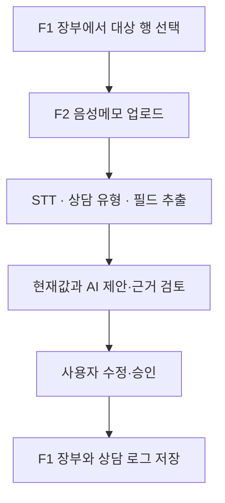
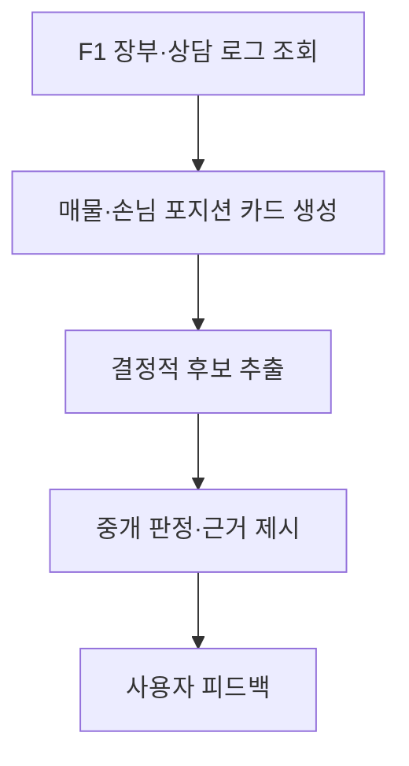
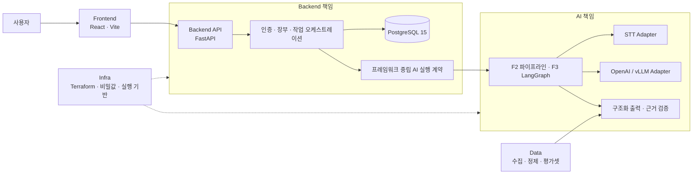

# AI 기반 부동산 중개 장부 MVP

최소 장부 데이터를 기반으로 **음성 상담 입력 자동화(F2)**와 **멀티 에이전트 중개 판단(F3)**을 종단 간 시연하고 평가하는 프로젝트입니다.

> 현재 목표는 현업용 장부 제품의 모든 CRUD와 운영 기능을 완성하는 것이 아닙니다.
> F1을 최소 데이터 기반으로 두고, F2·F3 AI 파이프라인의 정확도와 판단 품질을 검증하는 데 집중합니다.

---

## 프로젝트 소개

### 문제 정의

부동산 중개 업무에는 매물·구입 조건처럼 표로 관리되는 정보뿐 아니라 상담 중에만 드러나는 의향과 제약이 함께 존재합니다. 그러나 상담 내용을 장부 필드와 로그에 다시 입력하는 작업은 반복적이고, 누적된 기록이 많아질수록 필요한 맥락을 다시 찾아 양측의 거래 가능성을 판단하기도 어려워집니다.

단순 조건 검색만으로는 “급하지 않음”, “다른 곳도 상담 중”, “특정 조건이면 조정 가능”처럼 정형 필드 밖에 남은 말을 활용하기 어렵습니다. 반대로 AI가 근거 없이 값을 채우거나 바로 외부 행동을 실행하면 기존 장부의 신뢰성을 해칠 수 있습니다.

이 프로젝트는 다음 세 기능을 연결해 이 문제를 검증합니다.

- **F1 장부 시스템**은 매물·구입·상담 로그의 최소 저장·조회 기반이자 데이터의 단일 원천입니다.
- **F2 AI 입력 자동화**는 음성메모를 전사하고 장부 필드와 상담 로그 초안을 제안합니다.
- **F3 비서 에이전트**는 양측의 구조화 데이터와 상담 로그를 분리해 읽고, 후보와 근거가 있는 중개 판단을 제안합니다.

AI 결과는 사용자 승인 전까지 확정 데이터가 아니며, 근거 없는 값을 만들거나 기존 값을 자동으로 덮어쓰지 않는 것을 공통 원칙으로 합니다.

### MVP 범위

| 기능 | MVP에서 다루는 핵심 | 현재 상태 |
|---|---|---|
| F1 최소 장부 | 장부 목록·행 추가, 상담 로그, F2 승인 결과 저장, F3 후보 조건 조회 | Backend API·DB 기반 구현, Frontend 프로토타입 구현 |
| F2 음성 입력 | 음성 업로드, STT, 상담 유형·필드 추출, 근거 검토, 사용자 수정·승인 | 요구사항·제안 아키텍처 정리, 전체 실행 흐름 미구현 |
| F3 중개 판단 | 포지션 카드, 결정적 후보 추출, 매물·손님 대리, 중개 판정, 근거·피드백 | 요구사항·제안 아키텍처 정리, AI provider 기반 구현 |

통합검색, 문자 발송, 일정, 계약, 캠페인, 현업 수준의 권한·마스터 관리 등은 F2/F3 시연과 평가에 꼭 필요한 경우가 아니면 현재 MVP에서 최소화합니다.

### 사용자 흐름

#### 1. 음성 상담 입력 자동화(F2)



#### 2. 양측 포지션 기반 중개 판단(F3)



F2가 승인 후 F1에 저장한 구조화 데이터와 상담 로그를 F3가 입력으로 사용합니다.

---

## 아키텍처

### 논리 구성



- Frontend는 화면과 사용자 검토·승인 경험을 담당합니다.
- Backend만 인증, 데이터베이스, 트랜잭션과 AI 결과 저장을 소유합니다.
- AI는 모델·프롬프트·워크플로를 소유하지만 FastAPI나 데이터베이스에 직접 의존하지 않습니다.
- AI가 요청하는 조회나 부수 효과는 Backend가 주입한 제한된 capability를 거쳐 검증됩니다.
- Data는 재현 가능한 학습·평가 입력을, Infra는 Terraform 기반 계정·배포 기반과 비밀값 주입 경계를 담당합니다.

> 위 다이어그램은 승인된 모듈 경계와 현재 설계 방향을 함께 보여줍니다.
>
> - **현재 AWS에 적용됨:** 공유 dev 네트워크·RDS·EC2/ALB·CloudFront와 기존 `main` source delivery 자원
> - **이번 PR의 목표 구성·아직 미적용:** `dev` source 전환, Verify/Build 분리와 환경설정 materialization. 별도 Terraform plan·승인·apply가 필요합니다.
> - **미확정:** 운영 Provider 선택과 조건부 SQS/ECS 분리

### 기술 스택

| 영역 | 기술 | 상태 |
|---|---|---|
| Frontend | React 19, Vite 6, AG Grid, PatternFly | 프로토타입 구현 |
| Backend | Python 3.13, FastAPI, SQLModel, Yoyo migrations | 결정·구현 |
| AI | Python 3.13, LangGraph, OpenAI-compatible provider adapter | 기반 구현; F2/F3 workflow 진행 예정 |
| Database | PostgreSQL 15 | 결정·구현 |
| Data | 재현 가능한 수집·정제·평가 파이프라인 | 계획 |
| Infrastructure | Terraform 1.15.x, AWS Provider 6.x | 계정·공유 dev 기반 적용; 후속 변경 plan 대기 |
| 외부 모델 실행 | RunPod shared F2 Pod와 private Team Template | 결정·코드 구현, 외부 자원 미적용 |
| 조건부 운영 후보 | AWS SQS, ECS Fargate | 미확정 또는 조건부 |

### 저장소 구조

```text
.
├── frontend/   # React 사용자 인터페이스와 로컬 프로토타입
├── backend/    # FastAPI, 인증, 장부 API, DB·트랜잭션
├── ai/         # 모델 Adapter, AI 실행 계약과 workflow 기반
├── data/       # 데이터 수집·가공·품질 검증
├── infra/      # Terraform 기반 AWS 계정·공유 dev·delivery 구성
└── docs/       # 요구사항, 화면, 아키텍처, DB 문서
```

---

## 로컬 준비

### 사전 요구사항

- Git
- Node.js `24.19.0`과 npm `11.17.0` 권장
- Python `3.13.x`
- [uv](https://docs.astral.sh/uv/)
- PostgreSQL `15`

Terraform과 AWS CLI는 Infra 계정 연결 작업을 할 때만 필요합니다.

### 1. 저장소 받기

```bash
git clone https://github.com/SKNETWORKS-FAMILY-AICAMP/SKN30-FINAL-3Team.git
cd SKN30-FINAL-3Team
```

모듈별 설치, 환경변수, 실행, 테스트 방법은 각 모듈 README를 따릅니다.

- [Frontend README](frontend/README.md)
- [Backend README](backend/README.md)
- [AI README](ai/README.md)
- [Infra README](infra/README.md)

### 2. 커밋 전 자동 포맷 설정

저장소를 받은 뒤 루트에서 Git pre-commit hook을 한 번 설치합니다.

```bash
uv run --locked --project backend pre-commit install
```

이후 커밋할 때 staged 상태의 `ai/`·`backend/` Python 파일에 Ruff 안전 수정과 포맷이
자동 적용되고 해당 모듈의 Pyright가 실행됩니다. hook이 파일을 바꾸면 변경분을 다시 `git add`한
뒤 커밋합니다. 로컬 hook은 `git commit --no-verify`로 우회할 수 있으므로 CodeBuild의
format·lint·type 검사는 계속 유지합니다.

---

## 문서

README에는 프로젝트를 이해하고 로컬에서 시작하는 데 필요한 내용만 유지합니다. 상세 요구사항과 설계 상태는 다음 문서가 정본입니다.

- [현재 MVP 범위와 평가 중심](docs/requirements/common/mvp-scope-and-evaluation.md)
- [전체 요구사항 인덱스](docs/requirements/index.md)
- [공통 개요와 F1·F2·F3 책임 경계](docs/requirements/common/overview-and-principles.md)
- [F2 기능 정의와 사용자 흐름](docs/requirements/f2/overview-and-flow.md)
- [F3 비서 에이전트 개요](docs/requirements/f3/overview-and-common.md)
- [화면 문서 인덱스](docs/screen/index.md)
- [아키텍처 문서 인덱스](docs/architecture/index.md)
- [F2 아키텍처](docs/architecture/f2/overview.md)
- [F3 아키텍처](docs/architecture/f3/overview.md)
- [DB migration 관리](docs/db/README.md)
- [Frontend 실행 가이드](frontend/README.md)
- [Backend 실행 가이드](backend/README.md)
- [AI 모듈 가이드](ai/README.md)
- [Infra 계정 연결·운영 가이드](infra/README.md)
- [Architecture Decision Records](.agents/skills/project-wiki/references/decisions/index.md)

---

## 유의사항

- AI 제안은 사용자가 확인하고 승인하기 전까지 장부의 확정 데이터가 아닙니다.
- 상담 음성과 로그에는 개인정보가 포함될 수 있으므로 비밀값·개인정보를 저장소, 프롬프트 예시 또는 운영 로그에 남기지 않습니다.
- 모델, 큐, 운영 런타임처럼 아직 제안·미확정인 기술을 승인된 운영 구성으로 간주하지 않습니다.
- 현재 Frontend 프로토타입과 Backend API는 아직 통합되어 있지 않습니다.
