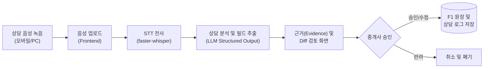
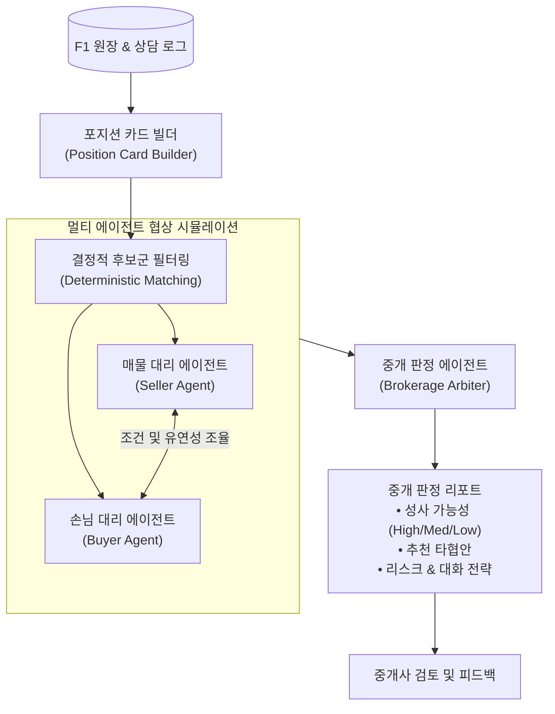
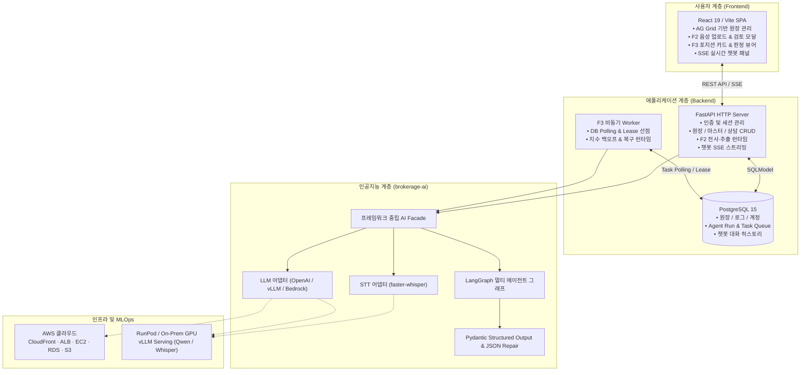

# AI 기반 부동산 중개 장부 & 지능형 에이전트 시스템 집크크 (집 creator crew)

부동산 현장의 **비정형 음성 상담**과 **정형 원장 데이터**를 결합하여, **음성 상담 입력 자동화(F2)**, **멀티 에이전트 중개 판단(F3)**, 그리고 **자연어 업무 어시스턴트 챗봇**을 종단 간(End-to-End) 제공하는 AI 기반 중개 지원 플랫폼입니다.

단순 조건 검색에 그치지 않고, 상담 대화 속에 숨은 양측의 미묘한 의향·제약·유연성을 포착하여 중개사의 의사결정을 효과적으로 보조합니다.

---

## 목차

1. [프로젝트 소개](#프로젝트-소개)
   - [문제 정의](#문제-정의)
   - [핵심 기능 4대 축](#핵심-기능-4대-축)
   - [사용자 워크플로](#사용자-워크플로)
2. [시스템 아키텍처](#시스템-아키텍처)
   - [전체 시스템 구조도](#전체-시스템-구조도)
   - [핵심 설계 원칙](#핵심-설계-원칙)
3. [기술 스택](#기술-스택)
4. [저장소 구조](#저장소-구조)
5. [빠른 시작 가이드 (Quick Start)](#빠른-시작-가이드-quick-start)
   - [사전 요구사항](#사전-요구사항)
   - [1. 저장소 복제 및 의존성 설치](#1-저장소-복제-및-의존성-설치)
   - [2. 로컬 데이터베이스 실행](#2-로컬-데이터베이스-실행)
   - [3. 환경변수 설정 및 DB 마이그레이션](#3-환경변수-설정-및-db-마이그레이션)
   - [4. 시드 데이터 적재](#4-시드-데이터-적재)
   - [5. 프로세스 기동 (API, Worker, Frontend)](#5-프로세스-기동-api-worker-frontend)
6. [개발 및 검증 도구](#개발-및-검증-도구)
7. [주요 문서 링크](#주요-문서-링크)

---

## 프로젝트 소개

### 문제 정의

부동산 중개 실무에서는 매물 정보나 희망 조건 같은 표 형식의 데이터뿐만 아니라, 고객과의 대화 중에만 드러나는 내밀한 조건과 맥락이 성패를 가릅니다.
- **기록의 파편화와 입력 피로**: 상담 직후 핵심 의향과 제약을 원장에 일일이 정리하는 작업은 번거롭고 누락되기 쉽습니다.
- **맥락 유실**: 원장에 입력되지 못한 "급하지 않음", "수리비 지원 시 상향 가능", "입주 일정 유연함" 등의 비정형 맥락은 시간이 지나면 잊혀져 매칭 기회를 놓치게 만듭니다.
- **AI 환각 및 데이터 신뢰성 위험**: AI가 근거 없이 데이터를 자의적으로 생성하거나 기존 장부 데이터를 멋대로 덮어쓰면 현업에서 신뢰할 수 없습니다.

본 프로젝트는 **중개사의 최종 검토 및 승인(Human-in-the-Loop)**을 핵심 원칙으로 하여, 데이터의 무결성을 지키면서도 AI의 분석·판단 능력을 극대화하도록 설계되었습니다.

### 핵심 기능 4대 축

| 기능 모듈 | 명칭 | 주요 역할 및 특징 |
|---|---|---|
| **F1** | **중개 원장 및 상담 관리** | • 매물·구입 원장 그리드 관리 (고성능 필터링 및 정렬)<br/>• 고객·단지 마스터 데이터 관리 및 상담 로그 이력 추적<br/>• 데이터의 단일 원천(Single Source of Truth)이자 격리된 테넌트 관리 |
| **F2** | **음성 상담 AI 입력 자동화** | • 현장 상담 음성메모 업로드 및 Whisper STT 전사<br/>• LLM 기반 상담 유형 분류(매도/매수/단순) 및 계약/희망 조건 자동 추출<br/>• 음성 텍스트 기반 추출 근거(Evidence) 제시 및 기존값 비교(Diff)<br/>• 중개사 1-Click 확인 및 승인 후 원장 자동 반영 |
| **F3** | **멀티 에이전트 중개 판단** | • 양측의 제약·유연성·숨은 니즈를 정제한 **포지션 카드** 자동 생성<br/>• 비즈니스 규칙 기반의 1차 결정적 후보군 필터링<br/>• **매물 대리인 & 매수인 대리인 에이전트** 간 조건 조율 시뮬레이션<br/>• 성사 가능성, 구체적 타협안, 잠재 리스크를 포함한 종합 중개 판정서 산출 |
| **Chatbot** | **지능형 업무 어시스턴트** | • 자연어 질의를 통한 원장 데이터(매물, 조건, 일정) 조건 검색<br/>• Server-Sent Events (SSE) 기반 실시간 스트리밍 답변<br/>• 대화 컨텍스트 유지 및 멀티턴 대화 세션 관리<br/>• 대화 도중 F2 음성 분석 모달 직접 호출 연동 |

---

### 사용자 워크플로

#### 1. 음성 상담 입력 자동화 (F2)



#### 2. 멀티 에이전트 중개 의사결정 지원 (F3)



---

## 시스템 아키텍처

### 전체 시스템 구조도



### 핵심 설계 원칙

1. **Human-in-the-Loop & 무결성**: AI의 모든 추출값과 판단은 사용자의 최종 승인 전까지 초안(Draft)으로 취급되며, 기존 장부 데이터를 자동으로 덮어쓰지 않습니다.
2. **책임 분리 (Clean Architecture)**:
   - `frontend/`: UI 렌더링, 상태 관리, 사용자 상호작용 및 승인 UX 담당
   - `backend/`: 비즈니스 로직, 인증, 트랜잭션 보장, 영속성 및 작업 오케스트레이션 담당
   - `ai/`: 모델 어댑터, 프롬프트 템플릿, LangGraph 워크플로 소유 (FastAPI/DB에 직접 의존하지 않는 프레임워크 중립 라이브러리)
   - `data/`: 원천 데이터 정제, 비식별화, 평가 데이터셋 릴리스 관리
   - `infra/`: Terraform 기반 인프라 선언 및 배포 자동화
3. **비동기 작업 신뢰성 (F3 Worker)**: 장기 실행 AI 추론 작업은 DB Polling 및 임대(Lease) 메커니즘을 적용하여, 작업 유실 방지, 타임아웃 복구, 중복 실행 방지를 보장합니다.

---

## 기술 스택

| 영역 | 기술 및 도구 | 선정 사유 |
|---|---|---|
| **Frontend** | **React 19**, **TypeScript**, **Vite 6** | 최신 React 동시성 기능 활용, 정적 타입 안정성, 초고속 HMR 및 빌드 |
| | **AG Grid** | 수천 건의 장부 데이터를 끊김 없이 렌더링하고 유연하게 조작 가능한 고성능 데이터 그리드 |
| | **PatternFly 6** | 엔터프라이즈 업무 시스템에 적합한 접근성 및 디자인 컴포넌트 시스템 |
| **Backend** | **Python 3.13**, **FastAPI** | 비동기 고성능 REST API 및 Server-Sent Events(SSE) 스트리밍 지원 |
| | **SQLModel / SQLAlchemy** | Pydantic과 SQLAlchemy의 장점을 결합한 타입 안전 ORM 계층 |
| | **PostgreSQL 15** | 강력한 ACID 트랜잭션, 관계형 데이터 및 JSONB 비정형 데이터 지원 |
| | **Yoyo Migrations** | 순수 SQL 기반의 투명하고 결정적인 데이터베이스 마이그레이션 관리 |
| **AI & Engine** | **LangGraph** | 복잡한 멀티 에이전트 간 순환 제어, 협상 흐름 시뮬레이션 및 상태 관리 |
| | **faster-whisper** | CTranslate2 기반 고속 음성 인식(STT) 엔진 |
| | **vLLM / OpenAI API** | 고속 토큰 서빙(vLLM) 및 범용 대형 언어 모델(GPT, Qwen) 유연한 전환 |
| | **Pydantic v2** | 엄격한 구조화 출력(Structured Output) 검증 및 Schema Enforcement |
| **Infra & MLOps**| **Terraform 1.15.x** | 코드형 인프라(IaC)를 통한 AWS 자원의 재현 가능한 형상 관리 |
| | **AWS** (CloudFront, ALB, EC2, RDS, S3) | 글로벌 캐싱, 보안 트래픽 분산, 컨테이너 서빙 및 안전한 원격 스토리지 |
| | **RunPod** | GPU 워커 인스턴스(vLLM / Whisper 호스팅) 비용 효율적 운영 |
| | **just** | 복잡한 개발, 빌드, 배포, 마이그레이션 명령어의 단일 진입점 제공 |

---

## 저장소 구조

```text
SKN30-FINAL-3Team/
├── frontend/             # React 기반 웹 UI (원장, F2 음성 모달, F3 결과 패널, 챗봇)
├── backend/              # FastAPI 서버, F3 비동기 Worker, 도메인 로직, DB 마이그레이션
│   ├── migrations/       # Yoyo 마이그레이션 SQL 스크립트
│   └── src/              # API 라우터, 도메인 서비스, 작업 큐 및 관리 명령
├── ai/                   # AI 핵심 모듈 (LangGraph 워크플로, STT/LLM 어댑터, 프롬프트)
├── data/                 # 데이터셋 레지스트리, 합성 시나리오 생성기, 비식별화 파이프라인
├── infra/                # Terraform 코드, AWS 배포 구성, Justfile 레시피, RunPod 런북
└── docs/                 # 기능별 요구사항, 상세 아키텍처, DB 설계 및 운영 문서
```

---

## 빠른 시작 가이드 (Quick Start)

로컬 환경에서 전체 시스템을 기동하고 시연하기 위한 단계별 안내입니다.

### 사전 요구사항

- **Git**
- **Python 3.13+**
- **Node.js 22.x** 및 **npm 11.x**
- **[uv](https://docs.astral.sh/uv/)** (Python 초고속 패키지 관리자)
- **[just](https://github.com/casey/just)** (명령어 실행기)
- **Docker** & **Docker Compose** (로컬 PostgreSQL 구동용)

### 1. 저장소 복제 및 의존성 설치

```bash
# 1) 저장소 복제
git clone https://github.com/SKNETWORKS-FAMILY-AICAMP/SKN30-FINAL-3Team.git
cd SKN30-FINAL-3Team

# 2) Backend 의존성 동기화
cd backend && uv sync --frozen && cd ..

# 3) AI 의존성 동기화
cd ai && uv sync --frozen && cd ..

# 4) Frontend 의존성 설치
cd frontend && npm ci && cd ..
```

### 2. 로컬 데이터베이스 실행

Docker Compose를 이용해 로컬 PostgreSQL 15 컨테이너를 기동합니다.

```bash
# 로컬 DB 환경 설정 복사
cp infra/local/.env.example infra/local/.env

# 컨테이너 백그라운드 실행
docker compose --env-file infra/local/.env -f infra/local/compose.yaml up -d
```

### 3. 환경변수 설정 및 DB 마이그레이션

```bash
# 1) Backend 설정 복사
cd backend
cp .env.example .env
# .env 파일의 DB_URL 설정 확인 (기본 로컬 DB 접속 정보와 일치)

# 2) AI 설정 복사 및 API 키 등록
cd ../ai
cp .env.example .env
# .env 파일의 AI_GENERAL_API_KEY 에 사용 가능한 OpenAI 또는 서빙 키 입력

# 3) DB 마이그레이션 실행
cd ../backend
uv run --env-file .env python src/migration_guard.py
cd ..
```

### 4. 시드 데이터 적재

F1 장부, 상담 로그, F2/F3 통합 시나리오가 포함된 **F3 합성 시드 데이터**를 생성합니다.

```bash
cd backend
uv run python src/manage.py seed-f3-synthetic --confirm-reset --model-profile local-openai
```
> 적재 완료 후 출력되는 JSON의 `brokerage_id`를 `backend/.env` 파일의 `AUTH_DEVELOPMENT_BROKERAGE_ID` 값으로 설정합니다.

### 5. 프로세스 기동 (API, Worker, Frontend)

터미널 3개를 열어 각각 프로세스를 실행합니다.

#### [터미널 1] Backend API 서버
```bash
just -f infra/justfile local-api
```
- API 서버: `http://127.0.0.1:8000`
- Swagger 문서: `http://127.0.0.1:8000/docs`

#### [터미널 2] F3 비동기 Worker
```bash
just -f infra/justfile local-worker
```
- DB를 지속적으로 폴링하여 F3 멀티 에이전트 분석 작업을 비동기로 처리합니다.

#### [터미널 3] Frontend 개발 서버
```bash
cd frontend
npm run dev
```
- 브라우저 접속: `http://localhost:5173`
- 로그인 화면에서 **'개발용 세션으로 로그인'**을 클릭하여 즉시 시연 화면으로 진입할 수 있습니다.

---

## 개발 및 검증 도구

### 코드 포맷 및 정적 분석

저장소 루트에서 다음 명령을 실행하여 코드 품질을 유지합니다.

```bash
# Backend 린트 및 포맷
uv run --locked --project backend ruff check --fix backend
uv run --locked --project backend ruff format backend

# AI 린트 및 포맷
uv run --locked --project ai ruff check --fix ai
uv run --locked --project ai ruff format ai

# Frontend 타입 및 빌드 검사
cd frontend
npm run typecheck
npm run build
```

### Git Pre-commit Hook 설정

커밋 시 자동으로 포맷팅과 정적 검사를 수행하도록 설정할 수 있습니다.

```bash
uv run --locked --project backend pre-commit install
```

---

## 주요 문서 링크

상세 설계, 계약 명세 및 운영 가이드는 각 영역별 문서를 참조하십시오.

### 아키텍처 및 요구사항
- [현재 MVP 범위와 평가 기준](docs/requirements/common/mvp-scope-and-evaluation.md)
- [공통 설계 원칙 및 책임 경계](docs/requirements/common/overview-and-principles.md)
- [F2 음성 AI 파이프라인 아키텍처](docs/architecture/f2/overview.md)
- [F3 멀티 에이전트 시스템 아키텍처](docs/architecture/f3/overview.md)
- [업무 어시스턴트 챗봇 아키텍처](docs/architecture/chatbot/overview.md)

### 인터페이스 계약 및 가이드
- [HTTP API 계약 가이드](.agents/skills/project-wiki/references/contracts/api.md)
- [F3 AI–Backend 연동 계약](.agents/skills/project-wiki/references/contracts/f3-ai.md)
- [환경변수 관리 가이드](docs/development/environment-variables.md)
- [데이터베이스 마이그레이션 관리](docs/db/README.md)

### 모듈별 세부 안내
- [Frontend README](frontend/README.md)
- [Backend README](backend/README.md)
- [AI 모듈 README](ai/README.md)
- [Data 관리 README](data/README.md)
- [Infra 운영 README](infra/README.md)
