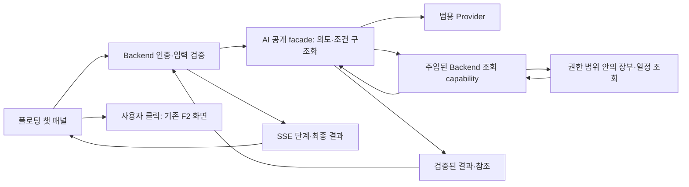

# 챗봇 실행·모델·조회 구조

[도입 검토](overview.md) · [요구사항](../../requirements/chatbot/overview-and-scope.md) · [SSE 계약안](api-and-stream.md) · [저장 설계](persistence.md)
PR #99에서 구현한 Python DTO·실행 facade·read capability·오류의 정본은
[AI–Backend 공개 계약](../../../.agents/skills/project-wiki/references/contracts/chatbot-ai.md)이다.
이 문서의 Backend 저장·HTTP/SSE 연결과 아래 도구 이름·제한값은 설계 제안이다. 기존 [ADR-0006](../../../.agents/skills/project-wiki/references/decisions/ADR-0006-ai-backend-boundary.md)의 모듈 경계를 유지한다.

## 권장 실행 흐름

1. Backend가 세션·CSRF·크기·동시 실행 제한을 확인한다. 사무소·작성자를 검증하고 request·질문을 DB에 저장한 뒤 연결과 독립된 task로 실행한다.
2. AI facade가 현재 질문·Backend가 DB에서 선택한 직전 완료 2회/현재 조건·도구 스키마에서 의도와 조건을 구조화한다. 추천 질문의 확정 액션은 모델 없이 처리할 수 있다.
3. AI가 구조화 출력을 재검증한다. 모호하면 추가 질문, 미지원이면 제한 안내로 종료하며 잘못된 조건으로 조회하지 않는다.
4. Backend capability가 단지 후보·ID·필터를 검증하고 파라미터 바인딩 조회를 수행한다. AI는 DB 스키마·연결·ORM을 받지 않는다.
5. Backend가 총건수·정렬·기간·금액과 결과 참조를 계산한다. 초기 답변은 이 검증된 값의 템플릿·카드로 구성해 두 번째 생성 호출을 줄인다.
6. Backend가 진행 상태를 저장하고 최종 답변·필터·완료 상태를 함께 commit한 뒤 SSE로 알린다. UI는 재접속 시 DB snapshot으로 복원하고 결과 상세 이동을 기존 장부 화면에 연결한다.

## 도구와 조회 제약

| 도구 후보 | 입력 | 출력·경계 |
|---|---|---|
| `search_properties` | 등록 단지, 거래 종류, 정규화 금액·면적 범위, 허용 정렬 | 사무소 범위의 매물 요약·총건수·조건·참조 ID. 세대와 매물의 삭제·진행 상태를 함께 검증 |
| `search_buyers` | 거래 종류, 진행 상태, 정규화 예산·면적 범위 | 구입 조건 요약·총건수·참조 ID. 연락처·이름은 모델 입력에서 제외하고 화면 표시는 별도 권한 적용 |
| `get_agenda` | 명시적 날짜 범위, 지원 일정 종류 | Time Keeper 유스케이스 기반 목록·정확한 총계·누락/상한 정보. 날짜 계산을 모델에 맡기지 않음 |
| `open_f2` | 신규 접수 또는 화면에서 명시 선택한 지원 대상 | 실제 분석 호출이 아닌 허용된 UI 액션. 분석·승인은 기존 F2·F1 화면에서 수행 |

한 질문은 조회 도구 1종을 원칙으로 하고 단지명 해소 등 보조 조회를 포함해 최대 3번을 초기 상한으로 제안한다.
결과는 첫 10건과 정확한 총건수·다음 페이지를 제공한다. “전체 100건 중 10건 표시”와 “총 10건”을 구분한다.
최신 매물 1건을 고르는 현재 장부 규칙을 그대로 쓸지 필터 평가 전에 확정하고, 챗봇과 그리드의 결과 집합을 비교한다.
F3 후보 조회는 앵커의 추정값·점수 규칙을 사용하므로 일반 장부 검색에 그대로 연결하지 않는다. 재사용은 Backend의 검증된 저수준 조회 조각에 한정한다.

## 자연어를 안전한 조건으로 바꾸는 방식

권장 방식은 자연어→제한된 JSON 조건→Backend 쿼리다. 모델에게 `SELECT` 문이나 테이블명을 생성하도록 하지 않는다.
예: “A단지 매매 15억 이하” → 거래 `매매`, 단지 후보 `A단지`, 금액 표현 `15억 이하` → Backend가 실제 단지 ID와 원 단위 상한으로 정규화한다.
억/만원·전세 보증금/월세·전용/공급 면적·미만/이하·날짜 경계를 검증하며, 모델이 계산한 숫자만 신뢰하지 않는다.
JSON Schema 적합성은 의미 정확성을 보장하지 않는다. 서로 모순된 조건, 존재하지 않는 단지, 가격 원문만 있고 정규화 값이 없는 경우를 별도 처리한다.

- Backend allowlist 밖의 필드·연산자·정렬·임의 URL·SQL은 거절한다. 범용 SQL/Repository를 AI 도구로 노출하지 않는다.
- 사무소 ID를 모델 출력이나 클라이언트 문맥으로 덮어쓸 수 없게 한다. 과거 카드·페이지 토큰·대상 ID도 매번 범위 검사한다.
- DB 조회는 timeout·건수 상한을 두고 모델을 기다리는 동안 DB 세션·트랜잭션을 잡아두지 않는다.
- 상담 로그·공공 API 본문은 조회 자료로만 취급한다. 그 안의 지시로 도구·권한·시스템 프롬프트를 바꾸지 않는다.
- 결과 상세 URL은 서버가 검증한 내부 액션에서 조립한다. 모델이 만든 URL·HTML을 그대로 실행하거나 렌더링하지 않는다.

## 모델과 환경

| 구분 | 적용 제안·근거 | 검증 필요 |
|---|---|---|
| local | 기존 OpenAI Luna 범용 Provider. “local”은 개발 환경이며 모델을 PC에서 직접 구동한다는 뜻이 아님 | 챗봇 스키마·한국어 조건·문맥 정확도 |
| dev | Qwen 27B 범용 endpoint. [ADR-0030](../../../.agents/skills/project-wiki/references/decisions/ADR-0030-local-dev-dual-cloud-serving.md)의 F2/general 독립 GPU·명시 전환 사용 | GPU 추론·구조화 출력·8K 문맥·동시성 1·혼잡과 F3 경합 |
| 재현성 | [ADR-0026](../../../.agents/skills/project-wiki/references/decisions/ADR-0026-general-ai-provider-and-model-profiles.md)의 Qwen3.8-27B BnB/GGUF 프로필·revision·hash 구분 | 실제 사용할 artifact·runtime 조합 명시. “Qwen 27B”만으로 고정하지 않음 |
| 기존 계획과 관계 | ADR-0030은 ADR-0026·0027의 GPU 보류·전환 절차를 부분 대체 | 코드 구현과 실제 GPU 검증 완료는 다름. 현재 배포 활성 모델은 운영 점검으로 확인 |

기존 [llama.cpp 어댑터](../../../ai/src/brokerage_ai/providers/llama_cpp.py)와 vLLM 경로를 활용하되 현재 운영 경로를 우선한다.
[llama.cpp 공식 문서](https://github.com/ggml-org/llama.cpp/blob/master/tools/server/README.md)는 JSON 제약 출력을 설명한다. 실제 모델·템플릿·고정 서버 버전에서 동일하게 동작하는지는 별도 smoke로 확인한다.
27B의 4-bit 가중치는 단순 계산으로 약 13.5GB지만 이것은 전체 VRAM이 아니다. KV cache·양자화 메타데이터·runtime·문맥·배치 여유를 포함해 측정한다.
모델 전환은 설정으로 명시하며 자동 fallback하지 않는다. 챗봇 route는 새 capability로 추가하고 F3의 활성 설정을 덮어쓰지 않는다.
F2는 기존 STT·추출 모델을 유지하며 범용 챗봇 LLM으로 교체하지 않는다.

## 멀티턴·확장 판단

최근 2회 제한은 사용자가 선택한 문맥 정책이다. DB 대화 이력의 보존량과 별개이며 모델의 기술적 기억 한계를 뜻하지 않는다.
현재 조건과 최근 2회만으로 “그중”, “가격순으로”, “두 번째”를 다루는 정도는 구현 가능하다. 긴 업무 목표 유지·복수 대상 비교·장기 기억은 별도 복잡성이다.
8K 운영 문맥 안에서 시스템·도구·현재 질문·직전 대화·출력 여유를 함께 예산화한다. 개별 입력은 2,000자부터 검토하고 토큰 상한 초과 시 조용히 자르지 않고 축약 입력을 요청한다.
과거 응답 전문과 모든 조회 행을 다시 보내지 않고 최소 문맥·조건·안전한 참조만 보낸다. 표시된 조건은 문맥 한도와 별개임을 UI에 설명한다.
2회 평가가 미달하면 단일 질문 모드로의 축소를 다시 제안한다. 사용자 합의 없이 기억 범위를 바꾸거나 기억한다고 표시한 채 문맥을 버리지 않는다.

초기 조회 workflow는 선형 구조로 충분하다. 요청·결과 저장은 Backend가 소유하고 AI에 DB 타입을 전달하지 않는다. 분기·중단/재개가 복잡해지면 AI 내부에서 LangGraph 사용을 검토하되 Backend에는 그래프 타입을 노출하지 않는다.
도구 추가는 권한·DTO·결과 UI·평가 사례가 함께 준비된 경우에만 노출한다. 범용 에이전트 플랫폼을 먼저 만들 필요는 없다.
