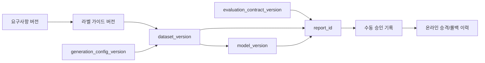

# F2 오프라인 데이터·학습·평가 아키텍처

## 문서 안내

- **이 문서가 답하는 질문:** 개인정보를 최소화하면서 F2용 데이터셋을 만들고, 추출 모델을 평가·승격·롤백하는 방법은 무엇인가?
- **관련 요구사항:** [F2 정의와 흐름](../../requirements/f2/overview-and-flow.md) · [STT·AI 처리](../../requirements/f2/processing.md) · [장부별 추출 필드](../../requirements/f2/fields.md) · [MVP 범위와 평가](../../requirements/common/mvp-scope-and-evaluation.md)
- **관련 승인 ADR:** [ADR-0006: AI–Backend 실행 경계](../../../.agents/skills/project-wiki/references/decisions/ADR-0006-ai-backend-boundary.md)
- **이 문서가 소유하지 않는 상세:** 데이터 레코드 스키마, 라벨 필드 목록, 저장 포맷·제품, 학습 코드 구조, 모델·TTS·서빙 제품 선정
- **탐색:** [아키텍처 인덱스](../index.md) · [F2 개요](overview.md) · [온라인 실행](online-runtime.md)

## 목적과 데이터 경계

오프라인 흐름은 재현 가능한 합성 데이터셋과 독립 평가셋으로 F2의 추출 품질을 측정하고, 기준을 통과한 모델만 수동 승인해 온라인에 공급한다.

현업 데이터는 승인된 비식별 export만 사용한다. 이 export에는 상담 유형 분포, 표현 패턴의 범주, 음질 특성, 필드별 수정 유형과 같은 개선 특성을 포함할 수 있지만 다음은 포함하지 않는다.

- 원본 음성·전사 원문
- 고객·상담사 또는 계정 식별자
- 자유서술의 원문 개인정보
- 특정 개인을 재식별할 수 있는 희귀 조합
- 승인되지 않은 AI 초안이나 검토 중 데이터

비식별 기준과 반출 권한은 [개인정보 정책](../../../.agents/skills/project-wiki/references/privacy/policy.md)을 따르며, 자동 생성·학습 전에 표본 기반 재식별 위험 검사를 통과해야 한다.

## 전체 흐름

```mermaid
flowchart LR
    FB["Backend<br/>승인 전후 차이"] --> DE["승인·비식별 export"]
    DE --> CHAR["현업 특성·분포·오류 유형"]

    subgraph DATA1["Data: 데이터 설계와 생성 통제"]
        CHAR --> SC["구조화 시나리오 + 정답"]
        SC --> SPLIT["출처 그룹 선분할"]
    end

    subgraph AI1["AI: 생성 Adapter 실행"]
        SPLIT --> TXT["상담문 생성"]
        TXT --> AUD["TTS + 잡음 음성 생성"]
    end

    subgraph DATA2["Data: 품질과 데이터셋"]
        AUD --> AUTO["자동 품질 검사"]
        AUTO --> HUMAN["현업 표본 검수"]
        HUMAN --> DS["불변 데이터셋<br/>train / dev / final"]
    end

    subgraph AI2["AI: 학습과 평가"]
        DS --> TRAIN["추출 모델 학습"]
        DS --> EVAL["STT·추출·근거·종단 평가"]
        TRAIN --> EVAL
        EVAL --> REPORT["버전된 평가 보고서"]
    end

    REPORT --> GATE{"팀 수동 승인"}
    GATE -->|"승격"| REG["모델 저장소<br/>현재 + 직전 승인"]
    GATE -->|"반려"| ANALYSIS["오류 분석·다음 데이터 버전"]
    REG --> ONLINE["온라인 STT/추출 Adapter"]
    ANALYSIS --> SC
```

운영 결과가 학습·배포로 직접 연결되는 자동 루프는 두지 않는다. 비식별 export, 데이터 버전 생성, 고정 평가, 보고서 검토와 팀 승인을 차례로 거친다.

## Data와 AI 책임

| 단계 | Data 책임 | AI 책임 |
|---|---|---|
| 요구사항 해석 | 요구사항 정본에서 평가 대상과 필드·상황 범주 도출 | 모델 입출력으로 평가 가능한지 기술 검토 |
| 시나리오·정답 | 시나리오 분포, 정답, 라벨 가이드, 금지 PII, 난이도·예외 설계 | 생성 모델이 소비할 중립 요청 계약 제공 |
| 상담문·음성 생성 | 생성 계획·seed·분할 소속·manifest 통제 | 텍스트 생성, TTS, 잡음 처리 Adapter 실행과 진단 반환 |
| 품질 관리 | 자동 규칙, 중복·누수 탐지, 표본 추출, 현업 검수 결과와 데이터 버전 확정 | 모델 호출 실패와 생성 품질 신호 제공 |
| 학습·평가 | 불변 train/dev/final 입력과 평가 계약 제공 | 추출 모델 학습, STT/추출/종단 평가 실행, 결과 산출 |
| 승격 | 데이터 계보와 평가 보고서 완전성 확인 | 후보 모델 artifact와 재현 정보 제공 |

Data는 모델·프롬프트를 직접 실행하지 않고 AI의 오프라인 Adapter를 사용한다. AI는 라벨 의미, 분할 승인, 데이터셋 버전의 정본을 소유하지 않는다. 구체 내부 구성은 [Data 지침](../../../.agents/skills/data/references/index.md)과 [AI 지침](../../../.agents/skills/ai/SKILL.md)이 각각 소유한다.

## 합성 데이터 구성

### 1. 구조화 시나리오

요구사항 정본을 기준으로 상담 유형, 채움/누락 필드 조합, 표현 다양성, 수정·부정·정정 발화, 애매한 값, 음질 조건을 조합한다. 실제 필드 목록과 허용값은 이 문서에 복제하지 않는다.

각 시나리오는 최소한 다음 계보를 추적할 수 있어야 한다.

- 요구사항·라벨 가이드 버전
- 시나리오 계열과 난이도·음질 범주
- 생성 구성·seed·Adapter 버전
- 기대 정답과 근거 범위
- 분할 소속과 품질 검수 상태

### 2. 상담문과 음성

AI 생성 Adapter가 구조화 시나리오를 자연스러운 상담문으로 바꾸고, TTS와 잡음 변형으로 여러 음성 조건을 만든다. 한 시나리오의 문장 변형이나 같은 원문에서 파생된 음성은 동일한 출처 그룹으로 묶어 분할 누수를 막는다.

### 3. 품질 관문

| 검사 계층 | 예시 검사 | 실패 시 처리 |
|---|---|---|
| 구조 | 필수 메타데이터, 정답 형식, 참조 무결성 | 데이터셋 편입 금지 |
| 내용 | 시나리오와 상담문 의미 일치, 정답·근거 포함 여부 | 재생성 또는 라벨 검토 |
| 음성 | 파일 재생 가능, 길이·무음·클리핑, 목표 잡음 조건 | 음성 재생성 |
| 개인정보 | 금지 패턴, 고유 식별자, 재식별 위험 | 즉시 격리·삭제 후 원인 수정 |
| 중복·누수 | 근접 문장, 동일 음성 파생, 템플릿·seed·출처 그룹 중복 | 그룹 전체 재배치 또는 제외 |
| 분포 | 상담 유형·필드·난이도·음질별 목표 범위 | 생성 계획 보완 |

자동 검사를 통과한 항목 중 위험·난이도별 층화 표본을 현업 담당자가 검수한다. 표본 실패율이 허용 기준을 넘으면 해당 생성 묶음 전체를 보류하고, 단순히 실패 샘플만 제거해 분포를 왜곡하지 않는다.

## 학습·개발·최종 평가셋 분리

분할은 데이터 생성이 끝난 뒤 무작위 행 단위로 나누지 않고 **출처 그룹을 먼저 배정한 뒤 생성**한다.

| 분할 | 용도 | 격리 규칙 |
|---|---|---|
| train | 추출 모델 학습 | train 전용 시나리오 계열·템플릿·생성 run 사용 |
| dev | 프롬프트·임계값·학습 설정 선택과 오류 분석 | train 파생 그룹 금지; 반복 확인 허용 |
| final evaluation | 승격 판단의 최종 성능 측정 | 숨김 정답, 별도 생성 run·템플릿·seed; 승인 담당자 외 접근 제한 |

동일 고객을 흉내 낸 가상 프로필, 시나리오 계열, 상담문 변형, TTS 원본, 잡음 파생은 하나의 그룹으로 취급한다. 근접 중복 탐지와 manifest 비교를 승격 전 다시 실행한다. 최종 평가 결과를 보고 프롬프트·모델·임계값을 바꾸면 새 후보로 간주하고 final 평가를 다시 수행한다.

## 학습 대상과 Adapter 전략

- 파인튜닝 대상은 **필드 추출 모델**로 제한한다.
- STT는 사전학습 모델 Adapter로 유지하고, 동일 평가셋에서 후보를 비교·교체할 수 있게 한다.
- 전처리와 출력 검증은 모델과 별도 버전으로 추적해 성능 변화 원인을 구분한다.
- 구체 기반 모델, TTS, 잡음 라이브러리와 서빙 제품은 미확정이며 데이터셋 계약과 평가 계약이 제품 교체를 견뎌야 한다.

## 평가 계층과 통과 기준

정확한 임계값은 기준선 측정 후 팀이 승인한다. 단일 종합 점수로 승격하지 않고 다음 계층을 함께 본다.

| 계층 | 핵심 질문 | 권장 지표 |
|---|---|---|
| STT | 중요한 표현이 전사에서 보존되는가? | WER/CER, 핵심 엔터티 오류율, 빈 전사율, 음질 구간별 성능 |
| 필드 추출 | 허용 필드를 정확히 제안하는가? | 필드별 precision·recall·F1, 정규화 exact match, 환각·누락률, 상담 유형 정확도 |
| 근거 | 제안값을 원문 근거가 실제로 지지하는가? | 근거 존재율, 지지 정확도, 위치 겹침, 무근거 제안률 |
| 종단 간 | 사용자의 장부 입력 부담을 실제로 줄이는가? | 무수정 승인율, 필드별 수정률, 제안 삭제율, 검토 시간, 저장 실패율 |

평가 보고서는 전체 평균뿐 아니라 상담 유형, 필드, 난이도, 음질, `확인 필요` 여부별 slice를 포함한다. 실패 사례는 원문 개인정보 없이 재현 가능한 합성 사례 식별자로 추적한다.

### 정밀도 우선 정책

장부에 잘못된 값을 제안하는 비용을 누락보다 높게 본다.

- 근거가 없거나 상충하면 값을 확정하지 않고 `확인 필요`로 반환한다.
- 허용 범위를 벗어난 값은 출력 검증에서 제거한다.
- 임계값 아래 후보는 누락 또는 확인 필요로 처리하며 자신 있게 보이도록 보정하지 않는다.
- 전체 F1이 좋아져도 핵심 필드 precision, 무근거 제안률, 사용자 수정 부담이 악화되면 승격하지 않는다.

## 기준선, 승격과 롤백

후보는 동일한 불변 평가셋과 평가 계약으로 현재 승인 모델 및 단순 기준선과 비교한다.

승격에는 다음 증거가 필요하다.

1. 데이터셋·코드·모델·평가 계약 버전과 실행 환경을 재현할 수 있다.
2. 자동 품질·누수 검사가 통과했다.
3. 필수 지표와 위험 slice가 승인 기준을 만족한다.
4. 주요 회귀와 실패 사례를 팀이 검토했다.
5. 팀 담당자가 평가 보고서를 보고 수동으로 승인했다.

모델 저장소에는 **현재 승인 모델**과 **직전 승인 모델**을 즉시 식별 가능하게 보존한다. 온라인 오류율, 지연, 사용자 수정률 또는 정책 위반이 허용 범위를 넘으면 Backend/AI 운영 담당자가 직전 모델로 되돌리고, 문제가 된 버전은 재승격 전까지 차단한다. 자동 학습·자동 승격은 하지 않는다.

## 운영 개선 루프

Backend는 승인 저장 후 AI 제안과 사용자 최종값의 차이를 계산한다. 접근 통제된 배치가 승인된 레코드만 모아 비식별·집계하고, Data는 이를 다음 용도로 제한해 사용한다.

- 자주 수정되는 필드와 오류 유형의 분포 갱신
- 합성 시나리오·난이도·표현 다양성 보강
- 새로운 평가 slice와 회귀 사례 설계
- 온라인 사용자 수정 부담과 오프라인 지표의 상관 확인

비식별 export가 기존 데이터셋을 덮어쓰지 않는다. 새 입력 스냅샷과 새 데이터셋 버전을 만들며, AI가 운영 DB를 조회하거나 미승인 초안을 직접 수집하는 경로는 두지 않는다.

## 버전 관계

구체 파일 포맷이나 스키마를 확정하지 않되 다음 계보를 양방향으로 추적한다.

평가 보고서에서 사용한 데이터셋·모델·평가 계약으로 이동할 수 있고, 온라인 모델 버전에서 승인 보고서와 생성 계보까지 역추적할 수 있어야 한다.

## 미확정 사항

다음은 구현 전에 소유 문서에서 확정해야 한다.

- 데이터 저장소와 파일 형식, 실행 환경, 라벨링·품질 도구, 분할 접근 권한: [Data 미해결 질문](../../../.agents/skills/data/references/open-questions.md)
- 모델·프롬프트·평가 실행 환경과 구체 Adapter: [AI 지침](../../../.agents/skills/ai/SKILL.md)
- 운영 DB·큐·배치와 비식별 export 방식: [Backend 미해결 질문](../../../.agents/skills/backend/references/open-questions.md)
- 개인정보 처리 근거와 정확한 보존기간: [개인정보 정책](../../../.agents/skills/project-wiki/references/privacy/policy.md)
- 프로젝트 공통 기술 후보: [프로젝트 미해결 질문](../../../.agents/skills/project-wiki/references/open-questions.md)

