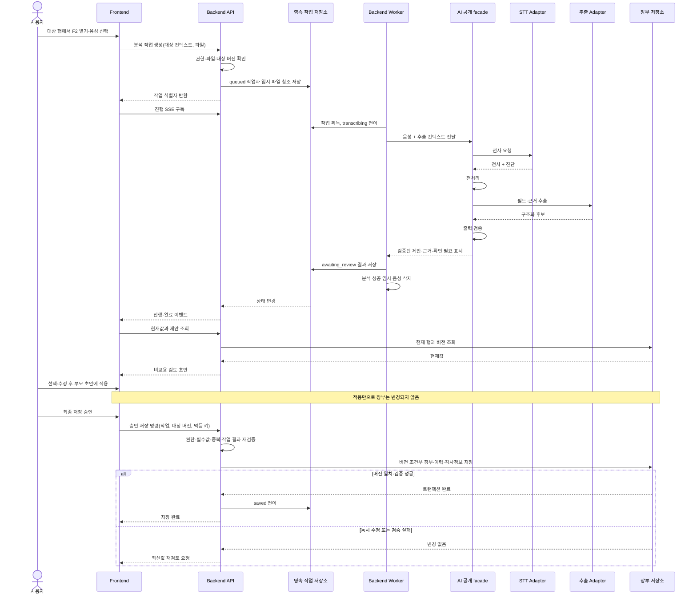
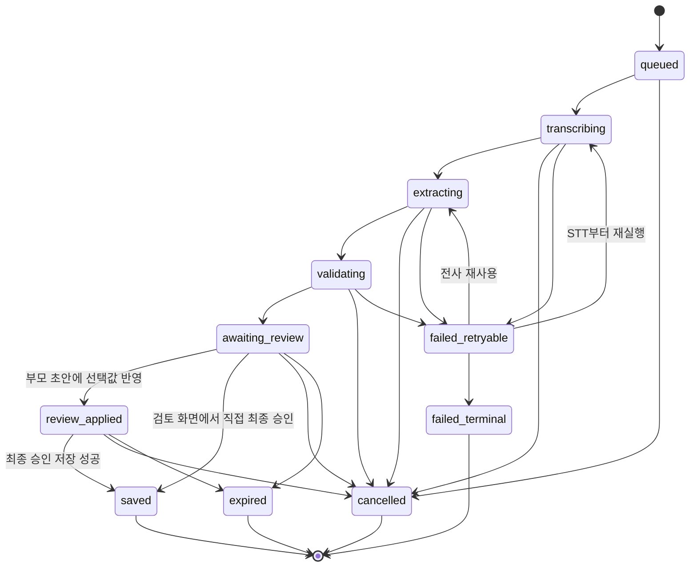

# F2 온라인 실행 아키텍처

## 문서 안내

- **이 문서가 답하는 질문:** 사용자의 분석 요청을 어떻게 안전하게 실행·복구하고, 승인된 변경만 장부에 저장하는가?
- **관련 요구사항:** [F2 정의와 흐름](../../requirements/f2/overview-and-flow.md) · [화면과 업로드](../../requirements/f2/list-and-popup.md) · [STT·AI 처리](../../requirements/f2/processing.md) · [검토·저장](../../requirements/f2/review-and-save.md) · [F1 연동](../../requirements/f1/integrations.md)
- **관련 승인 ADR:** [ADR-0006: AI–Backend 실행 경계](../../../.agents/skills/project-wiki/references/decisions/ADR-0006-ai-backend-boundary.md)
- **이 문서가 소유하지 않는 상세:** DTO·Pydantic 스키마, API 경로, ORM·테이블, 큐 제품, 웹 프레임워크, AI 내부 클래스 구조
- **탐색:** [아키텍처 인덱스](../index.md) · [F2 개요](overview.md) · [오프라인 데이터·학습·평가](offline-data-training-evaluation.md)

## 진입점과 대상 행 컨텍스트

그리드와 상세 화면의 F2 진입점은 모두 하나의 **대상 행 컨텍스트**로 수렴한다. 그리드에서 시작한 경우에도 대상 식별자와 사용자가 본 행 버전을 가지고 F1 상세 컨텍스트를 연 뒤 F2 검토 모달을 표시한다.

Backend는 작업 생성 시 사용자의 접근 권한과 대상의 존재를 확인하고 대상 버전 스냅샷을 기록한다. 이 스냅샷은 나중에 현재값 비교와 동시 수정 감지에만 쓰며 AI 입력에는 포함하지 않는다.

## 실행 구조

API와 Worker는 파일럿에서 같은 배포 단위로 운영할 수 있지만 역할은 논리적으로 분리한다.

- API는 업로드, 작업 명령·조회, 진행 구독, 사용자 승인 요청을 받는다.
- Worker는 영속 작업을 가져와 AI 공개 facade를 호출하고 단계 결과를 기록한다.
- 영속 작업 저장소가 API와 Worker 사이의 실행 경계이며, 프로세스 메모리는 작업 상태의 정본이 아니다.
- Backend는 AI의 공개 기능만 호출하고 프롬프트, 모델 SDK, 그래프 구현에 의존하지 않는다.
- AI facade는 DB 모델이나 Backend repository를 받지 않는 프레임워크 중립 입력·결과 계약을 제공한다.

공개 facade가 제공할 기능은 다음 수준으로 제한한다.

| 기능 | 책임 |
|---|---|
| 상담 음성 분석 | STT부터 검증된 추출 결과까지 실행 |
| 전사 재사용 추출 | 보존 중인 전사로 추출·검증 단계만 재실행 |
| 실행 취소 신호 전달 | 취소 가능한 단계에서 중단하고 정리 가능하도록 협력 |
| 단계 진행·진단 반환 | Backend가 상태와 안전한 오류 분류를 기록하도록 제공 |

구체 함수명, 요청·응답 모델과 예외 클래스는 AI·Backend 모듈 설계에서 정한다.

## 업로드부터 승인 저장까지

AI가 반환한 값은 검토 제안일 뿐이다. Backend가 현재값을 별도로 읽어 비교 화면을 구성하며, 사용자가 `선택 항목 반영`으로 부모 초안에 적용한 뒤 최종 저장을 승인하기 전에는 장부 트랜잭션을 시작하지 않는다.

## AI 선형 파이프라인

현재 F2에는 명시적인 선형 파이프라인을 제안한다.

1. **STT:** 음성에서 전사와 품질 진단을 생성한다.
2. **전처리:** 정규화하되 원문과 근거 위치를 추적할 수 있게 유지한다.
3. **필드 추출:** 허용된 필드의 값, 상담 유형, 근거 후보와 신뢰 신호를 생성한다.
4. **출력 검증:** 허용 필드, 형식, 근거 연결, 불확실 값 정책을 검사한다.

오케스트레이션 프레임워크는 이 흐름의 필수 조건이 아니다. 파이프라인이 분기·반복·도구 호출로 복잡해질 때 별도 결정으로 재검토한다.

## 작업 상태와 영속성

분석 작업 상태와 장부 데이터 상태를 분리한다. 작업 상태는 사용자에게 처리·복구 가능성을 알리고, 장부의 변경 여부는 저장 트랜잭션 결과로만 판단한다.

각 전이는 작업 저장소에 기록한 뒤 진행 이벤트로 내보낸다. Worker가 중단되면 실행 중 상태와 lease/heartbeat 정보를 기준으로 안전한 단계부터 재개하거나 `failed_retryable`로 전환한다. 프로세스 재시작이 작업 소실로 이어져서는 안 된다.

## 진행 알림과 연결 복구

- Frontend는 작업 식별자로 SSE를 구독하고 단계, 진행 메시지, 재시도 가능 여부를 받는다.
- 이벤트는 순서를 식별할 수 있어야 하며 Frontend는 마지막 수신 지점 이후를 재연결한다.
- SSE 연결이 끊겨도 분석은 취소되지 않는다.
- 재연결이 실패하거나 탭을 다시 연 경우 상태 조회로 현재 스냅샷을 복구한 뒤 SSE를 다시 구독한다.
- 진행 메시지와 로그에는 원본 음성, 전사 원문, 개인정보, 모델 내부 응답을 넣지 않는다.

구체 이벤트 이름과 재전송 보관 방식은 [API 계약](../../../.agents/skills/project-wiki/references/contracts/api.md) 및 Backend 내부 설계에서 정한다.

## 재시도·취소·멱등성

| 상황 | 처리 원칙 |
|---|---|
| 업로드 네트워크 오류 | 같은 사용자 요청의 재전송을 중복 작업으로 만들지 않도록 업로드/작업 생성 키를 사용 |
| STT 실패 | 보존 중인 같은 음성을 사용해 STT부터 재실행; 시도 횟수와 오류 분류 기록 |
| 빈 전사 | 추출을 실행하지 않고 재시도 가능 여부를 명시 |
| 추출·검증 실패 | 유효한 전사가 있으면 전사를 재사용해 해당 단계부터 재실행 |
| 사용자 취소 | 새 단계 시작을 막고 Adapter에 취소를 전달한 뒤 임시 음성 삭제 |
| Worker 재실행 | 완료된 단계 산출물과 실행 키를 확인해 중복 모델 호출·중복 저장 방지 |
| 승인 저장 재전송 | 같은 멱등 키는 최초 결과를 반환하며 장부·이력은 한 번만 반영 |

자동 재시도는 일시적 오류로 분류된 경우에만 제한된 횟수로 수행한다. 입력 오류, 정책 위반, 검증 불가능 결과는 자동 재시도하지 않는다. 구체 횟수와 backoff는 큐·운영 정책 결정에 둔다.

## 현재값 비교와 승인 트랜잭션

Backend는 분석 작업에 기록된 대상과 최신 장부값을 결합해 검토 초안을 만든다. 기존 값이 있는 필드는 자동 선택하지 않으며, 제안값·근거·`확인 필요` 상태를 함께 보여준다.

최종 승인 저장에서는 다음을 하나의 Backend 유스케이스로 수행한다.

1. 사용자 권한, 작업 소유자, 작업 만료 여부를 다시 확인한다.
2. 허용 필드와 필수값, 형식, 중복 규칙을 서버에서 재검증한다.
3. 사용자가 검토한 대상 버전과 최신 버전을 비교한다.
4. 버전이 같으면 장부 변경, 변경 이력, 필요한 감사정보를 하나의 트랜잭션으로 기록한다.
5. 버전이 다르면 아무것도 저장하지 않고 최신값 기준 재검토를 요구한다.

AI 제안과 사용자 최종값의 차이는 개선 신호로 남길 수 있지만, 원본 개인정보를 제거한 승인 결과만 오프라인 Data 흐름으로 export한다.

## 데이터 보존 제안

다음은 파일럿의 기술적 정리 주기이며 법정·감사 보존기간을 결정하지 않는다. 모델 실행 환경에 복제된 음성은 성공·실패와 무관하게 각 시도 종료 시 삭제하며, 아래 실패 보존은 Backend가 통제하는 암호화 임시 파일에만 적용한다.

| 데이터 | 제안 주기 | 목적과 처리 |
|---|---|---|
| 성공한 작업의 임시 음성 | `awaiting_review` 전이 직후 삭제 | 제안 생성 후 원본 최소화; 이후 추출 재시도는 전사 재사용 |
| 취소한 작업의 임시 음성 | 취소 확정 직후 삭제 | 더 이상 실행하지 않음 |
| 실패한 작업의 임시 음성 | 최대 1시간 | 같은 파일로 제한적 STT 재시도 후 삭제 |
| 전사·제안 초안 | 생성 후 최대 24시간 | 연결 복구와 사용자 검토; 만료 시 삭제·비식별화 |
| 승인된 장부·이력·감사정보 | 운영·법적 정책에 따름 | 정확한 기간은 [개인정보 정책](../../../.agents/skills/project-wiki/references/privacy/policy.md)의 미확정 사항 |

수명주기 삭제는 정상 종료뿐 아니라 만료 스캐너를 통해 보완하고, 삭제 실패를 관측 가능한 운영 이벤트로 기록한다.

## 오류와 복구 시나리오

| 시나리오 | 사용자에게 보이는 결과 | 시스템 복구 |
|---|---|---|
| 미지원 형식·길이 초과 | 작업 생성 전 입력 수정 안내 | 임시 업로드 즉시 정리 |
| 업로드 중 연결 끊김 | 재업로드 가능 표시 | 멱등 키로 중복 작업 방지, 미완료 조각 정리 |
| STT 일시 실패 | STT 재시도 가능 | 같은 음성으로 STT 단계만 제한 재실행 |
| 빈 전사·품질 부족 | 추출 중단, 다른 음성 요청 또는 재시도 | 추출 Adapter 호출 금지 |
| 추출 일시 실패 | 추출 재시도 가능 | 전사를 유지하고 추출부터 재실행 |
| 출력 검증 실패 | 제안 미노출 또는 확인 필요 안내 | 허용 범위를 벗어난 결과 폐기, 재시도 정책 적용 |
| SSE 연결 끊김 | 재연결 중 표시 | 상태 조회 후 마지막 이벤트 이후 재구독 |
| API/Worker 재시작 | 처리 중 또는 복구 중 표시 | 영속 상태·lease로 작업 회수, 안전한 단계부터 재개 |
| 사용자 취소 | 취소 완료 표시 | 새 호출 차단, 진행 중 호출 취소 시도, 음성 삭제 |
| 검토 중 다른 사용자가 행 수정 | 최신값 재검토 요청 | 버전 조건 실패로 트랜잭션 전체 롤백 |
| 저장 응답 유실 후 재요청 | 최초 저장 결과 표시 | 승인 멱등 키로 중복 장부·이력 생성 방지 |
| 보존기간 만료 | 작업 만료와 재분석 안내 | 초안·임시 파일 정리, 장부는 영향 없음 |

