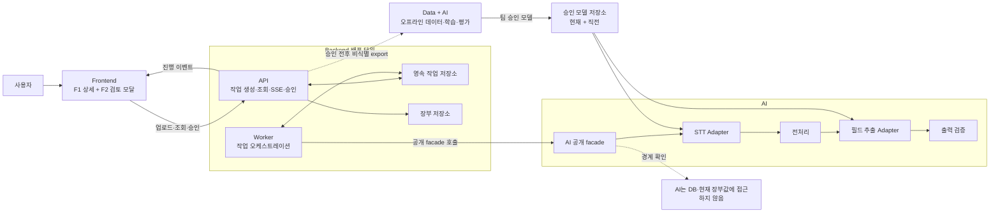

# F2 아키텍처 개요

## 문서 안내

- **이 문서가 답하는 질문:** F2를 어떤 큰 흐름과 모듈 책임으로 구현할 것인가?
- **관련 요구사항:** [F2 정의와 흐름](../../requirements/f2/overview-and-flow.md) · [F2 제외 범위와 완료 기준](../../requirements/f2/scope-and-acceptance.md) · [MVP 범위와 평가](../../requirements/common/mvp-scope-and-evaluation.md) · [F1 연동](../../requirements/f1/integrations.md) · [화면 매트릭스](../../screen/SCREEN_MATRIX_F1_F2_F3.md)
- **관련 승인 ADR:** [ADR-0006: AI–Backend 실행 경계](../../../.agents/skills/project-wiki/references/decisions/ADR-0006-ai-backend-boundary.md)
- **이 문서가 소유하지 않는 상세:** 요구사항 필드 목록, API DTO·경로, DB 테이블, Pydantic 모델, 코드 폴더·클래스 구조
- **탐색:** [아키텍처 인덱스](../index.md) · [온라인 실행](online-runtime.md) · [오프라인 데이터·학습·평가](offline-data-training-evaluation.md)

## 목적과 범위

F2는 업로드한 상담 음성에서 장부 입력 후보와 근거를 만들고, 사용자가 현재값과 비교해 선택·수정·승인한 경우에만 F1 장부에 저장하도록 돕는다.

한 문장으로 요약하면 다음과 같다.

> F1의 대상 행에서 음성을 업로드하면 Backend가 비동기 분석 작업을 관리하고 AI가 전사·추출 제안을 생성하며, 사용자가 검토한 결과를 Backend가 다시 검증한 뒤 하나의 트랜잭션으로 저장한다.

### 포함 범위

- F1 그리드·상세에서 시작하는 F2 분석 진입
- 파일 업로드, 비동기 분석, 진행 상태와 복구
- STT, 전처리, 필드 추출, 출력 검증
- 현재값과 제안값 비교, 사용자 선택·수정·승인
- 승인 시 장부 저장과 감사 가능한 결과 기록
- 합성 데이터셋, 평가, 모델 승격과 운영 피드백 루프

### 제외 범위

- 브라우저 녹음, 실시간 통화, 화자 분리
- AI 제안의 자동 장부 반영
- 요구사항 필드와 검증 규칙의 재정의
- 구체 DTO, API 경로, ORM, 테이블, 모듈 내부 패키지 구조
- DB·큐·웹 프레임워크·서빙 제품의 최종 선정

## 책임 분리

| 모듈 | F2에서 소유하는 책임 | 소유하지 않는 책임 |
|---|---|---|
| Frontend | 대상 행 컨텍스트 유지, 업로드·진행 표시, 현재값/제안값/근거 검토, 사용자 선택·수정·승인 | STT·추출 실행, 장부 트랜잭션, 모델 평가 |
| Backend | 인증·인가, 업로드 및 작업 수명주기, 영속 상태, SSE·상태 조회, 현재값 비교, 멱등성·동시성 검증, 승인 저장, 보존 주기 집행 | 프롬프트·LangGraph·모델 내부 로직 |
| AI | 프레임워크 중립 facade, STT·전처리·추출·출력 검증 파이프라인, 모델 Adapter, 학습·평가 실행 | DB·장부·Backend repository, 사용자 승인 판단 |
| Data | 합성 시나리오와 정답, 데이터 품질·분할·버전·평가 입력, 비식별 피드백 데이터셋 | 온라인 요청 처리, 모델·프롬프트 실행, 운영 DB |
| Infra | 실행 환경, 비밀값, 네트워크·관측성·용량·수명주기 정책의 기반 | 기능 규칙, 사용자 승인, 데이터 라벨 의미 정의 |

Backend와 AI 사이의 확정 경계는 [ADR-0006](../../../.agents/skills/project-wiki/references/decisions/ADR-0006-ai-backend-boundary.md)을 따른다. AI에는 음성 또는 전사와 장부 유형 등 추출에 필요한 컨텍스트만 전달하며, 기존 장부값과 DB 접근 권한은 전달하지 않는다.

## 시스템 구성

AI 경계 표시는 AI가 DB나 현재 장부값에 접근하지 않음을 강조한다. 분석 결과는 먼저 작업 저장소의 검토 초안으로 보존되고, 장부 저장은 사용자의 최종 승인 요청을 Backend가 처리할 때만 발생한다.

## 온라인과 오프라인 흐름

| 흐름 | 입력 | 결과 | 연결 지점 |
|---|---|---|---|
| [온라인 실행](online-runtime.md) | 사용자 음성, 대상 행 컨텍스트 | 검토 가능한 제안, 승인된 장부 변경 | 승인된 모델 버전을 사용하고 비식별 승인 차이를 생성 |
| [오프라인 데이터·학습·평가](offline-data-training-evaluation.md) | 비식별 특성, 합성 시나리오, 평가 계약 | 버전된 데이터셋·평가 보고서·승인 모델 | 승인 모델을 온라인 Adapter에 제공 |

오프라인 개선은 온라인 저장 경로와 분리한다. 운영 피드백이 곧바로 학습이나 배포를 일으키지 않으며, 비식별 export, 평가, 팀 수동 승격을 모두 통과해야 한다.

## 파일럿 운영 가정

다음 값은 용량 산정과 사용자 경험 검증을 위한 **제안**이며 SLA가 아니다.

| 항목 | 파일럿 가정 | 검증 방법 |
|---|---|---|
| 동시 분석 | 5~10건 | 작업 대기시간·실패율·자원 사용량 관찰 |
| 입력 길이 | 음성 3분 이내 | 업로드 검증과 대표 길이별 부하 시험 |
| 사용자 대기 | 업로드 완료 후 제안 검토 가능 상태까지 60초 목표 | 단계별 소요시간과 종단 간 백분위 측정 |

## 결정 상태

| 항목 | 상태 | 근거 또는 영향 |
|---|---|---|
| Frontend·Backend·AI·Data·Infra의 루트 경계 | 결정 | [ADR-0006](../../../.agents/skills/project-wiki/references/decisions/ADR-0006-ai-backend-boundary.md) |
| Backend만 장부와 트랜잭션을 소유하고 AI는 DB를 모름 | 결정 | [ADR-0006](../../../.agents/skills/project-wiki/references/decisions/ADR-0006-ai-backend-boundary.md) |
| 영속 비동기 작업, API/Worker 논리 분리, SSE + 상태 조회 | 제안 | 서버 재시작·연결 끊김에도 작업 복구 가능 |
| AI의 명시적 선형 파이프라인 | 제안 | 현재 F2 복잡도에서 단계 관찰·재시도를 단순화 |
| 합성 데이터 중심 학습·평가와 수동 모델 승격 | 제안 | 개인정보 노출과 자동 배포 위험을 제한 |
| DB·큐·Backend 프레임워크·구체 모델/서빙 제품 | 미확정 | [프로젝트 미해결 질문](../../../.agents/skills/project-wiki/references/open-questions.md)과 모듈별 미해결 질문에서 결정 필요 |
| 정확한 법정·감사 보존기간 | 미확정 | [개인정보 정책](../../../.agents/skills/project-wiki/references/privacy/policy.md) 확정 전까지 운영 정책과 분리 |

현재 문서에는 `구현됨` 상태의 항목이 없다. 실제 코드 경로와 검증 결과가 생긴 뒤에만 그 상태를 사용한다.

