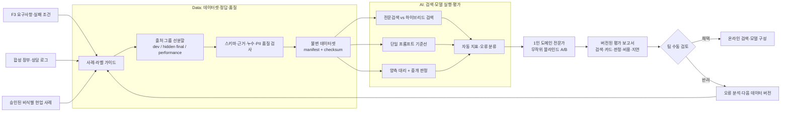

# F3 오프라인 데이터·평가 아키텍처

## 문서 안내

- **이 문서가 답하는 질문:** F3의 검색·대리·중개 판정 품질과 멀티 에이전트 구조의 효과를 어떤 데이터와 절차로 검증하는가?
- **관련 요구사항:** [MVP 범위와 평가](../../requirements/common/mvp-scope-and-evaluation.md) · [후보 추출·도구](../../requirements/f3/candidate-selection-and-tools.md) · [대리·중개 판정](../../requirements/f3/delegates-and-brokerage.md) · [신뢰·비기능·개인정보](../../requirements/f3/trust-nfr-privacy.md) · [수용 기준](../../requirements/f3/scope-acceptance-open.md)
- **관련 지침:** [Data 데이터셋 설계](../../../.agents/skills/data/references/dataset-design.md) · [Data 평가 설계](../../../.agents/skills/data/references/evaluation-design.md) · [AI 모듈 지침](../../../.agents/skills/ai/SKILL.md)
- **이 문서가 소유하지 않는 상세:** 데이터 레코드 스키마, 파일 포맷·저장소, 라벨 필드 정의, 평가 코드 구조, 합격 임계값
- **탐색:** [아키텍처 인덱스](../index.md) · [F3 개요](overview.md) · [온라인 실행](online-runtime.md)

## 목적과 평가 질문

F3 평가는 하나의 종합 점수로 끝내지 않고 실패 원인을 다음 세 계층으로 분리한다.

1. **후보·근거 검색:** 맞는 거래 후보와 필요한 원문 로그를 회수했는가?
2. **포지션 카드:** 각 대리가 허용된 측면의 데이터만 사용해 실제 입장과 근거를 구조화했는가?
3. **중개 판정:** 양측 카드를 비교해 순위·기각·걸림돌·양보 지점·행동을 구체적으로 제안했는가?

최종 의사결정 질문은 다음과 같다.

> 같은 사례와 모델 조건에서 양측 대리 후 중개 판정 구조가 단일 프롬프트 기준선보다 근거 적합성과 중개 판단 품질을 개선하는가?

## 전체 흐름



운영 결과가 데이터셋·프롬프트·온라인 구성으로 자동 반영되는 루프는 두지 않는다. 새로운 오류 사례는 다음 데이터셋 버전에 추가하고 같은 숨김 최종셋을 반복 튜닝에 사용하지 않는다.

## 데이터셋 구성

### 사례의 최소 의미

구체 저장 스키마를 확정하지 않되 한 평가 사례는 다음 의미를 연결할 수 있어야 한다.

- 안정적인 사례 ID, 데이터셋·요구사항·라벨 가이드 버전
- 앵커 측 구조화 데이터와 날짜 신호
- 원본 순서·시각·화자·측면·`log_id`를 보존한 앵커 상담 로그
- 반대편 대상들의 구조화 데이터와 측면별 상담 로그
- 기대 SQL 후보 집합·우선순위와 사용한 조건
- 기대 포지션 카드 또는 항목별 허용 판정·`불명/추정` 상태
- 각 판정의 기대 근거 `log_id`와 최신 정정·철회 관계
- 중개 판정 사람 평가용 기준과 판정 불가 조건
- 원천, 난이도, 시간 범위, 충돌·부정·희소 조건 같은 slice 메타데이터

정답이 하나로 고정될 수 없는 중개 문장은 허용 가능한 판단 범위와 평가 rubric으로 관리한다. 빈 값, 정보 없음, 판단 불가와 라벨 누락을 같은 상태로 합치지 않는다.

### 데이터셋 묶음

| 묶음 | 목적 | 주요 내용 |
|---|---|---|
| 합성 개발셋 | 검색·프롬프트·워크플로 반복 개발 | 정상, 경계, 충돌, 철회, 조건부 자금, 로그 부족과 대리 격리 사례 |
| 숨김 최종셋 | 멀티 에이전트 품질 결론 | 별도 생성 계열과 승인된 비식별 현업 사례; 정답 접근 제한 |
| 검색 평가셋 | 전문검색과 하이브리드 검색 비교 | 동의어·현업 표현·오타·부정·철회·최신 진술과 기대 근거 집합 |
| 후보 SQL 평가셋 | 결정적 후보 정확성 | 추정 가격, 평형, 날짜, 가격 변경, 후보 없음, 5건 초과 페이징 |
| 성능셋 | 지연·용량 검증 | 7,200행 이상 세대와 수만 건 로그, 인덱스 누락·재색인 상태 |

### 합성·비식별 현업 데이터 정책

- 개발과 오류 재현은 합성 데이터를 우선한다.
- 최종 품질 결론 전 승인된 비식별 현업 사례를 반드시 포함한다.
- 현업 사례는 성명·연락처·주소 상세와 희귀 재식별 조합을 제거하거나 가명화한다.
- 비식별화로 시간 순서, 부정·정정·철회와 현업 표현의 의미가 바뀌지 않았는지 표본 검수한다.
- 개인정보 처리 근거와 반출 승인이 확보되지 않으면 해당 사례를 사용하지 않으며 실제 현업 분포에 대한 품질 결론도 내리지 않는다.

## 분할·계보와 품질 게이트

동일 인물·세대·상담 원천·파생 문장·유사 시나리오가 분할을 넘지 않도록 출처 그룹을 먼저 배정한다.

| 분할 | 용도 | 격리 규칙 |
|---|---|---|
| dev | 프롬프트·검색·워크플로 선택과 오류 분석 | 반복 확인 허용; hidden final 파생 사례 금지 |
| hidden final | 최종 구조 비교와 품질 결론 | 정답과 A/B 식별을 평가 실행·개발자에게 숨김 |
| performance | SQL·검색·작업 지연과 용량 검증 | 품질 정답과 분리하며 규모·분포·인덱스 상태 고정 |

배포 데이터셋은 manifest에 원천·이용 조건, 생성 설정·seed, 분할과 사례 수, 개인정보 등급, 라벨·평가 계약 버전, 파일 체크섬과 알려진 한계를 기록한다.

다음 품질 검사를 통과하지 못한 사례는 평가에 편입하지 않는다.

- 필수 의미와 ID·근거 참조 무결성
- 구조화 값과 상담 로그·정답 간 모순
- 중복·근접 중복과 출처 그룹 분할 누수
- 정답 누락, `불명/추정` 라벨 오용과 최신 진술 관계 오류
- 개인정보·비밀값 잔존과 비식별화 의미 왜곡
- manifest 건수·분포와 실제 산출물·체크섬 불일치

## 모듈별 오프라인 책임

| 단계 | Data | AI | Backend |
|---|---|---|---|
| 사례 준비 | 원천 등록, 합성 시나리오, 비식별화, 정답·slice·분할 | 모델 입력 가능성 검토 | 승인된 운영 데이터 export 계약 제공 |
| 검색 평가 입력 | 기대 근거 집합과 부정·최신성 라벨 | 검색 질의 생성·평가 실행과 지표 산출 | 전문검색·벡터 검색 Adapter의 평가용 구현 제공 |
| Agent 평가 | 불변 사례·정답·rubric 제공 | 기준선·대리·중개 판정 실행, 오류 분류 | 운영 DB가 아닌 평가용 capability 제공 |
| 보고서 | 데이터 계보·품질 상태 확인 | 자동 지표·실행 비용·지연·재현 정보 생성 | 온라인 구성과 운영 지표 연결 검토 |
| 채택 | 데이터셋·평가 계약 완전성 확인 | 후보 모델·검색·프롬프트 구성 제공 | 수동 승인된 구성만 온라인 조립 지점에 적용 |

Data가 모델이나 pgvector를 직접 실행하지 않고 AI 평가 실행과 Backend 검색 Adapter를 소비한다. AI와 Data는 운영 DB를 직접 조회하지 않는다.

## 평가 계층과 지표

정확한 합격 임계값은 기준선 측정 후 팀이 별도로 승인한다. 임의 수치를 이 문서에서 합격선으로 만들지 않는다.

| 계층 | 핵심 질문 | 보고 지표·판정 |
|---|---|---|
| 후보 SQL | 맞는 후보를 빠짐없이 규칙대로 찾았는가? | Recall@K, Precision@K, 필터 위반률, 순서 일치, 100ms 목표 지연 |
| 로그 검색 | 필요한 원문과 최신 문맥을 회수했는가? | 근거 Recall@K, 무관 근거율, 철회·부정 오회수율, 최신 진술 보존, 검색 지연 |
| 포지션 카드 | 허용 측면에서 실제 입장과 근거를 구조화했는가? | 항목별 정확도·F1, 근거 지지율, 무근거 단정률, `불명/추정` 적절성 |
| 중개 판정 | 전체 후보를 비교해 유용한 판단을 냈는가? | 등급·기각 오류, pairwise 순위, 걸림돌·양보 지점·행동 rubric, 블라인드 선호 |
| 경계·신뢰 | 정보 격리와 추적이 지켜졌는가? | 반대편 도구 호출 0건, 근거 추적 성공률, 권한·마스킹 위반률 |
| 종단·운영 | 사용자 경험과 비용 목표를 만족하는가? | 5초 내 단계/완료 비율, 총 지연, 호출 수·토큰, 캐시 재사용, 실패·재시도율 |

검색 실패와 추론 실패를 분리한다. 기대 근거가 검색 결과에 없으면 검색 실패이고, 근거가 제공됐지만 카드나 판정이 틀리면 추론 실패다. 타임아웃·파싱·실행 실패도 평가에서 제외하지 않고 별도 오류로 집계한다.

## 전문검색과 하이브리드 검색 비교

같은 검색 평가 사례에 다음 두 구성을 실행한다.

1. 메타데이터 필터 + 전문검색
2. 같은 메타데이터 필터 + 전문검색과 pgvector 의미 검색의 합집합·문맥 확장

두 구성은 같은 로그 스냅샷, 질의, 접근 범위와 평가 계약을 사용한다. 하이브리드 검색은 표현 다양성 회수 이득뿐 아니라 부정·철회 혼동, 지연, 인덱스 누락 시 폴백과 개인정보 처리 비용을 함께 보고한다.

임베딩 모델·전처리·인덱스 버전과 검색 구성은 평가 보고서에 고정한다. 모델을 바꾸고 기존 벡터와 섞거나, 결과를 본 뒤 유리한 top-K·slice로 최종 평가를 다시 정의하지 않는다.

## 단일 프롬프트와 멀티 에이전트 비교

수용 기준의 동일 20개 사례를 최소 비교 단위로 사용한다.

- 기준선과 후보는 같은 구조화 데이터·로그 스냅샷·검색 결과·모델 계열과 출력 예산을 사용한다.
- 단일 프롬프트는 양측 자료를 한 번에 받아 직접 중개 판정을 생성한다.
- 멀티 에이전트는 격리된 양측 대리가 카드를 만든 뒤 중개 판정이 카드만 비교한다.
- 모델·프롬프트·워크플로와 검색 버전을 결과와 함께 기록한다.
- 출력에서 구성 이름을 제거하고 A/B 위치를 무작위화한다.
- 1인 도메인 전문가가 걸림돌 구체성, 양보 지점, 근거 적합성, 중개 판정 품질과 전체 선호를 평가한다.
- 1인 평가이므로 평가자 간 일치도를 제공할 수 없으며 이를 결과 한계로 명시한다.

평가자가 결과를 보고 기준이나 정답을 변경하면 새 라벨·평가 계약 버전을 발행하고 기존 보고서를 보존한다.

## 시스템 검증 시나리오

품질 평가와 별도로 다음 아키텍처 동작을 자동 또는 장애 주입 검증 대상으로 둔다.

- 손님/매물 저장과 손님/세대 상세의 [교차 판정] 버튼 실행으로 구성된 네 트리거
- 5초 초과 시 앵커·SQL 후보·진행률 부분 표시와 F1 비차단
- 후보 없음, 5건 초과 페이징과 가격 변경 후 새 후보 유입
- 일부 후보 카드, 중개 모델과 임베딩 생성·검색 실패
- 임베딩 인덱스 지연·재색인 중 전문검색 폴백
- Worker·API 재시작 후 영속 작업 복구와 중복 호출 방지
- 로그·가격·상태·조건 변경에 따른 캐시 무효화와 `superseded` 실행
- 매물·손님 대리 도구 격리와 중개 판정의 도구 미보유
- 원본 근거 이동, 개인정보 마스킹과 권한 변경 시 결과 차단
- F3 전체 중단 중 F1 조회·저장·편집 정상 동작

## 버전과 채택

평가 보고서에서 다음 관계를 추적할 수 있어야 한다.

```text
요구사항·라벨 가이드
  → dataset_version + manifest
  → search_config + embedding_version
  → model + prompt + workflow_version
  → evaluation_contract
  → report_id
  → 팀 수동 검토 기록
  → 온라인 구성 이력
```

온라인 구성은 보고서 검토 후 수동으로 적용한다. 검색·모델 구성 변경이 품질이나 개인정보 정책을 악화시키면 직전 승인 구성으로 되돌릴 수 있게 현재와 직전 구성을 식별해 보존한다.

## 미확정 사항과 완료 제한

- 데이터 저장 위치·포맷, 라벨링 운영, 숨김 평가 접근 권한은 [Data 미해결 질문](../../../.agents/skills/data/references/open-questions.md)에서 결정한다.
- 구체 DB·큐·웹 프레임워크와 모델 제공자는 [프로젝트 미해결 질문](../../../.agents/skills/project-wiki/references/open-questions.md)과 모듈 결정에서 관리한다.
- 개인정보 처리 근거·보존기간과 외부 모델 전송 조건은 [개인정보 정책](../../../.agents/skills/project-wiki/references/privacy/policy.md)을 따른다.
- 비식별 현업 최종셋 검증 전에는 실제 현업 분포에 대한 F3 품질 결론을 내리지 않는다.
- 현재 문서의 제품명·평가 절차와 온라인 채택 흐름은 팀 검토용 제안이며 합격 임계값이나 기술 승인을 대신하지 않는다.
