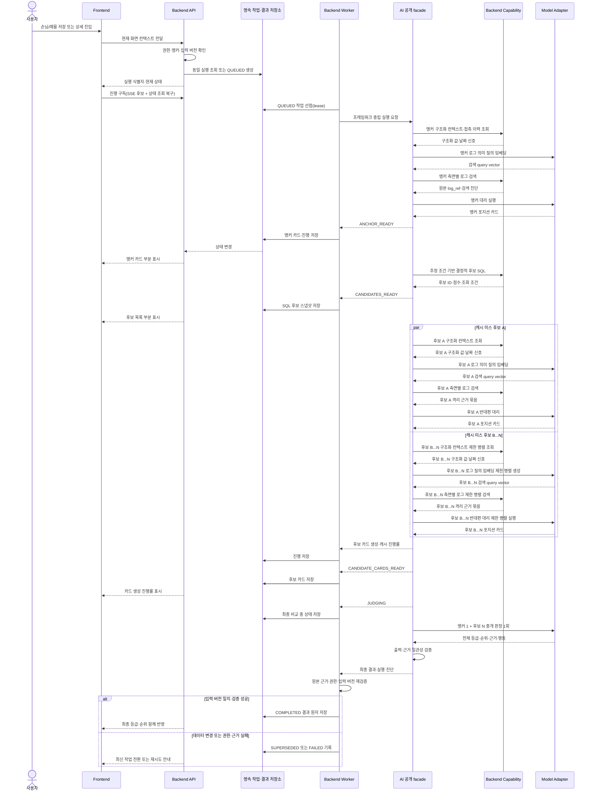

# F3 온라인 실행 아키텍처

## 문서 안내

- **이 문서가 답하는 질문:** 자동 트리거된 F3 교차 판정을 어떻게 비차단으로 실행·복구하고 검증된 최종 결과를 표시하는가?
- **관련 요구사항:** [포지션 카드와 캐시](../../requirements/f3/position-card.md) · [대리·중개 판정](../../requirements/f3/delegates-and-brokerage.md) · [후보 추출·도구](../../requirements/f3/candidate-selection-and-tools.md) · [교차 판정](../../requirements/f3/cross-judgment.md) · [신뢰·비기능·개인정보](../../requirements/f3/trust-nfr-privacy.md)
- **관련 승인 ADR:** [ADR-0006: AI–Backend 실행 경계](../../../.agents/skills/project-wiki/references/decisions/ADR-0006-ai-backend-boundary.md)
- **이 문서가 소유하지 않는 상세:** API 경로·전송 스키마, DB 테이블, 큐·Worker 제품, 재시도 횟수, 검색 top-K와 점수 가중치
- **탐색:** [아키텍처 인덱스](../index.md) · [F3 개요](overview.md) · [오프라인 데이터·평가](offline-data-evaluation.md)
- **읽는 법:** 이 문서의 본문은 **목표 아키텍처**다. 지금 저장소에 있는 것과 없는 것은 [현재 구현 범위](#현재-구현-범위)에서 확인한다.

## 트리거와 작업 생성

MVP의 교차 판정은 다음 네 사용자 행동에서 시작한다.

| 트리거 | 앵커 | 실행 시점 |
|---|---|---|
| 손님 신규 등록·조건 수정 저장 | 손님 | F1 저장 성공 후 |
| 매물 신규 등록·가격 변경 저장 | 매물 | F1 저장 성공 후 |
| 손님 상세 진입 | 손님 | 현재 데이터 버전 확인 후 |
| 세대 상세 진입 | 매물 | 현재 데이터 버전 확인 후 |

Backend는 F1 저장 트랜잭션과 F3 실행을 분리한다. F3 작업 생성이나 실행이 실패해도 이미 성공한 F1 저장을 되돌리지 않으며, 상세 진입에서도 F3 패널만 로딩·실패 상태를 표시한다.

작업 생성 시 사용자 권한, 앵커 종류·식별자, 현재 데이터 버전과 활성 AI 구성을 확인한다. **목표 정책은** 같은 앵커·입력·AI 구성의 활성 작업이나 완료 결과가 있으면 새 모델 호출을 만들지 않고 기존 작업을 구독하거나 결과를 재사용하는 것이다. 현재 구현은 요청마다 새 실행을 만든다. 아래 [현재 구현 범위](#현재-구현-범위)를 함께 본다.

앵커 유효성은 F1 장부 조회 범위를 그대로 따른다. 매물 앵커는 사무소, 매물 삭제 여부와 **부모 세대 삭제 여부**를 모두 만족해야 한다. F1의 세대 소프트 삭제는 이력 보존을 위해 딸린 매물 행을 건드리지 않으므로 매물 행의 표시만 보면 화면에 없는 세대의 매물이 앵커로 들어온다.

## 실행 구조와 공개 경계

API와 Worker는 파일럿에서 같은 배포 단위에 둘 수 있지만 역할은 논리적으로 분리한다.

- API는 자동 트리거, 작업·결과 조회, 진행 구독과 사용자 피드백을 처리한다.
- 영속 작업 저장소가 실행 상태와 단계 산출물의 정본이며 프로세스 메모리는 정본이 아니다.
- Worker는 작업을 획득하고 AI 공개 facade를 호출하며 단계 진행과 최종 결과를 저장한다.
- AI facade는 워크플로·Agent·모델 호출을 소유하고 주입된 Backend capability만 사용한다.
- Backend capability는 AI 상태나 LangGraph 타입을 받지 않고 요청 범위에 필요한 최소 조회만 제공한다.

### Backend에서 AI로 전달하는 실행 의미

| 의미 | 용도 |
|---|---|
| 실행·추적 식별자 | 중복 방지, 진행·비용·오류 상관관계 |
| 트리거와 앵커 종류·식별자 | 어느 교차 판정인지 결정 |
| 입력 데이터 버전 | 캐시·stale 판단과 재현성 |
| 권한 범위·측면 제한 | capability가 읽을 수 있는 대상을 제한 |
| 모델·프롬프트·워크플로 구성 버전 | 결과 재사용과 평가 추적 |

### AI가 사용하는 Backend capability

| Capability | 허용 책임 |
|---|---|
| 매물 컨텍스트 조회 | 세대·매물·임대차·날짜 신호와 매물 측 접근 범위 반환 |
| 손님 컨텍스트 조회 | 희망 조건·진행 상태·날짜 신호와 손님 측 접근 범위 반환 |
| 측면별 상담 로그 검색 | 허용된 측면 안에서 전문검색+벡터 검색과 원본 근거 반환 |
| 접촉 이력 조회 | 최종 접촉일·수단·응답 여부 반환 |
| 결정적 후보 검색 | 앵커 카드의 추정 조건으로 SQL 후보·점수·조회 조건 반환 |
| 체크포인트·캐시 | 저장 기술을 노출하지 않고 단계 복구와 카드 재사용 지원 |
| 진행 보고 | Backend가 저장할 안전한 단계·진단 반환 |

매물 대리와 손님 대리에는 서로 다른 capability 집합을 조립한다. 중개 판정은 카드 이외의 capability를 받지 않는다.

## 자동 트리거부터 최종 표시까지

`CANDIDATES_READY`까지는 SQL 후보이며 AI 등급이 아니다. 후보 간 순위가 전체 비교 전 뒤집히지 않도록 `JUDGING` 완료 전에는 강함·약함·기각과 최종 순위를 노출하지 않는다.

## 작업 상태와 공개 정책

상태값은 `agent_run.status` 기본값에 맞춰 대문자 스네이크로 표기한다. `QUEUED`와 `RUNNING`은 Worker가 작업을 잡았는지를 나타내는 실행 제어 상태이고, `ANCHOR_READY` 이후는 실제 업무 처리 진행 상태다.

| 상태 | 구분 | 의미 | 사용자 공개 |
|---|---|---|---|
| `QUEUED` | 실행 제어 | 영속 작업 생성, Worker 대기 | 실행 준비 중 |
| `RUNNING` | 실행 제어 | Worker가 lease를 걸고 선점함 | 실행 중 |
| `ANCHOR_READY` | 업무 처리 | 앵커 카드 검증·저장 완료 | 앵커 카드와 근거 표시 |
| `CANDIDATES_READY` | 업무 처리 | 결정적 SQL 후보 스냅샷 완료 | 후보 수·조회 조건·목록 표시 |
| `CANDIDATE_CARDS_READY` | 업무 처리 | 필요한 후보 카드 생성·재사용 완료 | 생성/캐시 진행률과 카드 근거 표시 가능 |
| `JUDGING` | 업무 처리 | 전체 후보 중개 판정 1회 실행 중 | 최종 비교 중; 임시 등급 미표시 |
| `COMPLETED` | 업무 처리 | Backend 검증을 통과한 최종 결과 저장 | 전체 등급·순위 원자 반영 |
| `FAILED_RETRYABLE` | 종료 | 모델·검색·Worker의 일시 오류 | F1은 계속 사용, F3 재시도 제공 |
| `FAILED_TERMINAL` | 종료 | 입력·권한·출력 검증의 영구 오류 | 안전한 오류와 수정 방법 표시 |
| `CANCELLED` | 종료 | 더 이상 현재 화면에서 실행할 필요 없음 | 마지막 안전 상태 유지 또는 닫기 |
| `SUPERSEDED` | 종료 | 실행 중 입력 데이터가 변경됨 | 결과 미반영, 최신 버전 작업으로 전환 |

현재 Backend가 실제로 기록하는 상태는 실행 접수 시 `QUEUED`, Worker 선점 시 `RUNNING`, lease 최대 시도 초과 시 `FAILED_TERMINAL` 세 가지다. 나머지는 아직 `제안`이며 구현되지 않았다.

`ANCHOR_READY`는 원장 조회를 끝냈다는 뜻이 아니라 **유효한 앵커 포지션 카드를 확보했다**는 뜻이다. Worker는 선점 후 카드 캐시를 먼저 조회한다. cache hit이면 기존 카드를 재사용하고, cache miss이면 AI 카드 생성이 필요하다. 카드를 확보하기 전에는 `ANCHOR_READY`로 넘어가지 않으며 빈 카드로 상태만 진행시키지 않는다.

현재 구현된 범위는 lease 소유권 확인, 앵커·입력 버전 확인, cache key 계산, 캐시 조회와 생성 요청 준비까지다. AI 카드 생성과 `ANCHOR_READY` 전환은 아직 구현하지 않았다.

포지션 카드 cache key의 현재 schema version은 `position-card:v2`이며 마지막 상담 시각만으로는 부족하다. F1의 상담 로그 추가는 매물·구입장의 `row_version`을 올리지 않으므로, 기존 최신 로그보다 **과거 시각의 로그를 추가**하거나 **로그를 무효화**하면 `MAX(interaction_at)`과 데이터 버전이 그대로여서 낡은 카드가 재사용된다. 따라서 key에는 상담 로그 **건수**와 **최대 로그 ID**를 source revision으로 함께 넣어 집합이 바뀌면 반드시 cache miss가 되게 한다.

이 `position-card:v2`는 키 계산 방식의 버전이며 Backend–AI 계약 버전 `position-card:v1`과 서로 다른 것을 버전한다. 번호가 다른 것은 정상이다.

재사용 판정은 cache key만 믿지 않고 저장된 카드의 `source_interaction_count`와 `last_interaction_at`을 현재 값과 다시 대조한다. 조회 시점과 카드 저장 시점 사이에 로그가 또 바뀔 수 있으므로, 카드 저장과 `ANCHOR_READY` 전환 단계에서 생성 요청에 실린 source identity를 한 번 더 확인해야 한다. 그 재검증은 아직 구현하지 않았다.

**목표 정책은** 5초 안에 `COMPLETED`가 되지 않으면 빈 패널을 유지하지 않고 확보된 마지막 안전 단계를 표시하는 것이다. SSE 후보 연결이 끊기면 작업은 취소되지 않으며 상태 조회로 스냅샷을 복구한 뒤 마지막 이벤트 이후를 다시 구독한다.

SSE 진행 구독과 재연결은 아직 구현하지 않았다. 현재 Frontend가 쓸 수 있는 것은 `GET /api/v1/f3/runs/{run_id}` polling뿐이다.

## 현재 구현 범위

이 절이 위 목표 아키텍처 중 무엇이 저장소에 있고 무엇이 없는지의 정본이다. 상태 표의 `구현됨` 표기와 [API 계약](../../../.agents/skills/project-wiki/references/contracts/api.md)의 F3 절은 이 절과 같은 사실을 설명해야 한다.

### 구현됨

| 항목 | 위치 |
|---|---|
| `POST /api/v1/f3/runs`. 요청마다 새 `QUEUED` 실행 생성 | `backend/src/api/f3_runs.py` |
| 앵커 검증. 사무소, 매물·부모 세대·구입장 삭제 여부 | `backend/src/domain/agent_execution/service.py` |
| `GET /api/v1/f3/runs/{run_id}` polling용 상태 조회 | `backend/src/api/f3_runs.py` |
| `claim_next_run` 작업 선점과 5분 lease·3회 상한 | `backend/src/domain/agent_execution/service.py` |
| 앵커 포지션 카드 cache key 계산과 캐시 조회, 생성 요청 준비 | `backend/src/domain/agent_execution/service.py` |
| 포지션 카드 Backend–AI 공개 계약. 어휘, 요청·결과 DTO, 생성 Protocol, 요청·결과 교차 검증 | `ai/src/brokerage_ai/f3/` |
| 포지션 카드 프롬프트와 구조화 출력 생성 (`position-card-prompt:v1`, `position-card-workflow:v1`) | `ai/src/brokerage_ai/f3/prompts.py`, `generator.py` |
| API와 같은 image를 쓰는 Worker 프로세스 진입점 | `backend/src/worker.py`, `infra/deploy/compose.dev.yml` |
| Worker의 DB readiness 확인, readiness file, SIGTERM·SIGINT graceful shutdown | `backend/src/worker.py` |
| `WORKER_ENABLED=false` 배포. 작업을 하나도 claim하지 않고 대기 | `backend/src/worker.py` |

Worker 배포 계약의 정본은 [백엔드 ADR-0003](../../../.agents/skills/backend/references/decisions/ADR-0003-dev-deployment-contract.md)이다.

포지션 카드의 Backend–AI 어휘와 DTO 정본은 [F3 AI 계약](../../../.agents/skills/project-wiki/references/contracts/f3-ai.md)이다. `negotiation_side`는 `LISTING`·`REQUIREMENT`로 확정됐고 더 이상 내부 임시값이 아니다. 계약 버전 `position-card:v1`은 아래 cache key 버전 `position-card:v2`와 다른 축이다.

### 미구현

| 항목 | 현재 상태 |
|---|---|
| Worker polling loop | 없음. `WORKER_ENABLED=false` Worker는 stop 이벤트만 기다린다 |
| Worker의 `claim_next_run` 호출 연결 | 유스케이스는 있으나 Worker가 부르지 않는다 |
| 실제 F3 handler | 없음. `WORKER_ENABLED=true`는 `ConfigurationError`로 기동을 거부한다 |
| AI 호출 | 없음. F3 경로는 AI runtime을 부르지 않는다 |
| Backend의 포지션 카드 생성기 연결 | AI 생성기는 있으나 F3 handler가 아직 호출하지 않는다 |
| LangGraph production graph와 checkpoint | 없음. 포지션 카드 생성은 구조화 출력 1회이며 이름뿐인 graph를 두지 않는다 |
| Backend 의 F1 snapshot 조립과 상담 로그 마스킹 | 없음. 계약이 요구하는 마스킹 입력을 아직 만들지 않는다 |
| 포지션 카드 저장 | 조회와 생성 요청 준비까지만 있다. 근거 저장과 quote offset 계산도 없다 |
| `ANCHOR_READY` 이후 상태 전이 완료 경로 | 없음 |
| 같은 앵커·입력 버전의 활성 실행 재사용 (F3-CR-12) | 없음. 요청마다 새 실행 |
| 뒤따른 화면의 기존 실행 구독 | 없음 |
| `SUPERSEDED` 전이 | 없음 |
| SSE 진행 구독과 재연결 | 없음. polling만 제공 |
| `WORKER_ENABLED=true` 운영 | 허용하지 않는다 |

## 결정적 후보 검색

후보 검색은 Agent가 생성한 자유문을 SQL로 번역하지 않는다. 앵커 카드에서 검증된 추정 가격·평형·시점 같은 제한된 조건을 Backend query가 받아 구조화 장부 데이터에 적용한다.

- 후보 포함·제외는 SQL 조건으로 결정한다.
- 가격 근접도·평형 일치·접수 최신순 점수는 우선 카드화 순서를 정할 뿐 중개 등급을 대신하지 않는다.
- 상위 15건을 먼저 카드화하고 나머지 후보 수와 다음 페이지를 보존한다.
- 조건에 맞는 후보가 없으면 사용한 조회 조건과 함께 빈 결과를 저장한다.
- 7,200행 규모의 100ms 목표는 AI 품질 평가와 분리한 Backend 성능 검증으로 확인한다.

## 하이브리드 상담 로그 검색

로그 검색은 다음 순서로 동작한다.

1. AI의 로그 검색 도구가 의미 질의를 만들고 AI embedding Adapter가 검색 query vector를 생성한다.
2. 요청 사용자 권한, 대리 측면, 대상, 기간을 필수 메타데이터 필터로 적용한다.
3. 전문검색과 pgvector 의미 검색을 같은 제한 범위 안에서 병렬 실행한다.
4. 결과 합집합에서 같은 `log_id`를 제거하고 각 검색 방식과 관련 진단을 남긴다.
5. 검색 적중 로그의 인접 문맥과 이후 정정·철회·최신 진술을 시간순으로 확장한다.
6. 원문 `log_id`, 시각, 화자·측면과 검색 범위를 Agent에 반환한다.

모든 과거 로그가 검색 대상이라는 의미에서 전 기간을 인덱싱한다. 한 번의 top-K만으로 전 기간을 읽었다고 간주하지 않으며 Agent는 필요할 때 기간·키워드를 바꿔 후속 검색할 수 있다. 최신 진술이 과거 의향을 철회하는 경우 시간 순서가 벡터 유사도보다 우선한다.

### 임베딩 생성과 재색인

- Backend는 로그 추가·수정 후 별도의 인덱싱 작업을 만들며 F1 저장 성공을 임베딩 완료까지 지연하지 않는다.
- AI embedding facade가 마스킹된 로그 원문을 활성 임베딩 모델로 변환하고 모델·전처리 버전을 반환한다.
- Backend는 원문, 벡터, 로그 버전과 임베딩 버전을 저장하고 접근 제어를 적용한다.
- 활성 임베딩 버전이 바뀌면 새 인덱스를 병행 생성하고 검증 후 전환한다. 이전 인덱스를 조용히 덮어쓰지 않는다.
- 임베딩 누락·실패·재색인 중에는 전문검색 결과로 계속 동작하고 `semantic_coverage`가 불완전하다는 실행 진단을 남긴다.
- 외부 임베딩 제공자를 사용할 경우 성명·연락처와 직접 식별자를 치환한 후 전송한다.

pgvector, PostgreSQL 전문검색과 구체 결합 점수·top-K는 후보 구현이다. 검색 Adapter의 공개 의미는 제품을 교체해도 유지한다.

## 캐시·중복 실행과 stale 처리

| 대상 | 재사용 기준 | 무효화 조건 |
|---|---|---|
| 포지션 카드 | 대상 ID, 마지막 로그 시각, 데이터 버전, 대리·모델·프롬프트 버전 일치 | 로그 추가, 가격·상태·조건 변경, 정정, AI 구성 변경 |
| 최종 교차 판정 | 앵커·후보 집합과 각 카드 버전, 중개 모델·프롬프트·워크플로 버전 일치 | 카드·후보 집합·AI 구성 중 하나라도 변경 |
| 활성 작업 | 앵커, 입력 버전, AI 구성과 권한 범위 일치 | 입력 버전 또는 권한 변경 |

**목표 정책은** 동일 키의 활성 작업을 하나만 실행하고 뒤따른 화면이 그 작업을 구독하는 것이다. 실행 중 F1 데이터가 바뀌면 이전 실행을 강제 성공으로 덮어쓰지 않고 `SUPERSEDED`로 남기며, 새 입력 버전 작업이 현재 화면의 결과 소유권을 가진다.

활성 작업 재사용, 기존 작업 구독과 `SUPERSEDED` 전이는 아직 구현하지 않았다. 현재는 `POST /api/v1/f3/runs` 요청마다 새 `QUEUED` 실행이 생기고, 앵커가 바뀐 실행은 Worker 단계에서 거부될 뿐 `SUPERSEDED`로 기록되지 않는다.

## 검증·개인정보와 실행 로그

AI와 Backend 검증을 분리한다.

- AI는 카드·중개 결과 형식, 인용과 판단의 일관성, 근거 없는 항목의 `추정` 표시를 검증한다.
- Backend는 `log_id` 존재, 원문 일치, 요청자 권한, 대리 측면, 입력 버전과 개인정보 마스킹을 검증한다.
- 검증되지 않은 근거를 조용히 제거하고 나머지를 성공으로 위장하지 않는다. 영향 범위에 따라 항목을 `판정 불가`로 바꾸거나 작업을 실패시킨다.
- 실행 로그에는 Agent·도구·검색 방식·근거 ID·입력/모델/프롬프트 버전·호출 수·토큰·지연·캐시 여부를 남긴다.
- 사용자용 진행 이벤트와 일반 오류 로그에는 상담 원문, 연락처, 모델 원문 응답을 넣지 않는다.

## 오류와 복구 시나리오

| 시나리오 | 사용자에게 보이는 결과 | 시스템 처리 |
|---|---|---|
| 후보 없음 | 조회 조건과 후보 없음 표시 | 정상 완료; 조건 완화는 사용자 선택으로만 실행 |
| 일부 후보 카드 실패 | 성공·실패 진행과 제한된 결과 안내 | 실패 후보를 기록하고 전체 판정 가능 여부를 명시적으로 판단 |
| 중개 모델 일시 실패 | 앵커·SQL 후보·카드는 유지, 재시도 제공 | 중개 판정 단계만 제한 재실행 |
| 임베딩 생성·검색 실패 | 의미 검색 축소 진단 표시 | 전문검색으로 폴백하고 실패를 별도 계측 |
| Worker 재시작 | 처리 중 또는 복구 중 표시 | 영속 단계·lease로 작업 회수, 완료 호출 중복 방지 |
| 진행 연결 끊김 | 재연결 중 표시 | 상태 조회 후 마지막 이벤트 이후 구독 |
| 입력 데이터 변경 | 최신 데이터로 다시 판정 중 표시 | 이전 실행 `SUPERSEDED`, 새 버전 실행 생성 |
| 권한 변경·근거 불일치 | 결과 미노출, 접근 또는 재실행 안내 | Backend 최종 검증 실패와 감사 기록 |
| F3 전체 중단 | F3 패널 실패·재시도 표시 | F1 조회·저장·편집은 계속 동작 |

자동 재시도는 일시 오류에만 적용한다. 구체 횟수·backoff·Worker/큐 제품은 Backend 운영 설계에서 정하고, 모든 모델·도구 호출에는 멱등 또는 안전한 재실행 전략을 둔다.
