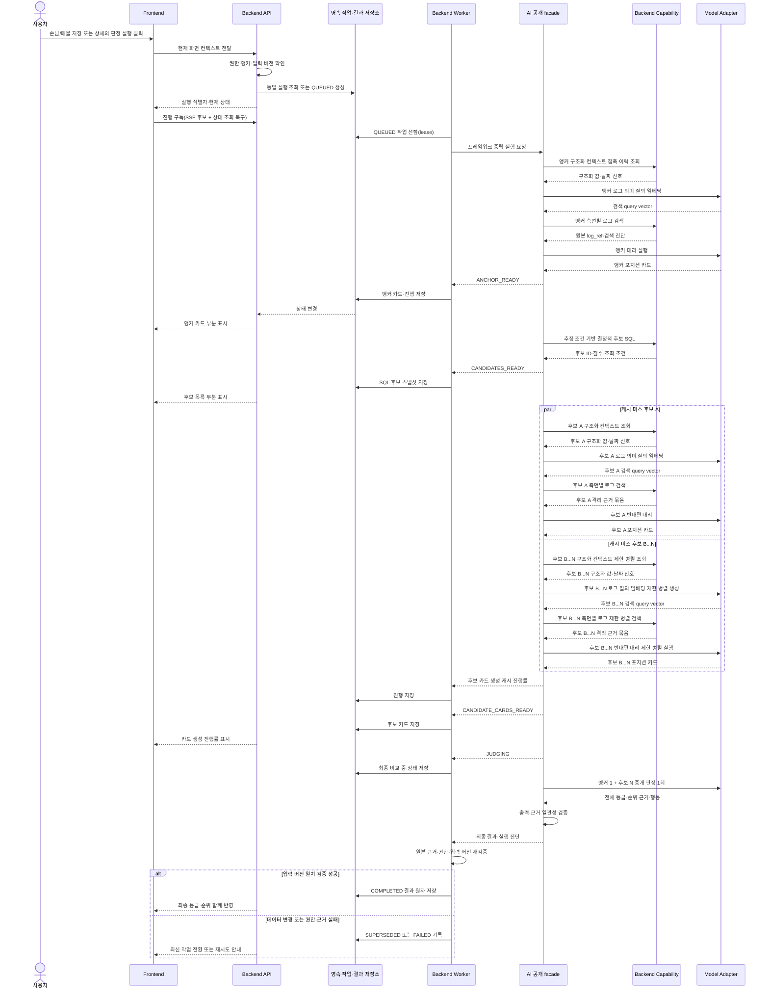

# F3 온라인 실행 아키텍처

## 문서 안내

- **이 문서가 답하는 질문:** 저장 자동 접수와 사용자의 상세 [교차 판정] 요청을 어떻게 비차단으로 실행·복구하고 검증된 최종 결과를 표시하는가?
- **관련 요구사항:** [포지션 카드와 캐시](../../requirements/f3/position-card.md) · [대리·중개 판정](../../requirements/f3/delegates-and-brokerage.md) · [후보 추출·도구](../../requirements/f3/candidate-selection-and-tools.md) · [교차 판정](../../requirements/f3/cross-judgment.md) · [신뢰·비기능·개인정보](../../requirements/f3/trust-nfr-privacy.md)
- **관련 승인 ADR:** [ADR-0006: AI–Backend 실행 경계](../../../.agents/skills/project-wiki/references/decisions/ADR-0006-ai-backend-boundary.md)
- **이 문서가 소유하지 않는 상세:** API 경로·전송 스키마, DB 테이블, 큐·Worker 제품, 재시도 횟수, 검색 top-K와 점수 가중치
- **탐색:** [아키텍처 인덱스](../index.md) · [F3 개요](overview.md) · [오프라인 데이터·평가](offline-data-evaluation.md)
- **읽는 법:** 이 문서의 본문은 **목표 아키텍처**다. 지금 저장소에 있는 것과 없는 것은 [현재 구현 범위](#현재-구현-범위)에서 확인한다.

## 트리거와 작업 생성

MVP의 교차 판정은 다음 네 사용자 행동에서 시작한다.

| 트리거 | 앵커 | 실행 시점 | 현재 |
|---|---|---|---|
| 손님 신규 등록·조건 수정 저장 | 손님 | F1 저장 성공 후 | Backend 자동 접수 구현됨 |
| 매물 신규 등록·가격 변경 저장 | 매물 | F1 저장 성공 후 | Backend 자동 접수 구현됨 |
| 손님 상세의 [교차 판정] 버튼 | 손님 | 사용자 버튼 클릭 후 | Frontend 요청·Backend 접수 구현됨 |
| 세대 상세의 [교차 판정 실행] 버튼 | 매물 | 사용자 버튼 클릭 후 | Frontend 요청·Backend 접수 구현됨 |

Backend는 F1 저장 트랜잭션과 F3 실행을 분리한다. F3 작업 생성이나 실행이 실패해도 이미 성공한 F1 저장을 되돌리지 않으며, 사용자의 판정 요청이 실패해도 F3 패널만 로딩·실패 상태를 표시한다. 상세 진입과 저장만으로는 패널을 열지 않는다.

세대 상세의 버튼은 둘이며 역할이 다르다. 액션 레일의 **[교차 판정]** 은 상세 하단의 교차 판정 섹션을 여닫기만 하고 실행을 요청하지 않는다. 실행을 요청하는 것은 섹션 안의 **[교차 판정 실행]** 하나다. 섹션을 접으면 패널이 화면에서 빠져 Frontend의 진행 확인만 멈추며, 이미 접수된 서버 실행을 취소하지는 않는다. 손님 상세는 아직 이 분리를 적용하지 않아 푸터의 **[교차 판정]** 버튼 하나가 실행을 요청한다.

자동 접수는 `backend/src/domain/agent_execution/triggers.py`가 소유한다. 매물·구입장 신규 등록은
항상 접수하고, 수정은 F1 서비스가 기존 저장값과 비교해 반환한 실제 변경 필드 중 판정 입력이 있을
때만 접수한다. 같은 가격·예산 재저장, 희망 단지 순서만 변경, 메모·담당자 변경은 새 실행을 만들지
않는다. 희망 단지 집합이 실제로 바뀌면 구입장 `row_version`도 함께 올라간다.

F1 commit 뒤 기존 실행 접수 유스케이스를 호출하므로 요청 중 모델 호출은 없고, 같은 앵커·입력
버전의 활성 실행은 재사용한다. 자동 실행은 `trigger_type=LEDGER_SAVE`로 기록한다. 접수 예외는 F1
응답 밖으로 전파하지 않고 앵커 종류·ID·예외 타입만 로그에 남긴다. 상세 화면은 사용자가
판정 실행 버튼을 누른 경우에만 `POST /api/v1/f3/runs`를 호출하며, 저장 시 생성된 같은 입력
버전의 활성 실행이 있으면 그 실행을 재사용한다. 섹션 여닫기는 이 호출을 만들지 않는다.

작업 생성 시 사용자 권한, 앵커 종류·식별자와 현재 데이터 버전을 확인한다. **목표 정책은** 같은 앵커·입력·AI 구성의 활성 작업이나 완료 결과가 있으면 새 모델 호출을 만들지 않고 기존 작업을 구독하거나 결과를 재사용하는 것이다. 현재는 같은 사무소·앵커·`row_version`의 활성 실행만 재사용한다. 완료 결과는 전체 입력 identity와 AI 구성이 같음을 접수 시점에 증명할 수 없어 재사용하지 않는다. 아래 [현재 구현 범위](#현재-구현-범위)를 함께 본다.

앵커 유효성은 F1 장부 조회 범위를 그대로 따른다. 매물 앵커는 사무소, 매물 삭제 여부와 **부모 세대 삭제 여부**를 모두 만족해야 한다. F1의 세대 소프트 삭제는 이력 보존을 위해 딸린 매물 행을 건드리지 않으므로 매물 행의 표시만 보면 화면에 없는 세대의 매물이 앵커로 들어온다.

## 실행 구조와 공개 경계

API와 Worker는 파일럿에서 같은 배포 단위에 둘 수 있지만 역할은 논리적으로 분리한다.

- API는 저장 자동 트리거와 사용자 실행 요청, 작업·결과 조회, 진행 구독과 사용자 피드백을 처리한다.
- 영속 작업 저장소가 실행 상태와 단계 산출물의 정본이며 프로세스 메모리는 정본이 아니다.
- Worker는 작업을 획득하고 AI 공개 facade를 호출하며 단계 진행과 최종 결과를 저장한다.
- AI facade는 워크플로·Agent·모델 호출을 소유하고 주입된 Backend capability만 사용한다.
- Backend capability는 AI 상태나 LangGraph 타입을 받지 않고 요청 범위에 필요한 최소 조회만 제공한다.

### Backend에서 AI로 전달하는 실행 의미

| 의미 | 용도 |
|---|---|
| 실행·추적 식별자 | 중복 방지, 진행·비용·오류 상관관계 |
| 트리거와 앵커 종류·식별자 | 어느 교차 판정인지 결정 |
| 입력 데이터 버전 | 캐시·stale 판단과 재현성 |
| 권한 범위·측면 제한 | capability가 읽을 수 있는 대상을 제한 |
| 모델·프롬프트·워크플로 구성 버전 | 결과 재사용과 평가 추적 |

### AI가 사용하는 Backend capability

| Capability | 허용 책임 |
|---|---|
| 매물 컨텍스트 조회 | 세대·매물·임대차·날짜 신호와 매물 측 접근 범위 반환 |
| 손님 컨텍스트 조회 | 희망 조건·진행 상태·날짜 신호와 손님 측 접근 범위 반환 |
| 측면별 상담 로그 검색 | 허용된 측면 안에서 전문검색+벡터 검색과 원본 근거 반환 |
| 접촉 이력 조회 | 최종 접촉일·수단·응답 여부 반환 |
| 결정적 후보 검색 | 앵커 카드의 추정 조건으로 SQL 후보·점수·조회 조건 반환 |
| 체크포인트·캐시 | 저장 기술을 노출하지 않고 단계 복구와 카드 재사용 지원 |
| 진행 보고 | Backend가 저장할 안전한 단계·진단 반환 |

매물 대리와 손님 대리에는 서로 다른 capability 집합을 조립한다. 중개 판정은 카드 이외의 capability를 받지 않는다.

## 실행 트리거부터 최종 표시까지

`CANDIDATES_READY`까지는 SQL 후보이며 AI 등급이 아니다. 후보 간 순위가 전체 비교 전 뒤집히지 않도록 `JUDGING` 완료 전에는 강함·약함·기각과 최종 순위를 노출하지 않는다.

## 작업 상태와 공개 정책

상태값은 `agent_run.status` 기본값에 맞춰 대문자 스네이크로 표기한다. `QUEUED`와 `RUNNING`은 Worker가 작업을 잡았는지를 나타내는 실행 제어 상태이고, `ANCHOR_READY` 이후는 실제 업무 처리 진행 상태다.

| 상태 | 구분 | 의미 | 사용자 공개 |
|---|---|---|---|
| `QUEUED` | 실행 제어 | 영속 작업 생성, Worker 대기 | 실행 준비 중 |
| `RUNNING` | 실행 제어 | Worker가 lease를 걸고 선점함 | 실행 중 |
| `ANCHOR_READY` | 업무 처리 | 앵커 카드 검증·저장 완료 | 앵커 카드와 근거 표시 |
| `CANDIDATES_READY` | 업무 처리 | 결정적 SQL 후보 스냅샷 완료 | 후보 수·조회 조건·목록 표시 |
| `CANDIDATE_CARDS_READY` | 업무 처리 | 필요한 후보 카드 생성·재사용 완료 | 생성/캐시 진행률과 카드 근거 표시 가능 |
| `JUDGING` | 업무 처리 | 전체 후보 중개 판정 1회 실행 중 | 최종 비교 중; 임시 등급 미표시 |
| `COMPLETED` | 업무 처리 | Backend 검증을 통과한 최종 결과 저장 | 전체 등급·순위 원자 반영 |
| `FAILED_RETRYABLE` | 종료 | 모델·검색·Worker의 일시 오류 | F1은 계속 사용, F3 재시도 제공 |
| `FAILED_TERMINAL` | 종료 | 입력·권한·출력 검증의 영구 오류 | 안전한 오류와 수정 방법 표시 |
| `CANCELLED` | 종료 | 더 이상 현재 화면에서 실행할 필요 없음 | 마지막 안전 상태 유지 또는 닫기 |
| `SUPERSEDED` | 종료 | 실행 중 입력 데이터가 변경됨 | 결과 미반영, 최신 버전 작업으로 전환 |

현재 Backend가 실제로 기록하는 상태는 실행 접수 시 `QUEUED`, Worker 선점 시 `RUNNING`, 검증된 앵커 카드 확보 시 `ANCHOR_READY`, 결정적 SQL 후보 스냅샷 저장 시 `CANDIDATES_READY`, 상위 후보 카드 ID 저장 시 `CANDIDATE_CARDS_READY`, 판정 호출 중 `JUDGING`, 검증된 결과 저장 시 `COMPLETED`, 입력 변경 시 `SUPERSEDED`, lease 최대 시도 초과나 영구 오류 시 `FAILED_TERMINAL` 아홉 가지다. Worker polling·handler가 저장 상태에 맞는 유스케이스를 호출한다. 나머지는 아직 `제안`이며 구현되지 않았다.

`ANCHOR_READY`는 원장 조회를 끝냈다는 뜻이 아니라 **유효한 앵커 포지션 카드를 확보했다**는 뜻이다. Worker는 선점 후 카드 캐시를 먼저 조회한다. cache hit이면 기존 카드를 재사용하고, cache miss이면 AI 카드 생성이 필요하다. 카드를 확보하기 전에는 `ANCHOR_READY`로 넘어가지 않으며 빈 카드로 상태만 진행시키지 않는다.

현재 구현된 앵커 카드 유스케이스는 lease·attempt와 앵커 입력을 확인하고, cache hit이면 검증된 카드를 재사용하며, cache miss이면 주입된 AI 생성기를 호출한 뒤 카드·가격·근거를 저장하고 `ANCHOR_READY`로 전이한다. Worker handler가 `RUNNING` 상태에서 이 유스케이스를 호출한다.

후보 카드 유스케이스는 `candidate-selection:v3` snapshot에서 `selected_for_cards`인 상위 5건을 순서대로 읽고 앵커의 반대편 포지션 카드를 확보한다. 앵커 카드와 같은 snapshot·privacy mode·cache key·저장 직전 fencing 경로를 재사용하며 후보의 현재 `row_version`을 고정한다. 후보를 순차 처리해 전부 확보한 경우에만 카드 ID를 snapshot에 기록하고 `CANDIDATE_CARDS_READY`로 전이한다. 후보가 0건이면 모델 호출 없이 전이하고, 하나라도 실패하면 상태는 `CANDIDATES_READY`에 남는다. Worker handler가 `CANDIDATES_READY` 상태에서 이 유스케이스를 호출한다.

Worker는 실패 원인을 원문 없이 집계할 수 있게 두 구조화 로그를 남긴다.

- `f3_step_failed`: `run_id`, 저장 상태, `failure_stage`, `failure_category`, attempt, outcome, 고정 `error_type`
- `f3_candidate_card_failed`: `run_id`, attempt, 후보 순번, 카드화 대상 건수, 고정 `error_type`

예외 메시지, 후보 표시명, 상담 본문, 전체 프롬프트와 모델 원문 응답은 로그하지 않는다.

포지션 카드 cache key의 현재 schema version은 `position-card:v3`이다. `v2`의 상담 로그 건수·마지막 시각·최대 ID에 더해, AI 요청 전체의 비식별 SHA-256 fingerprint와 측면별 상담 범위 identity를 넣는다. 매물·구입장 `row_version`만으로는 세대 스펙, 단지명, 당사자 역할, 날짜 bucket 변화를 잡을 수 없기 때문이다. 지문에는 원문을 저장하지 않는다.

이 `position-card:v3`는 키 계산 방식의 버전이며 Backend–AI 계약 버전 `position-card:v1`과 서로 다른 것을 버전한다. 번호가 다른 것은 정상이다.

재사용 판정은 cache key만 믿지 않고 저장된 카드의 대상·측면·입력 버전·`source_interaction_count`·`last_interaction_at`을 현재 값과 다시 대조한다. 카드 저장과 `ANCHOR_READY` 전환 직전에는 lease·attempt, 앵커 버전, 상담 범위 identity, source identity와 입력 fingerprint를 다시 계산한다. 하나라도 달라지면 결과와 상태 전이를 같은 transaction에서 거절한다.

**목표 정책은** 5초 안에 `COMPLETED`가 되지 않으면 빈 패널을 유지하지 않고 확보된 마지막 안전 단계를 표시하는 것이다. SSE 후보 연결이 끊기면 작업은 취소되지 않으며 상태 조회로 스냅샷을 복구한 뒤 마지막 이벤트 이후를 다시 구독한다.

SSE 진행 구독과 재연결은 아직 구현하지 않았다. 현재 Frontend가 쓸 수 있는 것은 `GET /api/v1/f3/runs/{run_id}` polling뿐이다.

## 현재 구현 범위

이 절이 위 목표 아키텍처 중 무엇이 저장소에 있고 무엇이 없는지의 정본이다. 상태 표의 `구현됨` 표기와 [API 계약](../../../.agents/skills/project-wiki/references/contracts/api.md)의 F3 절은 이 절과 같은 사실을 설명해야 한다.

### 구현됨

| 항목 | 위치 |
|---|---|
| `POST /api/v1/f3/runs`. 활성 실행이 없으면 `QUEUED` 생성, 있으면 같은 실행 반환 | `backend/src/api/f3_runs.py` |
| 상세 진입·저장에서 패널을 열지 않고 판정 실행 버튼에서만 실행 확인·polling 시작. 세대 상세는 레일의 [교차 판정]이 섹션 여닫기, 섹션의 [교차 판정 실행]이 실행 요청. 활성 실행이 없을 때만 `USER_REQUEST`로 접수 | `frontend/src/AppShell.jsx`, `frontend/src/features/DetailWorkspace.jsx`, `frontend/src/features/f3/CrossMatchSection.tsx` |
| 앵커 검증. 사무소, 매물·부모 세대·구입장 삭제 여부 | `backend/src/domain/agent_execution/service.py` |
| 사무소·앵커·입력 버전의 활성 실행 재사용과 PostgreSQL 동시 접수 직렬화 | `backend/src/domain/agent_execution/service.py`, `repository.py` |
| F1 매물·구입장 저장 성공 후 `LEDGER_SAVE` 자동 접수와 F3 실패 격리 | `backend/src/domain/agent_execution/triggers.py`, `backend/src/api/property_ledger.py` |
| 매물·구입장 PATCH의 실제 변경 감지, 동일 값 `row_version` 유지와 희망 단지 변경 버전 증가 | `backend/src/domain/property_ledger/service.py` |
| `GET /api/v1/f3/runs/{run_id}` polling용 상태 조회 | `backend/src/api/f3_runs.py` |
| `GET /api/v1/f3/runs/{run_id}/result` 진행 단계별 앵커 카드·전체 SQL 후보·후보 판정 페이지 조회 | `backend/src/api/f3_runs.py`, `backend/src/domain/agent_execution/results.py` |
| `POST /api/v1/f3/feedback` 카드·후보 판정의 구조화 관심없음 사유 기록 | `backend/src/api/f3_runs.py`, `backend/src/domain/agent_execution/feedback.py` |
| `claim_next_run` 작업 선점, `RUNNING`·`ANCHOR_READY`·`CANDIDATES_READY`·`CANDIDATE_CARDS_READY`·`JUDGING` 재선점과 5분 lease·3회 상한 | `backend/src/domain/agent_execution/service.py`, migration 016 |
| 합성 F1 앵커 snapshot과 측면별 상담 로그 범위·날짜 신호 조립 | `backend/src/domain/agent_execution/snapshot.py` |
| 입력 fingerprint·상담 범위 identity를 포함한 `position-card:v3` cache key와 재사용 | `backend/src/domain/agent_execution/fingerprint.py`, `cache_key.py` |
| 주입된 생성기 호출, 저장 직전 fencing, 카드·가격·근거 원자 저장과 `ANCHOR_READY` 전이 | `backend/src/domain/agent_execution/anchor_card.py` |
| 포지션 카드 Backend–AI 공개 계약. 어휘, 요청·결과 DTO, 생성 Protocol, 요청·결과 교차 검증 | `ai/src/brokerage_ai/f3/` |
| 포지션 카드 프롬프트와 구조화 출력 생성 (`position-card-prompt:v1`, `position-card-workflow:v1`) | `ai/src/brokerage_ai/f3/prompts.py`, `generator.py` |
| 중개 판정 Backend–AI 공개 계약과 구조화 출력 생성 (`brokerage-judgment:v1`, `brokerage-judgment-workflow:v1`) | `ai/src/brokerage_ai/f3/judgment_contracts.py`, `judgment_generator.py` |
| 중개 판정 요청 조립, 결과·근거 저장과 `JUDGING`·`COMPLETED` 전이 | `backend/src/domain/agent_execution/judgment.py` |
| 판정 결과와 근거 저장 | `match_evaluation`, `match_candidate_evaluation`, `match_candidate_evidence` (migration 006) |
| 결정적 SQL 후보 추출, 점수와 정렬, `CANDIDATES_READY` 전이 | `backend/src/domain/agent_execution/candidates.py` |
| 후보 조회 조건과 전체 후보 집합 보존 | `match_evaluation.candidate_selection_snapshot` (migration 006) |
| 상위 5건 후보 카드 순차 생성·재사용, 카드 ID 기록과 `CANDIDATE_CARDS_READY` 전이 | `backend/src/domain/agent_execution/candidate_cards.py` |
| 실패 단계·분류·후보 순번을 원문 없이 남기는 구조화 로그 | `backend/src/domain/agent_execution/pipeline.py`, `candidate_cards.py` |
| API와 같은 image를 쓰는 Worker 프로세스 진입점 | `backend/src/worker.py`, `infra/deploy/compose.dev.yml` |
| Worker의 DB readiness 확인, readiness file, SIGTERM·SIGINT graceful shutdown | `backend/src/worker.py` |
| `WORKER_ENABLED=false` 배포. 작업을 하나도 claim하지 않고 대기 | `backend/src/worker.py` |
| 합성 opt-in이 없으면 DB·Provider 접근과 claim 전 활성 Worker 기동 거절 | `backend/src/worker.py` |
| RDS polling, `claim_next_run` 연결과 저장 상태 기반 F3 handler | `backend/src/worker.py`, `backend/src/domain/agent_execution/pipeline.py` |
| capability별 lazy 모델 binding, 합성 모드 명시적 opt-in과 하나의 asyncio loop | `backend/src/worker.py` |
| 일시 Provider 오류의 즉시 lease release·3회 상한 재시도, 입력 변경 `SUPERSEDED`, 영구 오류 `FAILED_TERMINAL` | `backend/src/domain/agent_execution/pipeline.py` |

Worker 배포 계약의 정본은 [백엔드 ADR-0003](../../../.agents/skills/backend/references/decisions/ADR-0003-dev-deployment-contract.md)이다.

포지션 카드의 Backend–AI 어휘와 DTO 정본은 [F3 AI 계약](../../../.agents/skills/project-wiki/references/contracts/f3-ai.md)이다. `negotiation_side`는 `LISTING`·`REQUIREMENT`로 확정됐고 더 이상 내부 임시값이 아니다. 계약 버전 `position-card:v1`은 아래 cache key 버전 `position-card:v3`와 다른 축이다.

### 미구현

| 항목 | 현재 상태 |
|---|---|
| LangGraph production graph와 checkpoint | 없음. 포지션 카드 생성은 구조화 출력 1회이며 이름뿐인 graph를 두지 않는다 |
| 실사용 F1 snapshot 마스킹 | 없음. 현재 조립은 ADR-0014의 명시적 `SYNTHETIC_PROTOTYPE`만 허용하며 `MASKED`는 거절한다 |
| 뒤따른 화면의 기존 실행 구독 | 없음 |
| SSE 진행 구독과 재연결 | 없음. polling만 제공 |
| 정정 피드백과 다음 판정 입력 연결 (F3-TR-02) | 없음. 정정 상담 로그를 함께 만드는 유스케이스 전에는 공개 입력으로 받지 않는다 |
| 변경 없는 완료 판정 결과 재사용 (F3-CR-12 나머지) | 없음. 전체 입력 identity와 AI 구성의 동일성을 접수 시점에 검증할 수 있을 때 구현한다 |
| 배포 환경의 활성 Worker 전환 | 실행 코드는 지원하지만 현재 Infra 기본값은 `WORKER_ENABLED=false`, `F3_ALLOW_SYNTHETIC_PROTOTYPE=false`. 합성 전용 시연은 두 값을 모두 명시하고, 실사용은 마스킹과 `MASKED` 전환 뒤 별도 적용 |

## 결정적 후보 검색

후보 검색은 Agent가 생성한 자유문을 SQL로 번역하지 않는다. 앵커 카드에서 검증된 추정 가격·평형·시점 같은 제한된 조건을 Backend query가 받아 구조화 장부 데이터에 적용한다.

- 후보 포함·제외는 SQL 조건으로 결정한다.
- 가격 근접도·평형 일치·접수 최신순 점수는 우선 카드화 순서를 정할 뿐 중개 등급을 대신하지 않는다.
- 상위 5건을 먼저 카드화하고 나머지 후보 수와 다음 페이지를 보존한다.
- 조건에 맞는 후보가 없으면 사용한 조회 조건과 함께 빈 결과를 저장한다.
- 7,200행 규모의 100ms 목표는 AI 품질 평가와 분리한 Backend 성능 검증으로 확인한다.

### 현재 구현 규칙

정본 코드는 `backend/src/domain/agent_execution/candidates.py`이고 저장 위치는
`match_evaluation.candidate_selection_snapshot`(schema `candidate-selection:v3`)이다.
`v2`로 이미 완료된 과거 실행은 결과 조회에서 계속 읽지만, 새 후보 선택·카드화는
`v3`만 생성·진행한다.

가격 축은 앵커 **카드**의 첫 번째 거래 유형(`negotiation_position_price.display_order` 최소)
하나다. 카드 생성이 `PriceKind` 열거 순서로 금액을 채우므로 같은 카드에서 항상 같은 축이
나온다. 그 축의 `estimated_amount`가 있으면 추정가를, 없으면 장부 표기가를 쓴다 (F3-SQ-03).
단, 구입장 앵커의 카드 가격 종류는 `BUDGET`이므로 후보 매물 거래 유형은 카드가 아니라
구입장의 `demand_type`에서 정한다.

| 앵커 | 후보 장부 | SQL 조건 |
|---|---|---|
| `LISTING` | `property_requirement` | 사무소 · 구입장과 인물 `is_deleted = false` · `status = ACTIVE` · 카드 거래 유형과 호환되는 `demand_type` · `max_budget_amount IS NULL OR >= 추정가 × 0.9` · 희망 단지 미지정이거나 앵커 단지 포함 |
| `REQUIREMENT` | `property_listing` | 사무소 · 매물과 **부모 세대** `is_deleted = false` · `status = RECEIVED` · 구입장 `demand_type`과 호환되는 거래 가능 플래그 · 해당 거래 금액 `IS NULL OR <= 추정 예산 × 1.1` · 앵커가 희망 단지를 밝혔으면 그 단지 |

호환 어휘는 `SALE ↔ 매수`, `JEONSE ↔ 전세`, `MONTHLY_RENT ↔ 월세`다. `매도`는 매물의
반대편 수요가 아니므로 어느 방향에도 매핑하지 않고 후보 0건으로 처리한다. 매물 후보 금액은
호환 거래 유형의 플래그와 컬럼만 사용하며 다른 유형 금액을 `coalesce`하지 않는다. 월세는
보증금만 가격 축으로 비교한다. 구입장에 월 차임 예산 축이 없기 때문이며, 월 차임 값은 결과에서
버리지 않고 snapshot의 `monthly_amount`로 보존한다.

금액이나 예산이 비어 있는 행은 조건에서 빼지 않는다. 미기재는 "맞지 않는다"가 아니라 "아직
모른다"이며, 금액을 모르는 후보는 가격 근접도 0으로 뒤로 밀린다. 평형은 조건이 아니라
점수다. F1 업무 상태 어휘 전체는 아직 확정되지 않았으므로 현재 서버가 신규 저장에 쓰는 기본값
`RECEIVED`와 `ACTIVE`만 활성 상태로 사용한다. 이 두 값은 승인된 최종 상태 목록이 아니라 현재
구현 규칙이며, 상태 계약이 확정되면 필터와 이 문서를 함께 바꾼다.

점수는 세 성분의 가중합이며 Python에서 `Decimal` 6자리로 계산한다. SQL 부동소수 정렬은
동점 순서가 흔들릴 수 있어 정렬까지 애플리케이션에서 한다.

| 성분 | 가중치 | 정의 |
|---|---|---|
| 가격 근접도 | 0.5 | `max(0, 1 - |후보 금액 - 앵커 추정가| / 앵커 추정가)`. 금액 미상은 0 |
| 평형 일치 | 0.3 | 희망 평형 중 하나가 앵커 평형과 ±1평 이내면 1, 아니면 0. 희망 평형 미기재는 0 |
| 접수 최신성 | 0.2 | `1 / (1 + 경과일 / 30)`. 접수일 미상은 0, 미래 접수일은 1 |

정렬은 점수 내림차순 → 접수일 내림차순 → **ID 오름차순**이다. 마지막 tie-breaker가 유일해
동점이 있어도 전체 순서가 결정적이다.

`price_tolerance_ratio` 0.1, `pyeong_tolerance` 1평, 가중치와 반감 기준일 30일은 **MVP
조정값**이며 팀이 승인한 요구사항 수치가 아니다. 실제로 쓴 값은 snapshot의 `criteria`와
`score_weights`에 함께 저장하므로 나중에 바꿔도 과거 판정의 근거가 남는다.

snapshot은 상위 5건이 아니라 **전체** 후보의 ID, 구성 점수, 순위와 카드화 여부를 담고
`total_count`·`carded_count`·`remaining_count`를 함께 기록한다. 후보 0건이면 `candidates`가
빈 배열이고 `criteria`는 그대로 남는다.

`match_evaluation`은 `CANDIDATES_READY`에서 헤더로 먼저 만들고 중개 판정 결과는 나중에
채운다. 재선점으로 이 단계가 다시 돌면 같은 실행의 헤더를 새로 만들지 않고 갱신한다.
`candidate_count`는 실제로 카드화·판정할 후보 수이며 전체 후보 수가 아니다.

## 후보 포지션 카드 확보

`CANDIDATES_READY` snapshot에서 `selected_for_cards=true`인 상위 5건만 카드화한다. snapshot
순서가 SQL 후보 우선순위이므로 다시 정렬하지 않는다. 각 후보는 앵커와 반대편
`negotiation_side`를 쓰며 그 후보 자신의 현재 `row_version`으로 cache key와 저장 fencing을
고정한다.

후보 카드는 루트 실행에 직접 귀속하고 child `AgentRun`을 만들지 않는다. 카드별 transaction을
순차로 처리해 SQLModel Session을 async task 사이에 공유하지 않는다. 일부 후보 처리 후 실패한
경우 이미 저장한 카드는 재시도에서 사용할 수 있는 유효 캐시로 남지만, 모든 후보 카드가
확보되기 전에는 실행 상태와 후보 카드 ID 목록을 완료 처리하지 않는다. 최종 카드 ID는
`match_evaluation.candidate_selection_snapshot.candidate_cards`에 기록한다.

상태 조회 API는 진행·완료 상태 문자열만 공개한다. 별도 결과 조회 API는 앵커 카드의 공개 본문,
전체 SQL 후보와 저장된 후보 판정만 허용된 응답 DTO로 변환하며 내부 snapshot 전체나 후보 카드
본문·모델 진단은 공개하지 않는다. 카드 저장 시 기록한 `input_privacy_mode`가 승인된
`SYNTHETIC_PROTOTYPE`인지 조회 경계에서 다시 확인하며, 표식이 없거나 다르면 상태 외 결과를 비운다.

## 중개 판정과 완료

정본 코드는 `backend/src/domain/agent_execution/judgment.py`다. 저장된 앵커 카드 1장과 후보 카드
1~5장을 `brokerage-judgment:v1` 요청으로 조립해 **한 번의** AI 호출로 판정한다
(F3-BR-01, F3-NF-04). 흐름은 세 단계다.

| 단계 | transaction | 하는 일 |
|---|---|---|
| 1. 준비 | 연다 → 닫는다 | lease·앵커 버전·판정 바인딩·카드 집합 확인, 요청 조립, `JUDGING` 전이 |
| 2. 판정 | **없음** | `judge_candidates()` 1회 호출 |
| 3. 저장 | 연다 → commit | 현재 상태 재검증, 판정·후보·근거 원자 저장, `COMPLETED` 전이 |

판정 입력은 `negotiation_position_analysis.analysis_snapshot`에 저장된 공개 카드 결과를 그대로
복원한다. 어떤 후보 카드를 넣을지는 후보 카드 단계가
`match_evaluation.candidate_selection_snapshot.candidate_cards`에 기록한 ID가 정한다. 판정
시점에 cache key를 다시 계산하거나 상담 원문을 다시 읽지 않는다.

현재 Backend 조립은 ADR-0014의 `SYNTHETIC_PROTOTYPE`만 허용한다. `JudgmentBinding`과 AI 요청에
같은 privacy mode를 명시하며 `MASKED`는 실사용 F1 마스킹이 구현될 때까지 Provider 호출 전에
거절한다. 합성 입력 예외가 외부 Provider·리전·저장 여부를 승인하는 것은 아니다.

저장 직전에 다음을 다시 확인한다.

- 같은 Worker의 lease·attempt와 같은 사무소 실행인가
- `BROKERAGE_JUDGMENT` capability의 안전한 model snapshot과 prompt·workflow 버전이 같은가
- 앵커와 각 후보 장부의 `row_version`, 판정 헤더와 후보 카드 ID 집합이 준비 시점과 같은가
- 앵커와 후보 카드가 모두 유효하고 같은 tenant에 속하는가
- 후보 판정이 아직 저장되지 않았는가
- 요청·결과 후보 집합, 순위, 기각 사유와 카드 근거가 계약 검증을 통과하는가

후보별 판정과 근거, 헤더 확정, `COMPLETED` 전이는 하나의 transaction에 있다. 하나라도 실패하면
모두 rollback하므로 일부 후보만 저장된 완료 실행은 생기지 않는다. 카드의 `QUOTE` 근거 offset은
새로 계산하지 않고 `negotiation_position_evidence`에 저장된 값을 그대로 옮긴다.

후보가 0건이면 판정 모델 설정도 조회하지 않고 AI 호출과 `JUDGING`을 생략한다. 빈 최종 결과를
확정하고 `CANDIDATE_CARDS_READY`에서 바로 `COMPLETED`로 간다.

Provider 호출 중 Worker가 중단되면 상태는 `JUDGING`에 남는다. migration 016은 이 상태를 lease
선점 인덱스에 추가한다. 다음 Worker는 최초 시도의 모델·prompt·workflow·privacy 바인딩과 후보
집합을 다시 대조한 뒤 판정 호출부터 재실행한다. 저장은 lease attempt fencing을 통과한 결과만
허용하므로 이전 Worker의 늦은 응답은 반영되지 않는다.

`redacted_output_snapshot`에는 판정 헤더·앵커 카드 ID, 후보 수, 계약·prompt·workflow 버전,
안전한 provider·model 이름과 등장한 등급 목록만 남긴다. 판정 본문과 근거는 매칭 판정 테이블이
소유하며 전체 프롬프트와 전체 모델 원문은 저장하지 않는다.

## 하이브리드 상담 로그 검색

로그 검색은 다음 순서로 동작한다.

1. AI의 로그 검색 도구가 의미 질의를 만들고 AI embedding Adapter가 검색 query vector를 생성한다.
2. 요청 사용자 권한, 대리 측면, 대상, 기간을 필수 메타데이터 필터로 적용한다.
3. 전문검색과 pgvector 의미 검색을 같은 제한 범위 안에서 병렬 실행한다.
4. 결과 합집합에서 같은 `log_id`를 제거하고 각 검색 방식과 관련 진단을 남긴다.
5. 검색 적중 로그의 인접 문맥과 이후 정정·철회·최신 진술을 시간순으로 확장한다.
6. 원문 `log_id`, 시각, 화자·측면과 검색 범위를 Agent에 반환한다.

모든 과거 로그가 검색 대상이라는 의미에서 전 기간을 인덱싱한다. 한 번의 top-K만으로 전 기간을 읽었다고 간주하지 않으며 Agent는 필요할 때 기간·키워드를 바꿔 후속 검색할 수 있다. 최신 진술이 과거 의향을 철회하는 경우 시간 순서가 벡터 유사도보다 우선한다.

### 임베딩 생성과 재색인

- Backend는 로그 추가·수정 후 별도의 인덱싱 작업을 만들며 F1 저장 성공을 임베딩 완료까지 지연하지 않는다.
- AI embedding facade가 마스킹된 로그 원문을 활성 임베딩 모델로 변환하고 모델·전처리 버전을 반환한다.
- Backend는 원문, 벡터, 로그 버전과 임베딩 버전을 저장하고 접근 제어를 적용한다.
- 활성 임베딩 버전이 바뀌면 새 인덱스를 병행 생성하고 검증 후 전환한다. 이전 인덱스를 조용히 덮어쓰지 않는다.
- 임베딩 누락·실패·재색인 중에는 전문검색 결과로 계속 동작하고 `semantic_coverage`가 불완전하다는 실행 진단을 남긴다.
- 외부 임베딩 제공자를 사용할 경우 성명·연락처와 직접 식별자를 치환한 후 전송한다.

pgvector, PostgreSQL 전문검색과 구체 결합 점수·top-K는 후보 구현이다. 검색 Adapter의 공개 의미는 제품을 교체해도 유지한다.

## 캐시·중복 실행과 stale 처리

| 대상 | 재사용 기준 | 무효화 조건 |
|---|---|---|
| 포지션 카드 | 대상 ID, 마지막 로그 시각, 데이터 버전, 대리·모델·프롬프트 버전 일치 | 로그 추가, 가격·상태·조건 변경, 정정, AI 구성 변경 |
| 최종 교차 판정 | 앵커·후보 집합과 각 카드 버전, 중개 모델·프롬프트·워크플로 버전 일치 | 카드·후보 집합·AI 구성 중 하나라도 변경 |
| 활성 작업 | 앵커, 입력 버전, AI 구성과 권한 범위 일치 | 입력 버전 또는 권한 변경 |

위 표는 목표 재사용 identity다. 현재 활성 실행 접수 키는 사무소·앵커·`input_data_version`까지만
구현했고, 같은 사무소가 실행 중 변경한 AI 구성은 기존 활성 작업을 중단시키지 않는다. 완료 결과는
목표 identity 전부를 검증할 수 있을 때까지 재사용하지 않는다.

**목표 정책은** 동일 키의 활성 작업을 하나만 실행하고 뒤따른 화면이 그 작업을 구독하는 것이다. 실행 중 F1 데이터가 바뀌면 이전 실행을 강제 성공으로 덮어쓰지 않고 `SUPERSEDED`로 남기며, 새 입력 버전 작업이 현재 화면의 결과 소유권을 가진다.

입력 변경을 감지한 기존 실행의 `SUPERSEDED` 전이와 활성 작업 재사용은 구현됐다.
`POST /api/v1/f3/runs`는 같은 사무소·앵커·`input_data_version`의 활성 루트 실행을 반환하며,
PostgreSQL transaction advisory lock으로 여러 API 인스턴스의 동시 접수를 직렬화한다. 입력 버전이
바뀌면 기존 활성 실행을 재사용하지 않고 새 `QUEUED` 실행을 만든다.

완료 결과는 재사용하지 않는다. 현재 접수 키만으로는 상담 로그, 세대·단지·당사자 관계와 AI 구성이
같은지 증명할 수 없어 과거 완료 결과를 반환하면 stale 판정을 정상 결과로 보일 수 있다. 기존 작업의
SSE 구독과 새 입력 버전 실행의 자동 생성도 아직 없다.

## 검증·개인정보와 실행 로그

AI와 Backend 검증을 분리한다.

- AI는 카드·중개 결과 형식, 인용과 판단의 일관성, 근거 없는 항목의 `추정` 표시를 검증한다.
- Backend는 `log_id` 존재, 원문 일치, 요청자 권한, 대리 측면, 입력 버전과 개인정보 마스킹을 검증한다.
- 검증되지 않은 근거를 조용히 제거하고 나머지를 성공으로 위장하지 않는다. 영향 범위에 따라 항목을 `판정 불가`로 바꾸거나 작업을 실패시킨다.
- 실행 로그에는 Agent·도구·검색 방식·근거 ID·입력/모델/프롬프트 버전·호출 수·토큰·지연·캐시 여부를 남긴다.
- 사용자용 진행 이벤트와 일반 오류 로그에는 상담 원문, 연락처, 모델 원문 응답을 넣지 않는다.

## 오류와 복구 시나리오

| 시나리오 | 사용자에게 보이는 결과 | 시스템 처리 |
|---|---|---|
| 후보 없음 | 조회 조건과 후보 없음 표시 | 정상 완료; 조건 완화는 사용자 선택으로만 실행 |
| 일부 후보 카드 실패 | 성공·실패 진행과 제한된 결과 안내 | 실패 후보를 기록하고 전체 판정 가능 여부를 명시적으로 판단 |
| 중개 모델 일시 실패 | 앵커·SQL 후보·카드는 유지, 재시도 제공 | 중개 판정 단계만 제한 재실행 |
| 임베딩 생성·검색 실패 | 의미 검색 축소 진단 표시 | 전문검색으로 폴백하고 실패를 별도 계측 |
| Worker 재시작 | 처리 중 또는 복구 중 표시 | 영속 단계·lease로 작업 회수, 완료 호출 중복 방지 |
| 진행 연결 끊김 | 재연결 중 표시 | 상태 조회 후 마지막 이벤트 이후 구독 |
| 입력 데이터 변경 | 최신 데이터로 다시 판정 중 표시 | 이전 실행 `SUPERSEDED`, 새 버전 실행 생성 |
| 권한 변경·근거 불일치 | 결과 미노출, 접근 또는 재실행 안내 | Backend 최종 검증 실패와 감사 기록 |
| F3 전체 중단 | F3 패널 실패·재시도 표시 | F1 조회·저장·편집은 계속 동작 |

자동 재시도는 일시 오류에만 적용한다. 구체 횟수·backoff·Worker/큐 제품은 Backend 운영 설계에서 정하고, 모든 모델·도구 호출에는 멱등 또는 안전한 재실행 전략을 둔다.
