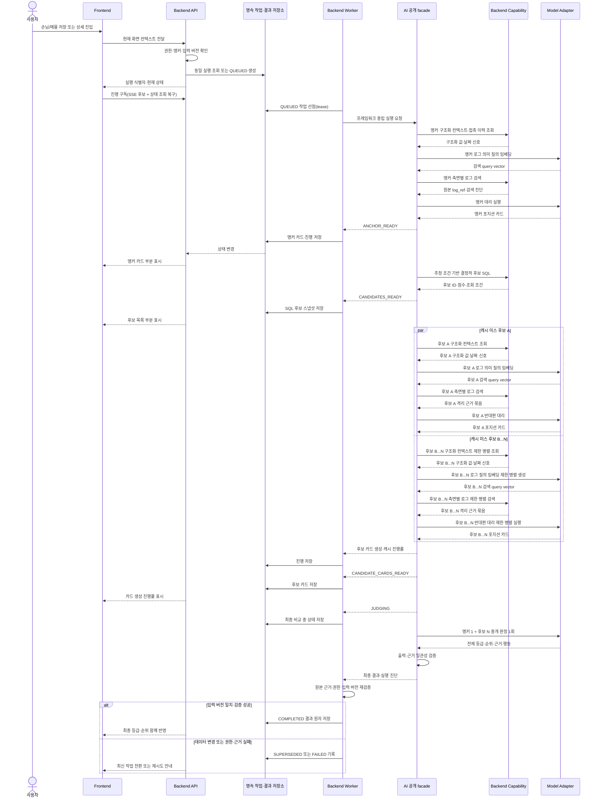

# F3 온라인 실행 아키텍처

## 문서 안내

- **이 문서가 답하는 질문:** 자동 트리거된 F3 교차 판정을 어떻게 비차단으로 실행·복구하고 검증된 최종 결과를 표시하는가?
- **관련 요구사항:** [포지션 카드와 캐시](../../requirements/f3/position-card.md) · [대리·중개 판정](../../requirements/f3/delegates-and-brokerage.md) · [후보 추출·도구](../../requirements/f3/candidate-selection-and-tools.md) · [교차 판정](../../requirements/f3/cross-judgment.md) · [신뢰·비기능·개인정보](../../requirements/f3/trust-nfr-privacy.md)
- **관련 승인 ADR:** [ADR-0006: AI–Backend 실행 경계](../../../.agents/skills/project-wiki/references/decisions/ADR-0006-ai-backend-boundary.md)
- **이 문서가 소유하지 않는 상세:** API 경로·전송 스키마, DB 테이블, 큐·Worker 제품, 재시도 횟수, 검색 top-K와 점수 가중치
- **탐색:** [아키텍처 인덱스](../index.md) · [F3 개요](overview.md) · [오프라인 데이터·평가](offline-data-evaluation.md)
- **읽는 법:** 이 문서의 본문은 **목표 아키텍처**다. 지금 저장소에 있는 것과 없는 것은 [현재 구현 범위](#현재-구현-범위)에서 확인한다.

## 트리거와 작업 생성

MVP의 교차 판정은 다음 네 사용자 행동에서 시작한다.

| 트리거 | 앵커 | 실행 시점 | 현재 |
|---|---|---|---|
| 손님 신규 등록·조건 수정 저장 | 손님 | F1 저장 성공 후 | 구현됨 |
| 매물 신규 등록·가격 변경 저장 | 매물 | F1 저장 성공 후 | 구현됨 |
| 손님 상세 진입 | 손님 | 현재 데이터 버전 확인 후 | Backend 접수 경계만 구현됨 |
| 세대 상세 진입 | 매물 | 현재 데이터 버전 확인 후 | Backend 접수 경계만 구현됨 |

상세 진입 트리거의 Backend 경계는 `POST /api/v1/f3/runs`다. Frontend가 화면 진입 시 그
경로를 부르면 되고, 같은 앵커·입력 버전이면 저장 시점에 만들어진 실행을 그대로 재사용한다.
Frontend 호출 자체는 이번 범위가 아니다.

Backend는 F1 저장 트랜잭션과 F3 실행을 분리한다. F3 작업 생성이나 실행이 실패해도 이미 성공한 F1 저장을 되돌리지 않으며, 상세 진입에서도 F3 패널만 로딩·실패 상태를 표시한다.

### 저장 후 자동 접수의 현재 구현

정본 코드는 `backend/src/domain/agent_execution/triggers.py`이고 호출 지점은
`backend/src/api/property_ledger.py`의 네 저장 경로다.

- **F1 저장이 commit 을 끝낸 뒤에** 부른다. 두 transaction 을 겹치지 않는다.
- 어떤 예외도 밖으로 나가지 않는다. F3 접수 실패가 성공한 F1 저장을 되돌리지 않고 응답을
  바꾸지도 않는다 (F3-NF-07, F3-CM-06).
- 요청 처리 중 모델을 부르지 않는다. 하는 일은 `agent_run` 적재까지다.
- 기존 재사용 로직을 그대로 쓴다. 같은 앵커·입력 버전의 실행이 있으면 새로 만들지 않는다.
- 자동 실행의 `trigger_type`은 `LEDGER_SAVE`이며 화면에서 직접 누른 `USER_REQUEST`와
  구분한다.
- 실패 로그에는 앵커 종류·ID와 예외 **타입 이름**만 남긴다. 상담 원문과 개인정보는 넣지
  않는다.

가격이나 조건이 실제로 바뀌지 않은 수정에서는 부르지 않는다. 담당자 메모만 고친 저장이
판정을 다시 돌릴 이유는 없다. 어떤 필드가 판정 입력인지는 `LISTING_TRIGGER_FIELDS`와
`REQUIREMENT_TRIGGER_FIELDS`가 정한다. 그 층을 지나도 행이 실제로 바뀌지 않으면
`row_version`이 그대로라 재사용 키가 같아 새 실행이 생기지 않는다. 두 층이 같은 결론을
서로 다른 비용으로 낸다.

작업 생성 시 사용자 권한, 앵커 종류·식별자, 현재 데이터 버전과 활성 AI 구성을 확인한다. **목표 정책은** 같은 앵커·입력·AI 구성의 활성 작업이나 완료 결과가 있으면 새 모델 호출을 만들지 않고 기존 작업을 구독하거나 결과를 재사용하는 것이다. 현재 구현은 `(사무소, 앵커, 입력 버전)`으로 재사용하며 **AI 구성은 키에 없다.** 접수 시점에는 어떤 모델로 돌지 알 수 없기 때문이다. 아래 [현재 구현 범위](#현재-구현-범위)를 함께 본다.

앵커 유효성은 F1 장부 조회 범위를 그대로 따른다. 매물 앵커는 사무소, 매물 삭제 여부와 **부모 세대 삭제 여부**를 모두 만족해야 한다. F1의 세대 소프트 삭제는 이력 보존을 위해 딸린 매물 행을 건드리지 않으므로 매물 행의 표시만 보면 화면에 없는 세대의 매물이 앵커로 들어온다.

## 실행 구조와 공개 경계

API와 Worker는 파일럿에서 같은 배포 단위에 둘 수 있지만 역할은 논리적으로 분리한다.

- API는 자동 트리거, 작업·결과 조회, 진행 구독과 사용자 피드백을 처리한다.
- 영속 작업 저장소가 실행 상태와 단계 산출물의 정본이며 프로세스 메모리는 정본이 아니다.
- Worker는 작업을 획득하고 AI 공개 facade를 호출하며 단계 진행과 최종 결과를 저장한다.
- AI facade는 워크플로·Agent·모델 호출을 소유하고 주입된 Backend capability만 사용한다.
- Backend capability는 AI 상태나 LangGraph 타입을 받지 않고 요청 범위에 필요한 최소 조회만 제공한다.

### Backend에서 AI로 전달하는 실행 의미

| 의미 | 용도 |
|---|---|
| 실행·추적 식별자 | 중복 방지, 진행·비용·오류 상관관계 |
| 트리거와 앵커 종류·식별자 | 어느 교차 판정인지 결정 |
| 입력 데이터 버전 | 캐시·stale 판단과 재현성 |
| 권한 범위·측면 제한 | capability가 읽을 수 있는 대상을 제한 |
| 모델·프롬프트·워크플로 구성 버전 | 결과 재사용과 평가 추적 |

### AI가 사용하는 Backend capability

| Capability | 허용 책임 |
|---|---|
| 매물 컨텍스트 조회 | 세대·매물·임대차·날짜 신호와 매물 측 접근 범위 반환 |
| 손님 컨텍스트 조회 | 희망 조건·진행 상태·날짜 신호와 손님 측 접근 범위 반환 |
| 측면별 상담 로그 검색 | 허용된 측면 안에서 전문검색+벡터 검색과 원본 근거 반환 |
| 접촉 이력 조회 | 최종 접촉일·수단·응답 여부 반환 |
| 결정적 후보 검색 | 앵커 카드의 추정 조건으로 SQL 후보·점수·조회 조건 반환 |
| 체크포인트·캐시 | 저장 기술을 노출하지 않고 단계 복구와 카드 재사용 지원 |
| 진행 보고 | Backend가 저장할 안전한 단계·진단 반환 |

매물 대리와 손님 대리에는 서로 다른 capability 집합을 조립한다. 중개 판정은 카드 이외의 capability를 받지 않는다.

## 자동 트리거부터 최종 표시까지

`CANDIDATES_READY`까지는 SQL 후보이며 AI 등급이 아니다. 후보 간 순위가 전체 비교 전 뒤집히지 않도록 `JUDGING` 완료 전에는 강함·약함·기각과 최종 순위를 노출하지 않는다.

## 작업 상태와 공개 정책

상태값은 `agent_run.status` 기본값에 맞춰 대문자 스네이크로 표기한다. `QUEUED`와 `RUNNING`은 Worker가 작업을 잡았는지를 나타내는 실행 제어 상태이고, `ANCHOR_READY` 이후는 실제 업무 처리 진행 상태다.

| 상태 | 구분 | 의미 | 사용자 공개 |
|---|---|---|---|
| `QUEUED` | 실행 제어 | 영속 작업 생성, Worker 대기 | 실행 준비 중 |
| `RUNNING` | 실행 제어 | Worker가 lease를 걸고 선점함 | 실행 중 |
| `ANCHOR_READY` | 업무 처리 | 앵커 카드 검증·저장 완료 | 앵커 카드와 근거 표시 |
| `CANDIDATES_READY` | 업무 처리 | 결정적 SQL 후보 스냅샷 완료 | 후보 수·조회 조건·목록 표시 |
| `CANDIDATE_CARDS_READY` | 업무 처리 | 필요한 후보 카드 생성·재사용 완료 | 생성/캐시 진행률과 카드 근거 표시 가능 |
| `JUDGING` | 업무 처리 | 전체 후보 중개 판정 1회 실행 중 | 최종 비교 중; 임시 등급 미표시 |
| `COMPLETED` | 업무 처리 | Backend 검증을 통과한 최종 결과 저장 | 전체 등급·순위 원자 반영 |
| `FAILED_RETRYABLE` | 종료 | 모델·검색·Worker의 일시 오류 | F1은 계속 사용, F3 재시도 제공 |
| `FAILED_TERMINAL` | 종료 | 입력·권한·출력 검증의 영구 오류 | 안전한 오류와 수정 방법 표시 |
| `CANCELLED` | 종료 | 더 이상 현재 화면에서 실행할 필요 없음 | 마지막 안전 상태 유지 또는 닫기 |
| `SUPERSEDED` | 종료 | 실행 중 입력 데이터가 변경됨 | 결과 미반영, 최신 버전 작업으로 전환 |

현재 Backend가 실제로 기록하는 상태는 실행 접수 시 `QUEUED`, Worker 선점 시 `RUNNING`, 앵커 카드 확보 시 `ANCHOR_READY`, 결정적 SQL 후보 스냅샷 저장 시 `CANDIDATES_READY`, 후보 카드 전량 확보 시 `CANDIDATE_CARDS_READY`, 판정 호출 중 `JUDGING`, 판정 결과 저장 시 `COMPLETED`, lease 최대 시도 초과 시 `FAILED_TERMINAL` 여덟 가지다. 나머지는 아직 `제안`이며 구현되지 않았다.

`ANCHOR_READY`는 원장 조회를 끝냈다는 뜻이 아니라 **유효한 앵커 포지션 카드를 확보했다**는 뜻이다. Worker는 선점 후 카드 캐시를 먼저 조회한다. cache hit이면 기존 카드를 재사용하고, cache miss이면 AI 카드 생성이 필요하다. 카드를 확보하기 전에는 `ANCHOR_READY`로 넘어가지 않으며 빈 카드로 상태만 진행시키지 않는다.

카드 생성과 저장은 구현됐다. 준비 transaction 에서 lease 를 확인하고 이 실행의 모델·prompt·workflow 바인딩을 기록한 뒤, 앵커 버전을 확인하고 대리 측면이 읽어도 되는 상담 로그만 골라 마스킹해 조립한다. 그 결과로 cache key 를 계산하고 대상·버전·상담 집합까지 대조하는 cache lookup 을 한다. transaction 을 닫고 AI 를 호출한 다음, 저장 transaction 에서 lease·바인딩·앵커 버전·source identity 를 다시 확인하고 모델 출력에 개인정보가 없는지 검사한 뒤 카드·거래 유형별 금액·근거를 원자 저장하면서 `ANCHOR_READY` 로 옮긴다. cache hit 이면 모델을 호출하지 않고 기존 카드를 재사용하되 source 재검증은 그대로 돈다. 계약과 저장 구조의 정본은 [F3 AI 계약](../../../.agents/skills/project-wiki/references/contracts/f3-ai.md)이다.

대리 측면별 로그 범위는 `InteractionScope` 하나로 정의한다. 같은 세대에 달린 매수 희망자의 로그는 매물 대리 입력에 들어가지 않으며, 관계가 끝난 과거 소유자의 로그는 그 시점의 매물 측 진술이라 포함한다 (F3-LA-02, F3-LA-05).

포지션 카드 cache key의 현재 schema version은 `position-card:v3`이며 마지막 상담 시각만으로는 부족하다. F1의 상담 로그 추가는 매물·구입장의 `row_version`을 올리지 않으므로, 기존 최신 로그보다 **과거 시각의 로그를 추가**하거나 **로그를 무효화**하면 `MAX(interaction_at)`과 데이터 버전이 그대로여서 낡은 카드가 재사용된다. 따라서 key에는 상담 로그 **건수**와 **최대 로그 ID**를 source revision으로 함께 넣어 집합이 바뀌면 반드시 cache miss가 되게 한다.

v3 은 여기에 **모델 입력 전체의 지문**과 **로그 범위 지문**을 더한다. 앵커 `row_version` 은 세대 스펙, 단지명, 당사자 역할, 날짜 신호가 바뀌어도 그대로여서 그것만으로는 캐시를 믿을 수 없다. snapshot 조립 시 `as_of`를 먼저 UTC로 정규화하고 그 UTC 날짜를 파생 신호와 지문 bucket의 공통 기준으로 쓴다. 같은 UTC 날짜는 재사용하고 다음 날에는 낡은 `days_since`·`days_until` 카드를 다시 만든다.

이 `position-card:v3`는 키 계산 방식의 버전이며 Backend–AI 계약 버전 `position-card:v1`과 서로 다른 것을 버전한다. 번호가 다른 것은 정상이다.

재사용 판정은 cache key만 믿지 않는다. 사무소, 측면, 대상, 데이터 버전과 저장된 카드의 `source_interaction_count`·`last_interaction_at`을 함께 대조한다. 저장 단계에서는 범위를 현재 장부에서 **다시 만들어** 범위 지문을 비교하고, 그 범위로 상담 집합을 다시 세며, 입력 전체를 다시 조립해 지문을 비교한다. cache hit이면 재사용할 카드가 아직 활성 상태인지 `SELECT ... FOR UPDATE`로 잠금 조회하고, `ANCHOR_READY` 전이 transaction이 끝날 때까지 동시 무효화를 막는다. 같은 cache key 저장 경합에서 이긴 카드를 재사용하는 경로도 행을 잠근다. 준비 단계의 cache lookup은 잠그지 않는다. 이 재검증은 cache hit과 cache miss **양쪽 모두**에서 돌며, 어긋나면 카드를 저장하지 않고 상태도 바꾸지 않는다.

**목표 정책은** 5초 안에 `COMPLETED`가 되지 않으면 빈 패널을 유지하지 않고 확보된 마지막 안전 단계를 표시하는 것이다. SSE 후보 연결이 끊기면 작업은 취소되지 않으며 상태 조회로 스냅샷을 복구한 뒤 마지막 이벤트 이후를 다시 구독한다.

SSE 진행 구독과 재연결은 아직 구현하지 않았다. 현재 Frontend가 쓸 수 있는 것은 `GET /api/v1/f3/runs/{run_id}` 상태 polling과 `GET /api/v1/f3/runs/{run_id}/result` 결과 조회다.

## 현재 구현 범위

이 절이 위 목표 아키텍처 중 무엇이 저장소에 있고 무엇이 없는지의 정본이다. 상태 표의 `구현됨` 표기와 [API 계약](../../../.agents/skills/project-wiki/references/contracts/api.md)의 F3 절은 이 절과 같은 사실을 설명해야 한다.

### 구현됨

| 항목 | 위치 |
|---|---|
| `POST /api/v1/f3/runs`. 요청마다 새 `QUEUED` 실행 생성 | `backend/src/api/f3_runs.py` |
| 앵커 검증. 사무소, 매물·부모 세대·구입장 삭제 여부 | `backend/src/domain/agent_execution/service.py` |
| `GET /api/v1/f3/runs/{run_id}` polling용 상태 조회 | `backend/src/api/f3_runs.py` |
| `claim_next_run` 작업 선점과 5분 lease·3회 상한 | `backend/src/domain/agent_execution/service.py` |
| 앵커 포지션 카드 cache key 계산과 캐시 조회, 생성 요청 준비 | `backend/src/domain/agent_execution/service.py` |
| 포지션 카드 Backend–AI 공개 계약. 어휘, 요청·결과 DTO, 생성 Protocol, 요청·결과 교차 검증 | `ai/src/brokerage_ai/f3/` |
| 포지션 카드 프롬프트와 구조화 출력 생성 (`position-card-prompt:v1`, `position-card-workflow:v1`) | `ai/src/brokerage_ai/f3/prompts.py`, `generator.py` |
| F1 snapshot 조립, 대리 측면별 상담 로그 범위, 날짜 신호 계산 | `backend/src/domain/agent_execution/snapshot.py` |
| 모델 출력 자유 문자열의 개인정보 검증 | `backend/src/domain/agent_execution/pii_guard.py` |
| 모델 입력 전체의 결정적 지문과 날짜 bucket | `backend/src/domain/agent_execution/fingerprint.py` |
| 상담 로그와 자유 문자열의 길이 보존 마스킹 | `backend/src/domain/agent_execution/masking.py` |
| 카드·다중 가격·근거 저장, cache lookup, 모델 바인딩, `ANCHOR_READY` 전이, 경합 처리 | `backend/src/domain/agent_execution/anchor_card.py` |
| 거래 유형별 금액 테이블 | `docs/db/migrate/012_CREATE_NEGOTIATION_POSITION_PRICE.sql` |
| 결정적 SQL 후보 추출, 점수와 정렬, `CANDIDATES_READY` 전이 | `backend/src/domain/agent_execution/candidates.py` |
| 후보 조회 조건과 전체 후보 집합 보존 | `match_evaluation.candidate_selection_snapshot` (migration 006) |
| 후보 포지션 카드 확보와 `CANDIDATE_CARDS_READY` 전이 | `backend/src/domain/agent_execution/candidate_cards.py` |
| 앵커·후보가 공유하는 카드 생성·검증·저장 경로 | `backend/src/domain/agent_execution/anchor_card.py` |
| 중개 판정 1회 실행, 결과·근거 저장, `JUDGING`·`COMPLETED` 전이 | `backend/src/domain/agent_execution/judgment.py` |
| 판정 결과와 근거 저장 | `match_evaluation`, `match_candidate_evaluation`, `match_candidate_evidence` (migration 006) |
| API와 같은 image를 쓰는 Worker 프로세스 진입점 | `backend/src/worker.py`, `infra/deploy/compose.dev.yml` |
| Worker의 DB readiness 확인, readiness file, SIGTERM·SIGINT graceful shutdown | `backend/src/worker.py` |
| 같은 앵커·입력 버전의 실행 재사용과 동시 접수 직렬화 (F3-CR-12) | `backend/src/domain/agent_execution/service.py` |
| `GET /api/v1/f3/runs/{run_id}/result` 결과 조회 | `backend/src/api/f3_runs.py`, `backend/src/domain/agent_execution/results.py` |
| `POST /api/v1/f3/feedback` 사용자 피드백 | `backend/src/api/f3_runs.py`, `backend/src/domain/agent_execution/feedback.py` |
| F1 저장 성공 후 F3 자동 접수 (`LEDGER_SAVE`) | `backend/src/domain/agent_execution/triggers.py` |
| `WORKER_ENABLED=false` 배포. 작업을 하나도 claim하지 않고 대기 | `backend/src/worker.py` |
| Worker polling loop, `claim_next_run` 연결, AI runtime 조립과 정리 | `backend/src/worker.py` |
| 저장된 상태 기준 단계 오케스트레이션과 오류 분류 | `backend/src/domain/agent_execution/pipeline.py` |
| `SUPERSEDED`·`FAILED_TERMINAL` 전이와 재시도 lease 반납 | `backend/src/domain/agent_execution/pipeline.py` |

Worker 배포 계약의 정본은 [백엔드 ADR-0003](../../../.agents/skills/backend/references/decisions/ADR-0003-dev-deployment-contract.md)이다.

포지션 카드의 Backend–AI 어휘와 DTO 정본은 [F3 AI 계약](../../../.agents/skills/project-wiki/references/contracts/f3-ai.md)이다. `negotiation_side`는 `LISTING`·`REQUIREMENT`로 확정됐고 더 이상 내부 임시값이 아니다. 계약 버전 `position-card:v1`은 아래 cache key 버전 `position-card:v3`와 다른 축이다.

### 미구현

| 항목 | 현재 상태 |
|---|---|
| LangGraph production graph 와 checkpoint | 없음. 생성과 판정 모두 구조화 출력 1회다 |
| `WORKER_ENABLED=true` 운영 배포 | 코드는 있으나 운영 Provider·모델이 미확정이라 배포하지 않는다 |
| `FAILED_RETRYABLE`·`CANCELLED` 상태 | 없음. 재시도는 상태를 바꾸지 않고 lease 만 반납한다 |
| SSE 진행 구독과 재연결 | 없음. polling만 제공 |
| AI 구성 변경 시 실행 재사용 무효화 | 없음. 재사용 키에 AI 구성이 들어가지 않는다 |
| 15건 이후 후보의 추가 카드화와 지연 로딩 | 없음. 남은 건수와 후보 metadata만 조회할 수 있다 |
| 정정 상담 로그 생성 (F3-TR-02) | 없음. 피드백만 저장한다 |
| 상세 진입 시 Frontend 의 실행 접수 호출 | 없음. Backend 접수 경계(`POST /api/v1/f3/runs`)만 있다 |

## Worker 실행 오케스트레이션

정본 코드는 `backend/src/worker.py`(프로세스)와
`backend/src/domain/agent_execution/pipeline.py`(단계 선택과 오류 분류)다.

`WORKER_ENABLED=false`는 그대로다. readiness만 확인하고 실행을 하나도 claim하지 않는다.
`WORKER_ENABLED=true`면 DB readiness와 AI 설정을 먼저 확인한 뒤 polling을 시작한다.

- Provider와 모델 ID를 코드에서 고르지 않는다. 기동 시 `load_ai_config`로 LLM Provider가
  하나라도 설정돼 있는지 확인하고, 없으면 `ConfigurationError`로 기동을 거부한다. 실행별
  모델은 그 사무소의 활성 `ai_model_config` 행에서 온다.
- `worker_id`는 호스트·PID·무작위 접미사로 만들고 `agent_run.lease_owner`의 64자 안으로
  자른다. 겹치면 남의 결과를 덮어쓴다.
- 큐가 비면 `stop_event.wait(timeout)`으로 기다린다. sleep 반복이나 busy loop를 만들지
  않으며, 대기 중 정지 신호가 오면 즉시 깨어난다.
- 프로세스 수명 동안 asyncio loop 하나를 쓴다. 단계마다 `asyncio.run()`을 부르면 매번 새
  loop가 생겨 `AsyncOpenAI` client가 깨진다.
- SIGTERM·SIGINT를 받으면 **처리 중인 실행을 지금 단계까지 마치고** 종료한다. 단계 하나가
  transaction 하나라 저장된 상태가 정본으로 남는다. 종료 시 AI runtime을 닫고 DB 커넥션을
  정리하며 readiness file을 지운다.

### 저장된 상태에서 이어서 처리

Worker는 어떤 단계를 부를지 정하지 않는다. **DB에 저장된 상태가 정본**이고 pipeline이 그
상태에 맞는 유스케이스를 고른다.

| 저장된 상태 | 하는 일 | 다음 상태 |
|---|---|---|
| `RUNNING` | 앵커 포지션 카드 확보 | `ANCHOR_READY` |
| `ANCHOR_READY` | 결정적 SQL 후보 추출 | `CANDIDATES_READY` |
| `CANDIDATES_READY` | 후보 포지션 카드 확보 | `CANDIDATE_CARDS_READY` |
| `CANDIDATE_CARDS_READY` | 중개 판정 1회와 결과 저장 | `COMPLETED` |
| `JUDGING` | 저장된 결과가 없으면 되돌려 다시 판정 | `CANDIDATE_CARDS_READY` |

`COMPLETED`와 종료 상태는 다시 처리하지 않는다.

한 번 claim한 실행은 **같은 lease 아래에서** 끝까지 간다. 단계마다 다시 선점하려 하면 lease가
아직 유효해 아무도 집지 못하고 실행이 5분 동안 멈춘다. `attempt_count`도 이 방식에서 "이
실행을 몇 번 시도했는가"라는 원래 의미를 유지한다.

`JUDGING`에서 끊긴 실행은 저장된 후보 판정이 하나도 없을 때만 되돌린다. 저장과 `COMPLETED`
전이가 원자이므로 결과가 남아 있는데 상태가 `JUDGING`인 것은 손상된 상태이며, 덮어쓰지 않고
종료 처리한다.

선점 대상은 `QUEUED`뿐 아니라 **lease가 만료된 모든 진행 상태**다. Worker가 파이프라인 중간에
죽으면 그 실행은 lease만 만료된 채 영영 아무도 집지 않는다. 회수해도 진행 상태는 되돌리지
않는다. `QUEUED`만 `RUNNING`으로 옮긴다.

### 오류 분류와 재시도

| 원인 | 처리 |
|---|---|
| 입력 장부·상담 로그가 실행 중 바뀜 | `SUPERSEDED` |
| 계약 위반, 잘못된 입력, PII 검증 실패, 바인딩 오류, 활성 모델 설정 없음 | `FAILED_TERMINAL` |
| 일시적인 Provider 오류(`ProviderError.retryable`)와 분류되지 않은 예외 | 재시도 |
| lease 상실 | 아무것도 쓰지 않고 이 실행을 놓는다 |

재시도에 새 scheduler나 heartbeat를 만들지 않는다. 기존 5분 lease와 3회 상한을 그대로 쓴다.
재시도 가능한 실패에서는 lease 만료 시각을 지금으로 당겨 다음 선점이 5분을 기다리지 않게 하고
**상태는 그대로 둔다.** 저장된 단계가 정본이므로 다음 Worker가 그 단계부터 이어서 처리한다.
3회를 넘기면 기존 `claim_next_run` 정리가 `FAILED_TERMINAL`과
`LEASE_EXPIRED_MAX_ATTEMPTS`로 끝낸다. `FAILED_RETRYABLE` 상태는 만들지 않는다. 재시도는
상태 변경이 아니라 lease 반납으로 표현한다.

공개 `failure_message`에는 고정 문구만 저장한다. raw exception, SQL, Provider 응답과
개인정보는 DB에 들어가지 않고 구조화 운영 로그에도 예외 **타입 이름**까지만 남긴다.

| 저장된 failure_code | 의미 |
|---|---|
| `INPUT_SUPERSEDED` | 실행 중 입력 데이터가 변경됨 |
| `EXECUTION_FAILED` | 그 밖의 영구 실패 |
| `LEASE_EXPIRED_MAX_ATTEMPTS` | 시도 횟수 초과 |

## 결정적 후보 검색

후보 검색은 Agent가 생성한 자유문을 SQL로 번역하지 않는다. 앵커 카드에서 검증된 추정 가격·평형·시점 같은 제한된 조건을 Backend query가 받아 구조화 장부 데이터에 적용한다.

- 후보 포함·제외는 SQL 조건으로 결정한다.
- 가격 근접도·평형 일치·접수 최신순 점수는 우선 카드화 순서를 정할 뿐 중개 등급을 대신하지 않는다.
- 상위 15건을 먼저 카드화하고 나머지 후보 수와 다음 페이지를 보존한다.
- 조건에 맞는 후보가 없으면 사용한 조회 조건과 함께 빈 결과를 저장한다.
- 7,200행 규모의 100ms 목표는 AI 품질 평가와 분리한 Backend 성능 검증으로 확인한다.

### 현재 구현 규칙

정본 코드는 `backend/src/domain/agent_execution/candidates.py`이고 저장 위치는
`match_evaluation.candidate_selection_snapshot`(schema `candidate-selection:v1`)이다.

가격 축은 앵커 **카드**의 첫 번째 거래 유형(`negotiation_position_price.display_order` 최소)
하나다. 카드 생성이 `PriceKind` 열거 순서로 금액을 채우므로 같은 카드에서 항상 같은 축이
나온다. 그 축의 `estimated_amount`가 있으면 추정가를, 없으면 장부 표기가를 쓴다 (F3-SQ-03).

| 앵커 | 후보 장부 | SQL 조건 |
|---|---|---|
| `LISTING` | `property_requirement` | 사무소 · 구입장 `is_deleted = false` · 인물 `is_deleted = false` · `max_budget_amount IS NULL OR >= 추정가 × 0.9` · 희망 단지 미지정이거나 앵커 단지 포함 |
| `REQUIREMENT` | `property_listing` | 사무소 · 매물 `is_deleted = false` · **부모 세대 `is_deleted = false`** · 대표 금액 `IS NULL OR <= 추정 예산 × 1.1` · 앵커가 희망 단지를 밝혔으면 그 단지 |

매물 후보의 대표 금액은 `is_sale_available → sale_price`, `is_jeonse_available →
jeonse_deposit_amount`, `is_monthly_rent_available → monthly_rent_deposit_amount` 순서의 첫
값이다. 카드가 가격 축을 고르는 순서와 같다.

금액이나 예산이 비어 있는 행은 조건에서 빼지 않는다. 미기재는 "맞지 않는다"가 아니라 "아직
모른다"이며, 금액을 모르는 후보는 가격 근접도 0으로 뒤로 밀린다. 평형은 조건이 아니라
점수다. `demand_type`, `status`, `listing_status`는 F1이 값 목록을 확정하지 않아 조건으로
쓰지 않는다.

점수는 세 성분의 가중합이며 Python에서 `Decimal` 6자리로 계산한다. SQL 부동소수 정렬은
동점 순서가 흔들릴 수 있어 정렬까지 애플리케이션에서 한다.

| 성분 | 가중치 | 정의 |
|---|---|---|
| 가격 근접도 | 0.5 | `max(0, 1 - |후보 금액 - 앵커 추정가| / 앵커 추정가)`. 금액 미상은 0 |
| 평형 일치 | 0.3 | 희망 평형 중 하나가 앵커 평형과 ±1평 이내면 1, 아니면 0. 희망 평형 미기재는 0 |
| 접수 최신성 | 0.2 | `1 / (1 + 경과일 / 30)`. 접수일 미상은 0, 미래 접수일은 1 |

정렬은 점수 내림차순 → 접수일 내림차순 → **ID 오름차순**이다. 마지막 tie-breaker가 유일해
동점이 있어도 전체 순서가 결정적이다.

`price_tolerance_ratio` 0.1, `pyeong_tolerance` 1평, 가중치와 반감 기준일 30일은 **MVP
조정값**이며 팀이 승인한 요구사항 수치가 아니다. 실제로 쓴 값은 snapshot의 `criteria`와
`score_weights`에 함께 저장하므로 나중에 바꿔도 과거 판정의 근거가 남는다.

snapshot은 상위 15건이 아니라 **전체** 후보의 ID, 구성 점수, 순위와 카드화 여부를 담고
`total_count`·`carded_count`·`remaining_count`를 함께 기록한다. 후보 0건이면 `candidates`가
빈 배열이고 `criteria`는 그대로 남는다.

`match_evaluation`은 `CANDIDATES_READY`에서 헤더로 먼저 만들고 중개 판정 결과는 나중에
채운다. 재선점으로 이 단계가 다시 돌면 같은 실행의 헤더를 새로 만들지 않고 갱신한다.
`candidate_count`는 실제로 카드화·판정할 후보 수이며 전체 후보 수가 아니다.

## 후보 포지션 카드

정본 코드는 `backend/src/domain/agent_execution/candidate_cards.py`다. snapshot의
`selected_for_cards`가 참인 후보에 대해 **반대편** 측면의 포지션 카드를 확보한다.

카드 생성 자체는 앵커 카드와 **같은 코드**를 쓴다. `anchor_card.py`의 `prepare_generation`이
대상(`CardTarget`)과 기대 실행 상태를 인자로 받고, `store_position_card`가 상태 전이 없이 카드
하나만 저장한다. snapshot 조립, 마스킹, PII 검사, cache key, cache lookup과 저장 직전 재검증은
한 벌만 존재한다. 후보용 두 번째 구현을 만들지 않는다.

- 후보 카드의 `negotiation_side`는 앵커의 반대편이다. 매물 앵커면 후보 카드가
  `REQUIREMENT`, 구입장 앵커면 `LISTING`이다.
- 후보의 기대 입력 버전은 준비 시점에 읽은 그 후보의 `row_version`이다. 실행의
  `input_data_version`은 앵커 것이므로 후보에 쓰지 않는다.
- cache hit이면 모델을 부르지 않는다. 저장 직전 재검증은 hit·miss 모두에서 그대로 돈다.
- 후보를 **순차로** 처리한다. SQLModel `Session`을 여러 async task가 공유하지 않는다.
  카드는 대개 캐시에서 나오므로 실제 모델 호출은 평시 1~3회로 수렴한다 (F3-NF-03).
- 후보 하나가 실패하면 예외가 그대로 올라가고 실행은 `CANDIDATES_READY`에 남는다. 일부만
  성공한 상태를 `CANDIDATE_CARDS_READY`로 만들지 않는다. 이미 저장된 카드는 유효한 캐시라서
  재시도가 그대로 재사용한다.
- 후보가 0건이면 모델을 한 번도 부르지 않고 곧장 다음 단계로 넘어간다.

확보한 카드 ID는 같은 snapshot의 `candidate_cards`(`candidate_id`,
`position_analysis_id`, `cache_hit`)에 붙인다. 중개 판정 단계가 **어떤 카드를 모델에 넣었는지**
확정하는 값이다. 판정 시점에 cache key를 다시 계산해 되찾는 방식은 비싸고, 그 사이 캐시가
바뀌면 다른 카드를 가리킨다. 상태를 옮기기 전에 후보 집합이 그대로인지와 각 카드가 아직 그
대상의 활성 카드인지 다시 확인한다.

## 중개 판정과 완료

정본 코드는 `backend/src/domain/agent_execution/judgment.py`다. 앵커 카드 1장과 후보 카드
N장을 **한 번의** AI 호출로 판정한다 (F3-BR-01, F3-NF-04). 포지션 카드와 같은 세 단계
구조를 쓴다.

| 단계 | transaction | 하는 일 |
|---|---|---|
| 1. 준비 | 연다 → 닫는다 | lease·앵커 버전 확인, 판정 바인딩 확정·기록, 카드 조립, `JUDGING` 전이 |
| 2. 판정 | **없음** | `judge_candidates()` await |
| 3. 저장 | 연다 → commit | 재검증 후 판정·후보·근거를 원자 저장하며 `COMPLETED` 전이 |

판정 입력 카드는 저장된 `analysis_snapshot`을 그대로 되살려 만든다. 컬럼들을 다시 조립하면
저장 당시 카드와 미묘하게 다른 것이 판정에 들어간다. 어떤 카드를 넣을지는 후보 카드 단계가
snapshot에 붙여 둔 `candidate_cards`가 정하며, 판정 시점에 cache key를 다시 계산하지 않는다.

저장 직전에 다시 확인하는 것:

- 같은 Worker가 여전히 유효한 lease를 쥐고 있는가
- 실행의 사무소가 준비 단계와 같은가
- 판정 바인딩의 안전한 model snapshot이 그대로인가
- 앵커 `row_version`이 그대로인가
- 판정 헤더가 같은 행이고 후보 카드 집합이 그대로인가
- 앵커와 후보 카드가 전부 아직 활성인가
- 이미 저장된 후보 판정이 없는가
- `validate_judgment_result()`를 통과하는가
- 판정 자유 문자열에 개인정보 패턴이 없는가
- 결과의 prompt·workflow 버전이 바인딩과 같은가

하나라도 어긋나면 아무것도 저장하지 않고 상태도 바꾸지 않는다. 저장과 `COMPLETED` 전이가 한
transaction 안에 있으므로 **일부 후보만 저장된 채 완료되는 상태는 생기지 않는다.**

후보가 0건이면 `JUDGING`을 거치지 않고 모델도 부르지 않는다. 빈 최종 결과를 원자 저장하고
곧장 `COMPLETED`로 간다. 판정할 것이 없는데 "판정 중"으로 표시하는 것은 거짓이다.

### 판정 모델 바인딩

대리와 판정은 다른 모델을 쓸 수 있어야 한다 (F3-NF-10). 그래서 포지션 카드용
`POSITION_CARD` 설정을 억지로 재사용하지 않고 `ai_model_config.capability =
'BROKERAGE_JUDGMENT'`인 활성 설정을 따로 요구한다. 다른 사무소의 설정과 존재하지 않는 설정은
**같은 오류**로 거절한다.

`agent_run`에는 모델 바인딩 컬럼이 한 벌뿐이고 그 자리는 이미 포지션 카드 바인딩이 차지하고
있다. 판정 바인딩은 새 컬럼을 만들지 않고 `redacted_output_snapshot["judgment"]`에 allowlist
필드(`provider`, `model_name`, `model_version`, `config_key`, `config_version`)와 두 버전만
기록한다. API key, token, endpoint URL은 들어가지 않는다.

### 근거와 offset

판정 단계에는 상담 원문이 없다. 그래서 인용 근거는 **그 카드가 이미 갖고 있던**
`(interaction_id, quote_text)` 쌍만 허용하고, `match_candidate_evidence`의
`quote_start_offset`·`quote_end_offset`은 새로 계산하지 않고
`negotiation_position_evidence`에 저장된 값을 그대로 옮긴다. 카드에 없는 인용은 거절한다.
정황 판단은 `INFERENCE`로 명시한다.

### 실행에 남기는 것

`redacted_output_snapshot["judgment_result"]`에는 비식별 요약만 넣는다: 판정 헤더 ID, 앵커
카드 ID, 후보 수, 계약·prompt·workflow 버전, 안전한 provider·model 이름, 등장한 등급 목록.
판정 본문과 근거는 `match_candidate_evaluation`과 `match_candidate_evidence`가 소유하며 실행에
중복 저장하지 않는다. 전체 프롬프트와 전체 모델 응답은 어디에도 남기지 않는다.

### 후보 카드의 소유 실행

후보 카드는 **루트 실행에 직접 귀속한다.** child `AgentRun`을 만들지 않는다.
`negotiation_position_analysis.agent_run_id`는 어느 실행이 카드를 만들었는지를 담는 감사
값이고 루트 실행 하나로 그 질문에 답할 수 있다. child run을 만들면 lease와 결과 소유권이 두
행으로 갈라져 저장 직전 fencing만 복잡해지고 지금 얻는 것이 없다. 공개 실행 조회는
`parent_run_id IS NULL`로 격리하므로 노출 문제는 애초에 생기지 않는다.

## 하이브리드 상담 로그 검색

로그 검색은 다음 순서로 동작한다.

1. AI의 로그 검색 도구가 의미 질의를 만들고 AI embedding Adapter가 검색 query vector를 생성한다.
2. 요청 사용자 권한, 대리 측면, 대상, 기간을 필수 메타데이터 필터로 적용한다.
3. 전문검색과 pgvector 의미 검색을 같은 제한 범위 안에서 병렬 실행한다.
4. 결과 합집합에서 같은 `log_id`를 제거하고 각 검색 방식과 관련 진단을 남긴다.
5. 검색 적중 로그의 인접 문맥과 이후 정정·철회·최신 진술을 시간순으로 확장한다.
6. 원문 `log_id`, 시각, 화자·측면과 검색 범위를 Agent에 반환한다.

모든 과거 로그가 검색 대상이라는 의미에서 전 기간을 인덱싱한다. 한 번의 top-K만으로 전 기간을 읽었다고 간주하지 않으며 Agent는 필요할 때 기간·키워드를 바꿔 후속 검색할 수 있다. 최신 진술이 과거 의향을 철회하는 경우 시간 순서가 벡터 유사도보다 우선한다.

### 임베딩 생성과 재색인

- Backend는 로그 추가·수정 후 별도의 인덱싱 작업을 만들며 F1 저장 성공을 임베딩 완료까지 지연하지 않는다.
- AI embedding facade가 마스킹된 로그 원문을 활성 임베딩 모델로 변환하고 모델·전처리 버전을 반환한다.
- Backend는 원문, 벡터, 로그 버전과 임베딩 버전을 저장하고 접근 제어를 적용한다.
- 활성 임베딩 버전이 바뀌면 새 인덱스를 병행 생성하고 검증 후 전환한다. 이전 인덱스를 조용히 덮어쓰지 않는다.
- 임베딩 누락·실패·재색인 중에는 전문검색 결과로 계속 동작하고 `semantic_coverage`가 불완전하다는 실행 진단을 남긴다.
- 외부 임베딩 제공자를 사용할 경우 성명·연락처와 직접 식별자를 치환한 후 전송한다.

pgvector, PostgreSQL 전문검색과 구체 결합 점수·top-K는 후보 구현이다. 검색 Adapter의 공개 의미는 제품을 교체해도 유지한다.

## 캐시·중복 실행과 stale 처리

| 대상 | 재사용 기준 | 무효화 조건 |
|---|---|---|
| 포지션 카드 | 대상 ID, 마지막 로그 시각, 데이터 버전, 대리·모델·프롬프트 버전 일치 | 로그 추가, 가격·상태·조건 변경, 정정, AI 구성 변경 |
| 최종 교차 판정 | 앵커·후보 집합과 각 카드 버전, 중개 모델·프롬프트·워크플로 버전 일치 | 카드·후보 집합·AI 구성 중 하나라도 변경 |
| 활성 작업 | 앵커, 입력 버전, AI 구성과 권한 범위 일치 | 입력 버전 또는 권한 변경 |

**목표 정책은** 동일 키의 활성 작업을 하나만 실행하고 뒤따른 화면이 그 작업을 구독하는 것이다. 실행 중 F1 데이터가 바뀌면 이전 실행을 강제 성공으로 덮어쓰지 않고 `SUPERSEDED`로 남기며, 새 입력 버전 작업이 현재 화면의 결과 소유권을 가진다.

활성 작업 재사용과 `SUPERSEDED` 전이는 구현했다. `POST /api/v1/f3/runs`는 같은 앵커·입력 버전의 재사용 가능한 실행이 있으면 그것을 돌려주고, 실행 중 입력이 바뀌면 Worker가 `SUPERSEDED`로 기록한다. 동시 접수는 PostgreSQL transaction advisory lock으로 직렬화하며 프로세스 메모리 lock은 쓰지 않는다.

**AI 구성은 재사용 키에 없다.** 어떤 모델·프롬프트로 돌지는 Worker가 선점한 뒤 활성 `ai_model_config`를 읽어 정하므로 접수 시점에는 알 수 없다. AI 구성이 바뀌어도 같은 입력 버전의 완료 결과가 그대로 재사용되며, 구성 변경 시 기존 카드·판정을 무효화하는 경로는 아직 없다. 위 캐시 표의 「AI 구성 변경」 무효화 조건은 여전히 **목표**다.

## 검증·개인정보와 실행 로그

AI와 Backend 검증을 분리한다.

- AI는 카드·중개 결과 형식, 인용과 판단의 일관성, 근거 없는 항목의 `추정` 표시를 검증한다.
- Backend는 `log_id` 존재, 원문 일치, 요청자 권한, 대리 측면, 입력 버전과 개인정보 마스킹을 검증한다.
- 검증되지 않은 근거를 조용히 제거하고 나머지를 성공으로 위장하지 않는다. 영향 범위에 따라 항목을 `판정 불가`로 바꾸거나 작업을 실패시킨다.
- 실행 로그에는 Agent·도구·검색 방식·근거 ID·입력/모델/프롬프트 버전·호출 수·토큰·지연·캐시 여부를 남긴다.
- 사용자용 진행 이벤트와 일반 오류 로그에는 상담 원문, 연락처, 모델 원문 응답을 넣지 않는다.

## 오류와 복구 시나리오

| 시나리오 | 사용자에게 보이는 결과 | 시스템 처리 |
|---|---|---|
| 후보 없음 | 조회 조건과 후보 없음 표시 | 정상 완료; 조건 완화는 사용자 선택으로만 실행 |
| 일부 후보 카드 실패 | 성공·실패 진행과 제한된 결과 안내 | 실패 후보를 기록하고 전체 판정 가능 여부를 명시적으로 판단 |
| 중개 모델 일시 실패 | 앵커·SQL 후보·카드는 유지, 재시도 제공 | 중개 판정 단계만 제한 재실행 |
| 임베딩 생성·검색 실패 | 의미 검색 축소 진단 표시 | 전문검색으로 폴백하고 실패를 별도 계측 |
| Worker 재시작 | 처리 중 또는 복구 중 표시 | 영속 단계·lease로 작업 회수, 완료 호출 중복 방지 |
| 진행 연결 끊김 | 재연결 중 표시 | 상태 조회 후 마지막 이벤트 이후 구독 |
| 입력 데이터 변경 | 최신 데이터로 다시 판정 중 표시 | 이전 실행 `SUPERSEDED`, 새 버전 실행 생성 |
| 권한 변경·근거 불일치 | 결과 미노출, 접근 또는 재실행 안내 | Backend 최종 검증 실패와 감사 기록 |
| F3 전체 중단 | F3 패널 실패·재시도 표시 | F1 조회·저장·편집은 계속 동작 |

자동 재시도는 일시 오류에만 적용한다. 구체 횟수·backoff·Worker/큐 제품은 Backend 운영 설계에서 정하고, 모든 모델·도구 호출에는 멱등 또는 안전한 재실행 전략을 둔다.
