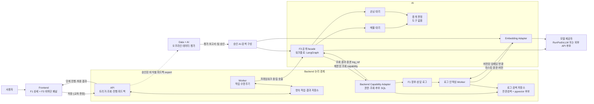

# F3 아키텍처 개요

## 문서 안내

- **이 문서가 답하는 질문:** F3 핵심 교차 판정을 어떤 큰 흐름과 모듈 책임으로 구현할 것인가?
- **관련 요구사항:** [F3 개요·공통](../../requirements/f3/overview-and-common.md) · [포지션 카드](../../requirements/f3/position-card.md) · [대리·중개 판정](../../requirements/f3/delegates-and-brokerage.md) · [후보 추출·도구](../../requirements/f3/candidate-selection-and-tools.md) · [교차 판정](../../requirements/f3/cross-judgment.md) · [MVP 범위와 평가](../../requirements/common/mvp-scope-and-evaluation.md)
- **관련 승인 ADR:** [ADR-0006: AI–Backend 실행 경계](../../../.agents/skills/project-wiki/references/decisions/ADR-0006-ai-backend-boundary.md) · [AI ADR-0002: LangGraph 채택 범위](../../../.agents/skills/ai/references/decisions/ADR-0002-langgraph-adoption.md)
- **이 문서가 소유하지 않는 상세:** DTO·Pydantic 스키마, API 경로, DB 테이블, 프롬프트 원문, 코드 폴더·클래스 구조. 포지션 카드의 Backend–AI 어휘와 DTO 정본은 [F3 AI 계약](../../../.agents/skills/project-wiki/references/contracts/f3-ai.md)이다
- **탐색:** [아키텍처 인덱스](../index.md) · [온라인 실행](online-runtime.md) · [오프라인 데이터·평가](offline-data-evaluation.md)

## 목적과 범위

F3는 F1에 누적된 구조화 데이터와 상담 로그에서 양측의 실제 입장을 포지션 카드로 만들고, 결정적 SQL로 찾은 반대편 후보들을 한 번에 비교해 중개 판단과 근거를 제안한다.

한 문장으로 요약하면 다음과 같다.

> 사용자의 저장 또는 상세의 [교차 판정] 버튼에 반응해 Backend가 복구 가능한 F3 작업을 만들고, AI가 격리된 양측 대리와 Backend 조회 capability를 사용해 후보를 판정하며, Backend가 검증한 최종 결과를 F1을 막지 않는 패널에 표시한다.

### 포함 범위

- 매물·손님 저장 및 상세의 [교차 판정] 버튼에서 시작하는 핵심 교차 판정
- 매물 대리와 손님 대리의 포지션 카드 생성 및 캐시
- 가격·평형·날짜·상태를 사용하는 결정적 SQL 후보 추출
- 전문검색과 pgvector 의미 검색을 결합한 상담 로그 근거 검색
- 앵커 1장과 후보 N장을 한 번에 비교하는 중개 판정
- 단계 진행, 최종 결과, 근거 추적, 사용자 피드백
- 합성·비식별 평가셋과 단일 프롬프트 대비 품질 평가

### 제외 범위

- 배치 판정과 캠페인
- 문자 생성·발송, 보류 목록과 일정 생성
- F3의 무승인 F1 데이터 변경 또는 외부 행동
- 구체 DTO, API 경로, ORM, 테이블과 모듈 내부 패키지 구조
- 후보 기술의 최종 채택과 운영 파라미터 확정

## 설계 원칙

1. **AI는 DB를 모르고 Backend는 AI 그래프를 모른다.** 모듈 사이에는 프레임워크 중립 facade와 capability만 둔다.
2. **후보 추출과 근거 검색을 분리한다.** 거래 후보는 결정적 SQL로 찾고 pgvector는 상담 로그 의미 검색에만 사용한다.
3. **대리의 정보 범위를 도구 수준에서 격리한다.** 매물 대리는 손님 데이터에, 손님 대리는 매물 데이터에 접근하지 못한다.
4. **중개 판정은 카드만 비교한다.** 중개 판정에는 DB·검색 도구를 주입하지 않고 앵커 1장과 후보 N장을 한 번에 전달한다.
5. **부분 진행과 최종 판정을 구분한다.** 앵커·후보·카드 생성 진행은 먼저 보여주되 등급과 순위는 전체 비교 완료 후 함께 공개한다.
6. **모든 결과는 입력 버전과 근거로 추적한다.** 원본 로그로 이동할 수 없는 인용이나 현재 버전과 맞지 않는 결과는 최종 결과로 노출하지 않는다.
7. **F3 장애를 F1에서 격리한다.** 작업 실패·재시도·지연은 F3 패널에만 영향을 주고 F1 조회·저장·편집을 막지 않는다.

## 모듈 책임

| 모듈 | F3에서 소유하는 책임 | 소유하지 않는 책임 |
|---|---|---|
| Frontend | 상세의 [교차 판정] 버튼 실행, 저장 후 활성 실행 확인, 진행 구독, 단계 결과·최종 판정·근거·피드백 표시 | SQL·검색, Agent 실행, 결과 영속화 |
| Backend | 인증·인가, 자동 트리거, 영속 작업·Worker, 입력 버전, 결정적 후보 SQL, 로그 원문·전문검색·벡터 저장, capability 구현, 캐시·결과·피드백 저장 | 프롬프트, Agent 역할, LangGraph 상태와 중개 판단 |
| AI | 공개 실행·임베딩 facade, 매물·손님 대리, 포지션 카드, 도구 정의·호출 정책, 워크플로, 중개 판정, 출력·근거 일관성 검증 | DB·Repository·트랜잭션, 사용자 권한 판정, F1 데이터 변경 |
| Data | 합성·비식별 평가 사례, 정답·slice, 분할, manifest·체크섬, 데이터 품질과 계보 | 온라인 검색·판정, 모델·프롬프트 실행, 운영 DB |
| Infra | Worker·모델·DB 실행 기반, 비밀값·네트워크·관측성·용량 정책 | 후보 규칙, 포지션 라벨 의미, 평가 정답 |

Backend와 AI의 확정 경계는 [ADR-0006](../../../.agents/skills/project-wiki/references/decisions/ADR-0006-ai-backend-boundary.md)을 따른다. 아래 구성의 제품명은 팀 검토를 위한 후보이며 승인된 기술 결정이 아니다.

## 시스템 구성

AI 공개 facade가 카드 생성과 중개 판정 순서를 소유하지만, 원천 조회는 모두 주입된 Backend capability를 거친다. `Backend Capability Adapter`는 요청 사용자의 권한과 대리 측면을 매 호출마다 다시 검사한다.

## 후보 추출과 상담 로그 검색의 구분

| 구분 | 입력 | 방식 | 출력과 보장 |
|---|---|---|---|
| 거래 후보 추출 | 앵커 카드의 추정 조건, 구조화 장부값, 날짜 신호 | 결정적 SQL | 후보 ID·점수·조회 조건; 같은 입력에 같은 결과 |
| 상담 로그 검색 | 측면·대상·기간·키워드·의미 질의 | 메타데이터 제한 후 전문검색+벡터 검색 | 원본 `log_id`가 있는 근거 후보; 검색 방식과 범위 진단 포함 |
| 중개 판정 | 앵커 카드 1장, 후보 카드 N장 | LLM 구조화 판정 1회 | 전체 후보의 등급·순위·비교 근거·걸림돌·양보 지점·행동 |

pgvector 유사도는 거래 후보를 포함·제외하거나 SQL 후보 점수를 대신하지 않는다. 상담 로그에서도 벡터 유사도만으로 의향이나 최신 상태를 확정하지 않고 원문 시각·화자·정정·철회 문맥을 함께 사용한다.

## 온라인과 오프라인 흐름

| 흐름 | 입력 | 결과 | 연결 지점 |
|---|---|---|---|
| [온라인 실행](online-runtime.md) | F1 사용자 행동, 장부·로그 버전 | 단계 진행, 검증된 중개 판정, 피드백 | 승인된 모델·검색 인덱스를 사용하고 비식별 평가 후보를 생성 |
| [오프라인 데이터·평가](offline-data-evaluation.md) | 합성·승인된 비식별 사례, 평가 계약 | 검색·Agent·종단 비교 보고서 | 승인된 구성과 버전을 온라인 Adapter에 제공 |

운영 피드백은 자동으로 데이터셋이나 프롬프트를 변경하지 않는다. Backend의 승인된 비식별 export, 새 데이터셋 버전, 고정 평가와 팀 검토를 차례로 거친다.

## 결정 상태

| 항목 | 상태 | 근거 또는 영향 |
|---|---|---|
| Frontend·Backend·AI·Data·Infra 루트 경계 | 결정 | [ADR-0006](../../../.agents/skills/project-wiki/references/decisions/ADR-0006-ai-backend-boundary.md) |
| Backend만 DB·권한·트랜잭션을 소유하고 AI는 DB를 모름 | 결정 | [ADR-0006](../../../.agents/skills/project-wiki/references/decisions/ADR-0006-ai-backend-boundary.md) |
| 핵심 교차 판정 중심 MVP | 결정 | [현재 MVP 범위](../../requirements/common/mvp-scope-and-evaluation.md) |
| 영속 작업+Worker, 단계 공개+최종 원자 반영 | 구현됨 | RDS polling·lease 재선점·상태 기반 handler와 결과 원자 저장. SSE는 후속 범위 |
| 전문검색+pgvector 하이브리드 로그 검색 | 제안 | 표현 다양성을 보완하되 원본 근거와 시간 문맥을 유지 |
| AI가 워크플로를 지휘하고 Backend capability를 주입 | 제안 | Agent 구조를 AI에 가두고 DB 접근을 Backend가 통제 |
| F3 AI workflow의 LangGraph 사용 | 결정 | [AI ADR-0002](../../../.agents/skills/ai/references/decisions/ADR-0002-langgraph-adoption.md); F2에는 강제하지 않음 |
| 포지션 카드 `negotiation_side` 어휘 `LISTING`·`REQUIREMENT` | 결정 | [F3 AI 계약](../../../.agents/skills/project-wiki/references/contracts/f3-ai.md); Backend `AnchorType`과 값이 같고 OQ-012를 종료함 |
| 포지션 카드 Backend–AI 요청·결과 DTO와 근거 규칙 (`position-card:v1`) | 결정 | [F3 AI 계약](../../../.agents/skills/project-wiki/references/contracts/f3-ai.md) |
| 포지션 카드 생성·저장 수직 슬라이스 | 구현됨 | 합성 snapshot, 주입 생성기 호출, fencing, 카드·가격·근거 저장과 `ANCHOR_READY` 전이. Worker handler 연결 포함 |
| 중개 판정 생성·저장 수직 슬라이스 | 구현됨 | 앵커 1장과 후보 1~15장 일괄 판정, 저장 직전 fencing, 결과·근거 원자 저장과 `JUDGING`·`COMPLETED` 전이. Worker handler 연결 포함 |
| FastAPI·SQLAlchemy 계열·PostgreSQL·pgvector·SSE | 후보 | 팀 승인 전에는 제품 채택으로 간주하지 않음 |
| 로컬/외부 모델 제공자와 구체 임베딩 모델 | 미확정 | 지연·비용·개인정보 전송 조건에 영향 |

포지션 카드와 중개 판정의 공개 계약·생성기, 합성 입력의 Backend 조립·저장과 Worker
polling·handler는 구현됐다. 실사용 F1 마스킹과 F3 production graph는 아직 없다. 계약의 정본은
[F3 AI 계약](../../../.agents/skills/project-wiki/references/contracts/f3-ai.md)이며 구현 여부는
[온라인 실행](online-runtime.md)의 현재 구현 범위를 본다. 팀이 다른 제안을 승인해 프로젝트 공통
결정을 바꾸면 관련 ADR과 계약 정본을 별도로 갱신한다.
