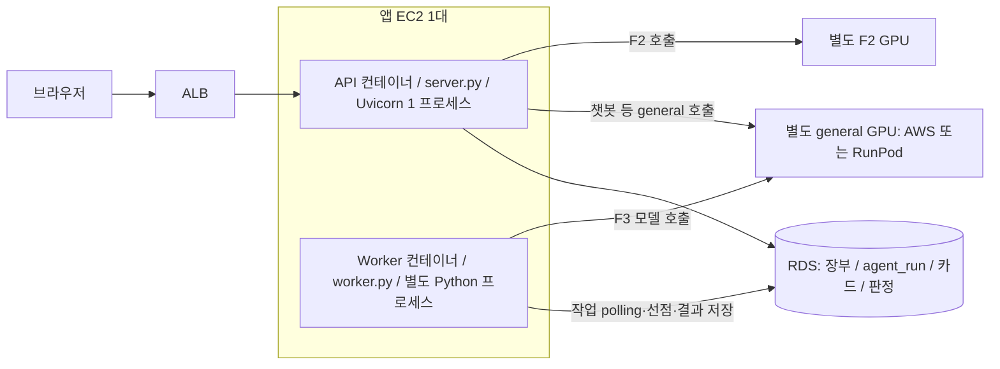

# F3 Worker 실행 단위와 서버 분리 검토

로컬 `174903a` 코드·Infra 스킬·배포 계약을 대조한 검토다. 현재 AWS 실행 인스턴스와 배포 revision은 조회하지 않았다.
사용자의 GPU 상시 운영 조건은 향후 설계 전제로 반영하며, 실제 GPU 기동 상태를 확인했다는 의미는 아니다.

## 현재 실행 구조 — 코드에서 확인됨

- [Compose](../../../infra/deploy/compose.dev.yml)는 같은 immutable image로 `api`, `worker` 두 서비스를 만든다.
- [Dockerfile](../../../backend/Dockerfile)의 기본 명령은 `python src/server.py`; Worker만 `python src/worker.py`로 덮어쓴다.
- [server.py](../../../backend/src/server.py)는 Uvicorn `workers=1`이다. 이는 API 프로세스 수이며 F3 Worker 수가 아니다.
- [worker.py](../../../backend/src/worker.py)는 별도 진입점에서 DB polling을 실행한다. `threading.Event`는 종료·대기 신호이고 API가 생성한 Worker 스레드가 아니다.
- Worker 하나는 실행 한 건을 처리하고 내부 후보 카드 miss 최대 5건을 `asyncio.gather`로 호출한다. OS 스레드 5개나 Worker 서버 5개라는 뜻이 아니다.
- 실제 모델 가중치·추론은 별도 GPU endpoint에 있다. 앱 EC2에서 AI 라이브러리가 입력·프롬프트·호출·검증을 담당한다.
- [ADR-0030](../../../.agents/skills/project-wiki/references/decisions/ADR-0030-local-dev-dual-cloud-serving.md)은 F2와 general의 GPU 분리를 정의한다. F3와 챗봇은 general을 공유한다.

## 같은 EC2 배치가 적절한가?

현재 팀 규모의 개발·시연에서는 합리적인 출발점이다. API가 모델 결과를 기다리며 F1 저장을 붙잡지 않고,
Worker를 독립 프로세스로 재시작할 수 있으며, 상태가 RDS에 있어 프로세스 종료 후 복구할 수 있다.
공유 DB를 사용하는 모듈러 모놀리스의 API·백그라운드 실행 역할 분리이며, 서버 수만으로 아키텍처 적절성을 판단하지 않는다.

다만 **프로세스 분리와 자원·장애·배포 격리는 다르다.**

| 경계 | 현재 상태·제약 |
|---|---|
| 메모리·프로세스 | 서로 다른 컨테이너·프로세스. API와 Worker가 하나의 Python 이벤트 루프/GIL을 공유하지 않음 |
| 호스트 | CPU·메모리·커널·디스크·네트워크 공유. EC2 장애는 둘 다 중단 |
| 자원 제한 | Compose에 CPU·메모리 한도가 없음. `tmpfs` 제한은 컨테이너 전체 메모리 제한이 아님 |
| 배포 | `application_start.sh`가 둘 다 시작, `application_stop.sh`가 Compose 전체를 종료. 검증도 고정 api-1/worker-1 두 이름을 요구 |
| 확장 | Terraform app ASG는 `t3.small`, desired 1/max 1. API·Worker 독립 ASG나 자동 확장 정책 없음 |
| 생존 점검 | Worker ready file 존재만 검사. 파일은 기동 시 작성되므로 처리 정체·DB 단절·backlog 악화를 검출하지 못함 |

기본 컨테이너에는 자원 제한이 없다는 점은 [Docker 공식 문서](https://docs.docker.com/engine/containers/resource_constraints/)와 일치한다.
측정으로 API 여유를 확보한 CPU·메모리·DB pool 예산을 부여하고 Worker 처리 진척·최장 대기 시간을 감시하는 개선을 권고한다.
현재 구조에서 F3 장애 시 F1 독립성은 주로 논리적 실패 격리이며, 호스트 자원 고갈까지 보장한 것은 아니다.

## 다른 서버로 분리하도록 설계됐는가?

**업무 실행의 기반은 갖췄지만, 독립 배포·확장까지 완성되지는 않았다.**

| 이미 있는 확장 기반 | 근거·의미 |
|---|---|
| 영속 큐와 단계 상태 | `agent_run`이 정본. API 프로세스 메모리·로컬 파일 큐에 작업을 맡기지 않음 |
| 여러 소비자 선점 | [repository/runs.py](../../../backend/src/domain/agent_execution/repository/runs.py)의 `FOR UPDATE SKIP LOCKED`. 서버 간 작업 분배에 사용 가능 |
| 분산 접수 중복 방지 | 사무소·앵커별 PostgreSQL advisory lock. API 인스턴스의 메모리 lock에 의존하지 않음 |
| lease·늦은 결과 차단 | DB 시각, worker ID, attempt, 만료 확인. 서버 시계 차이와 이전 시도의 저장을 방어 |
| 독립 실행 구성 | 별도 entrypoint·DB 연결·Provider 주입. 같은 이미지의 Worker를 다른 CPU EC2에서 실행 가능 |
| AI 경계 | 설치형 AI facade와 원격 GPU 호출. Worker 이동을 위해 새 AI HTTP 서버를 먼저 만들 필요 없음 |

`SKIP LOCKED`는 여러 큐 소비자의 잠금 경합을 피하는 용도에 적합하다: [PostgreSQL 문서](https://www.postgresql.org/docs/15/sql-select.html).
단, [기존 Infra 문서의 ECS AI 분리](../infra/overview.md)는 **AI facade를 별도 서비스로 옮기는 후보**다.
DB를 소유하는 Backend Worker를 다른 서버로 이동하는 것과 다른 변경이며, 후자에 Cloud Map·내부 AI API가 필수는 아니다.

## 서버 분리·증설 전에 필요한 보완

1. 역할별 배포: API host는 api만, Worker host는 worker만 실행·검증·rollback. 동일 이미지부터 유지하고 별도 launch template/배포 대상/ASG를 구성한다.
2. 네트워크·권한: Worker SG→RDS 5432, Worker SG→general GPU 8000 또는 RunPod HTTPS를 허용한다. 현재 [SG](../../../infra/environments/dev/security.tf)·[GPU SG](../../../infra/environments/dev/serving.tf)는 app SG 기준이다. Worker에 ALB inbound는 필요 없다.
3. 설정 전달: Worker host에도 RDS CA·DB_URL·general 설정·인증값을 주입한다. [refresh script](../../../infra/deploy/scripts/refresh_ai_endpoints.sh)의 기본은 F2 API만, `--all`은 같은 host의 API·Worker 동시 갱신이다. 분리 후 모든 Worker에 general 전환이 적용돼야 한다.
4. 복구: 현재 전체 실행 lease 300초·heartbeat 없음과 배포 stop 30초를 맞춘다. 장기 호출 중 강제 종료·다중 Worker 재선점·늦은 응답을 검사하고, 단계별 lease/연장·drain을 설계한다.
5. 처리량: Worker별 최대 5개 후보 호출이 서버 수만큼 증가한다. general GPU 전체 동시성·rate limit·챗봇 우선순위를 공동으로 제어해야 한다.
6. 모델 중복: 다른 실행의 같은 후보 cache miss에 대한 전역 생성 선점, 성공 카드 개별 저장, 재시도 backoff·next_attempt_at을 추가한다.
7. 운영: Worker별 처리 진척·최장 대기·실패·lease 만료·GPU 포화 지표와 DB 연결 총량을 관리한다. ready file만으로 정상 처리로 판단하지 않는다.
8. 호환성: API와 Worker revision이 잠시 달라도 작업·DB schema를 읽을 수 있는 배포 순서와 전진 migration 정책을 둔다.

별도 CPU Worker EC2부터 도입할 수 있고 GPU 서버는 기존 것을 계속 사용한다. SQS는 Worker 서버 분리의 선행 조건이 아니다.
큐 지연 격리·독립 재시도·DB polling 비용이 문제가 될 때 SQS·DLQ로 확장한다.
앱 ASG 최대값만 올리면 Worker까지 함께 늘고 GPU·DB 부하는 증가하므로 독립 확장의 완성으로 간주하지 않는다.

## 검증 한계와 판정

이번 확인은 코드·배포 선언·승인 문서의 대조다. 기존 단위 테스트 86개 통과는 이전 검토의 증거이며 다중 host 부하 검증을 뜻하지 않는다.
현재 Infra는 작은 dev 환경에 타당하고 서버 분리의 기반도 있다. **독립 확장을 지원하는 운영 구성은 후속 구현·검증이 필요하다.**
조건부 자동 판정은 [선행 계산 설계안](conditional-auto-judgment.md)과 함께 용량·사용자 대기로 평가한다.
