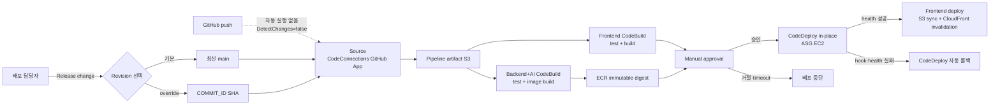

# 배포 및 운영 구조

## 문서 안내

- **이 문서가 답하는 질문:** 선택한 revision을 어떻게 빌드·승인·배포하고 실패와 비용을 어떻게 통제하는가?
- **관련 개요:** [개발·시연용 인프라 아키텍처](overview.md)
- **관련 결정:** [프로젝트 ADR-0008](../../../.agents/skills/project-wiki/references/decisions/ADR-0008-dev-demo-runtime-and-delivery.md) · [Infra ADR-0002](../../../.agents/skills/infra/references/decisions/ADR-0002-dev-demo-aws-runpod-architecture.md) · [Infra ADR-0003](../../../.agents/skills/infra/references/decisions/ADR-0003-dev-storage-database-and-configuration.md) · [Infra ADR-0004](../../../.agents/skills/infra/references/decisions/ADR-0004-dev-runtime-and-observability-baseline.md) · [Infra ADR-0005](../../../.agents/skills/infra/references/decisions/ADR-0005-dev-frontend-origin-and-api-routing.md)
- **적용 범위:** account bootstrap은 이미 적용됐고 dev workload Terraform은 미적용이다. 애플리케이션 delivery Pipeline과 RunPod 자원은 아직 생성하지 않는다.

## 전달 원칙

- CI/CD는 `GitHub CodeConnections → CodePipeline V2 → CodeBuild → Manual approval → CodeDeploy`를 사용한다.
- CodeConnections는 `GitHub (via GitHub App)`으로 연결하고 개인 access token이나 장기 AWS access key를 저장하지 않는다.
- Source action은 `main`을 가리키되 `DetectChanges=false`로 설정한다. commit push, pull request merge 또는 tag 생성만으로 Pipeline을 시작하지 않는다.
- 배포 담당자가 `Release change`를 실행하면 최신 `main` revision을 사용한다. 특정 revision이 필요하면 CodePipeline source revision override에 `revisionType=COMMIT_ID`와 전체 commit SHA를 지정한다.
- 선택된 commit SHA, 실행자, 승인자, Build 결과와 배포 결과를 Pipeline 실행 이력과 CloudWatch에 남긴다. 비밀값과 원문 개인정보는 남기지 않는다.
- 애플리케이션 Pipeline은 Terraform을 실행하지 않는다. Infra 변경은 기존 수동 Terraform 절차를 유지한다.

[AWS CodePipeline은 수동 실행에서 최신 revision 또는 특정 source revision override를 지원](https://docs.aws.amazon.com/codepipeline/latest/userguide/pipelines-trigger-source-overrides.html)한다. `COMMIT_ID` override는 저장소 전체 content에 적용될 수 있으므로 승인 화면에서 해당 SHA가 의도한 revision인지 확인한다.

## Pipeline 구조



Frontend와 Backend+AI Build action은 같은 stage에서 같은 `runOrder`로 병렬 실행한다. 둘 중 하나라도 실패하면 Manual approval stage로 진행하지 않는다. 승인 후 Backend를 먼저 배포하고 ALB health를 통과한 다음 Frontend를 배포해 호환되지 않는 UI가 먼저 노출되는 위험을 줄인다.

## Source와 artifact

[CodeConnections GitHub 연결은 GitHub App 설치와 선택한 repository 권한](https://docs.aws.amazon.com/codepipeline/latest/userguide/connections-github.html)을 사용한다. GitHub organization 또는 repository 소유자가 App 연결을 승인하고, Connection이 `AVAILABLE`인지 확인한 뒤 Pipeline에 연결한다.

Source output은 Pipeline artifact 전용 S3에 저장한다. 이 bucket은 다음과 같이 제한한다.

- Terraform state, Frontend origin, 임시 음성, 데이터셋과 모델 artifact를 저장하지 않는다.
- Pipeline·CodeBuild·CodeDeploy 역할만 최소 권한으로 접근한다.
- versioning은 사용하지 않고 저장 암호화, public access block과 객체 생성 14일 후 만료 lifecycle을 적용한다.
- Build log와 artifact에 `.env`, token, 원문 개인정보 또는 전체 접속 URL을 포함하지 않는다.

## Build 단계

### Frontend CodeBuild

1. lockfile 기반 의존성을 설치한다.
2. 저장소에 승인된 lint·test·build 명령을 실행한다.
3. 실패하면 즉시 종료하고 정적 build artifact만 Pipeline artifact S3에 출력한다.
4. API URL 등 공개 설정만 빌드 변수로 사용하고 비밀값을 번들에 넣지 않는다.

### Backend+AI CodeBuild

1. Backend와 AI의 lockfile을 사용해 테스트와 경계 검증을 실행한다.
2. 저장소 root build context에서 `brokerage-ai`를 non-editable dependency로 포함한 Backend 이미지를 만든다.
3. API와 Worker가 같은 이미지를 쓰되 서로 다른 실행 명령을 갖도록 한다.
4. ECR tag는 추적 편의를 위해 commit SHA를 사용하고, 배포 정본은 tag가 아니라 immutable image digest로 고정한다.
5. Pipeline artifact로 `appspec.yml`, CodeDeploy lifecycle script, image digest manifest와 배포 metadata를 출력한다.
6. Build 또는 push가 실패하면 승인과 배포로 진행하지 않는다.

CodeBuild 역할은 Source 읽기, Pipeline artifact, ECR push, 필요한 로그 쓰기만 허용한다. Build container가 운영 비밀값을 읽지 않게 하고 테스트 전용 값만 사용한다.

## 승인 단계

Manual approval은 두 Build가 모두 성공한 뒤 한 번 수행한다. 승인자는 다음을 확인한다.

- 실행 대상이 최신 `main`인지 지정 SHA인지와 실제 commit 내용
- Frontend와 Backend+AI 테스트 결과
- ECR image digest와 취약점·크기 등 제공되는 Build 결과
- DB migration 포함 여부와 전진 호환성
- 도메인·ACM 미구성 환경에서 합성 데이터만 사용한다는 시연 조건
- 예상 비용 증가, RunPod Pod 유지 여부와 종료일

거절하거나 승인 timeout이 발생하면 배포하지 않는다. 동일 revision을 다시 배포할 때도 새 Pipeline 실행과 승인을 거친다.

## Backend CodeDeploy

Backend는 ASG `desired=1`의 EC2에 CodeDeploy 인플레이스 방식으로 배포한다. 현재 Launch Template bootstrap은 SSM agent, Docker와 CloudWatch agent만 준비한다. CodeDeploy agent 설치, Pipeline artifact 읽기, migration 전용 자격과 애플리케이션 설정·비밀값 조립 권한은 delivery 단계에서 별도 추가한다.

[CodeDeploy는 ASG와 연동해 새 인스턴스에 revision을 배포하고 Load Balancer와 조정](https://docs.aws.amazon.com/codedeploy/latest/userguide/integrations-aws-auto-scaling.html)한다. 단일 ASG에는 하나의 CodeDeploy deployment group만 연결한다.

### Lifecycle

| 순서 | CodeDeploy hook | 동작 | 실패 결과 |
|---|---|---|---|
| 1 | `ApplicationStop` | 기존 API·Worker graceful stop | 배포 실패 |
| 2 | `BeforeInstall` | 디스크·agent·필수 명령과 artifact 검증 | 배포 실패 |
| 3 | `AfterInstall` | ECR에서 지정 digest pull, 설정 준비, DB migration 실행 | 배포 중단; 새 앱 시작 금지 |
| 4 | `ApplicationStart` | API와 Worker를 별도 service로 시작 | 배포 실패 |
| 5 | `ValidateService` | 로컬 health, 프로세스 상태, Worker 준비 상태 확인 | 자동 롤백 조건 발생 |
| 6 | ALB health check | target이 연속 정상인지 확인 | traffic 차단 및 자동 롤백 |

CodeDeploy deployment group은 실패 상태와 CloudWatch alarm에 자동 롤백을 연결한다. 롤백은 이전 애플리케이션 revision과 image digest로 복귀하지만 이미 적용된 DB migration을 역으로 되돌리지 않는다.

### DB migration 규칙

- migration은 애플리케이션 시작 시 암묵적으로 실행하지 않고 CodeDeploy `AfterInstall` hook에서 명시적으로 실행한다.
- 동일 revision 재배포와 ASG instance 교체에도 안전하도록 migration lock과 적용 이력을 사용한다.
- migration 실패 시 hook을 non-zero로 종료해 배포와 신규 프로세스 시작을 차단한다.
- 전진 호환되는 expand/contract migration만 허용한다. 새 코드와 직전 코드가 모두 동작할 수 없는 파괴적 변경은 한 번의 배포에 넣지 않는다.
- rollback은 앱 revision만 되돌린다. DB down migration을 자동 실행하지 않으므로 수동 복구 절차와 백업 확인 없이 파괴적 migration을 승인하지 않는다.

## Frontend 배포

Backend health가 확인된 뒤 Frontend deploy action을 실행한다. 배포 전용 CodeBuild action이 build artifact를 Frontend origin S3에 동기화하고 CloudFront invalidation을 생성한다.

현재 `npm run build`는 존재하지 않는 `frontend/scripts/prepare-sites-build.mjs`를 호출하므로 delivery 구현 전에 표준 release build를 복구해야 한다.

- 해시가 포함된 정적 asset은 장기 cache하고 entry document는 짧게 cache한다.
- entry document는 `no-cache` 또는 짧은 TTL metadata, hash asset은 immutable metadata로 업로드한다.
- CloudFront managed security headers를 default와 API behavior에 모두 적용하며 CORS는 Backend가 소유한다.
- S3 객체 ACL로 공개하지 않고 CloudFront OAC bucket policy만 허용한다.
- sync 실패 시 invalidation을 실행하지 않는다.
- invalidation 실패는 Pipeline 실패로 표시하고 재실행 여부를 운영자가 판단한다.
- 환경 종료 시 `force_destroy=false`인 Frontend bucket의 객체를 승인 절차로 비운 뒤 Terraform destroy를 수행한다.

## 실패 차단과 복구

| 실패 지점 | 차단·복구 동작 |
|---|---|
| Source revision 조회 실패 | Build 시작 안 함, Pipeline 실패 |
| Frontend 또는 Backend+AI Build 실패 | Manual approval 진입 안 함, 배포 없음 |
| Manual approval 거절·timeout | 배포 없음 |
| DB migration 실패 | 새 앱 시작 안 함, CodeDeploy 실패; DB 상태를 확인한 후 forward fix |
| API·Worker start 또는 local health 실패 | CodeDeploy 실패 및 이전 revision 자동 롤백 |
| ALB health check 또는 연결된 CloudWatch alarm 실패 | target에 traffic 허용하지 않고 자동 롤백 |
| Frontend deploy 실패 | Backend는 이미 검증된 상태를 유지; Frontend 재배포 또는 이전 artifact 복원 |
| ASG instance 교체 | CodeDeploy가 마지막 성공 revision을 새 인스턴스에 적용하고 health 확인 |

API·DTO는 이번 작업에서 변경하지 않는다. Frontend와 Backend 배포가 일시적으로 다른 revision이어도 기존 공개 계약을 깨지 않는 것을 전제로 하며, 향후 계약 변경에는 별도 호환성·순서 계획이 필요하다.

## Terraform 운영

Terraform 배포 Pipeline은 만들지 않는다. AWS IaC 변경은 다음 수동 절차를 유지하며 RunPod Terraform 소유 범위는 현재 보류한다.

```text
preflight → fmt/validate → plan → 사람 승인 → apply → 검증 → drift plan
```

- account ID와 `ap-northeast-2` guard를 먼저 확인한다.
- plan에서 비용 발생, 교체·삭제, IAM 확대와 민감정보 노출을 검토한다.
- 애플리케이션 Pipeline 역할에 Terraform state 접근이나 `apply` 권한을 주지 않는다.
- Terraform state S3는 Pipeline artifact와 업무용 S3에서 분리한다.

## RunPod 운영

[RunPod Pod](https://docs.runpod.io/pods/manage-pods)는 팀 공용 Template에서 개발자별로 생성한다. Template은 공개 비밀값 없이 image, start command, port, disk와 일반 설정을 재사용한다. 개발자는 생성 시점에 실제 가용 GPU와 모델별 VRAM 요구를 확인해 GPU를 선택한다.

### 개발자 실험

1. 공용 Template revision과 목적, 소유자, 종료 시각을 기록한다.
2. 가용 GPU를 선택해 개인 식별 가능한 Pod 이름으로 생성한다.
3. LLM·STT·Embedding endpoint와 secret은 역할별로 분리해 주입한다.
4. 합성·비식별 입력으로 health와 모델 평가를 실행한다.
5. 필요한 결과를 업무용 S3에 내보낸 뒤 Pod를 삭제한다.

표준 개발 절차에는 `stop`을 넣지 않는다. stop 상태에서도 volume 비용이 남고 재시작 시 같은 GPU 확보를 보장할 수 없기 때문이다. 계속 사용할 실험은 실행 상태로 짧게 유지하고, 끝난 Pod는 결과를 반출한 뒤 삭제한다.

### 시연·운영 기간

- 시연 기준 모델과 GPU를 확정하면 해당 Pod를 운영 기간 동안 상시 유지한다.
- Pod health, endpoint 응답시간, 모델 오류와 비용을 담당자가 매일 확인한다.
- 운영 기간 종료일에 artifact 반출과 호출 차단을 확인한 뒤 Pod를 삭제한다.
- Pod local disk를 장기 원본으로 취급하지 않는다. custom image와 Network Volume은 [Template](https://docs.runpod.io/pods/templates/manage-templates)·기본 vLLM·일반 모델 다운로드가 요구를 충족하지 못할 때만 별도 승인한다.

LLM·STT·Embedding은 논리적으로 독립된 route와 관측 차원을 갖는다. 물리적으로 한 Pod에 통합할지는 각 모델의 VRAM 합계, 동시 실행 peak, cold start, 처리량과 장애 영향을 측정한 후 결정한다.

## 관측성과 알림

| 대상 | 로그·메트릭 | 기본 알람·대응 |
|---|---|---|
| ALB | target health, target 5xx | unhealthy host와 target 5xx alarm을 SNS topic에 연결 |
| EC2 host | CloudWatch Agent memory·disk metric, agent·cloud-init log | API·Worker 프로세스 alarm은 delivery 단계에서 추가 |
| RDS | CPU, free storage, PostgreSQL·upgrade log | CPU 80%와 free storage 5 GiB alarm을 SNS topic에 연결 |
| CodePipeline·CodeBuild | 실행 SHA, stage duration, failure | Build·approval·deploy 실패 시 SNS |
| CodeDeploy | lifecycle hook, deployment status, ALB health | 실패 시 자동 롤백 및 SNS |
| S3 deletion | 임시 음성 age, 삭제 실패 건수 | 1시간 초과 객체 또는 sweeper 실패 시 SNS |
| RunPod·OpenAI | route별 latency, error, token·request count, 추정 비용 | endpoint down, 오류율·예산 증가 시 담당자 알림 |

CloudWatch log group은 기본 14일 보존한다. 음성, 전사 원문, 전체 프롬프트, 인증 헤더, API key와 개인정보가 포함된 모델 응답을 기록하지 않고 내부 작업 ID와 가명 사용자 ID, route, 지연, 상태 코드와 사용량만 남긴다.

현재 SNS topic에는 subscription이 없으므로 alarm action은 사람 알림이 아니라 후속 연결점이다. API·Worker process, Pipeline, S3 deletion과 RunPod 알림은 각 delivery·애플리케이션 단계에서 실제 metric 생산자가 준비된 뒤 연결한다.

## 비용과 종료 정책

| 비용 경계 | 한도 | 운영 규칙 |
|---|---|---|
| AWS | 2026-09-23까지 누적 300,000원 | 자동 집행 없는 참고 상한, 변경별 예상 비용·소유자·종료일 검토 |
| RunPod | 2개월 합계 USD 300 | Pod별 소유자·종료일, 개발 후 삭제, 시연 Pod만 상시 유지 |
| OpenAI | 2개월 합계 USD 300 | 모델 route별 사용량·비용 기록, 실험 상한과 key 분리 |

비용 발생 자원에는 최소 `Project`, `Environment`, `Owner`, `ManagedBy`, `ExpiresAt=2026-09-23` 태그를 적용한다. 이 계정에서는 AWS Budget과 Cost Anomaly Detection을 사용할 수 없으므로 해당 자원을 만들지 않고 자동 알림·차단을 전제하지 않는다. Data/model S3의 승인된 release artifact는 2026-09-23까지 유효하며 환경 종료 확인 후 만료·삭제한다.

## 운영 체크리스트

### 배포 전

- Source `DetectChanges=false`, 대상 branch와 SHA 확인
- 두 Build 성공, image digest와 artifact 분리 확인
- migration 전진 호환성과 RDS backup 상태 확인
- Manual approval 완료 및 변경 영향 공지
- CloudFront 기본 도메인과 `/api/*` 동일 origin을 사용하며 합성·비식별 데이터만 사용하는지 확인

### 배포 후

- CodeDeploy와 ALB health, API·Worker 상태 확인
- Frontend asset과 CloudFront invalidation 확인
- RDS connection·migration version, 임시 음성 삭제 sweeper 확인
- RunPod route별 health와 예산 추적 확인
- 같은 Terraform 구성의 drift plan은 별도 승인 절차에서 수행

### 환경 종료

- RunPod Pod 삭제와 artifact 반출 확인
- OpenAI·RunPod secret 회전 또는 폐기
- ASG·RDS·ALB 등 유료 자원의 유지 필요성 검토
- RDS deletion protection을 별도 승인 apply로 해제한 뒤 final snapshot을 생성하고, snapshot 소유자·보존 근거·폐기 승인일을 기록
- non-versioned Pipeline artifact의 14일 lifecycle과 CloudWatch log의 14일 보존 만료 확인
