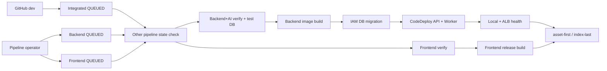

# 배포 및 운영 구조

## 문서 안내

- **관련 결정:** [프로젝트 ADR-0011](../../../.agents/skills/project-wiki/references/decisions/ADR-0011-dev-cicd-pipeline-modes.md) · [Infra ADR-0011](../../../.agents/skills/infra/references/decisions/ADR-0011-dev-delivery-implementation.md) · [Infra ADR-0014](../../../.agents/skills/infra/references/decisions/ADR-0014-dev-deep-power-lifecycle.md)
- **실행 runbook:** [infra/delivery/README.md](../../../infra/delivery/README.md)
- **현재 상태:** dev workload, DB migration과 `main` source의 기존 세 Pipeline은 적용됐다. `dev` source 전환, Verify/Build 분리, 환경 materialization과 전용 CI pgvector ECR 변경은 Terraform plan 검증 후 apply 승인 전이다. 아래 표는 승인된 목표 구성을 나타낸다.

## Pipeline 구성

| Pipeline | 시작 | Verify | Build | Deploy |
|---|---|---|---|---|
| `dev-integrated` | 최종 전환 후 `dev` 자동 감지 | Backend+AI와 Frontend 병렬 | Backend image와 Frontend release 병렬 | migration → Backend/Worker → health → Frontend |
| `dev-backend` | 운영자 수동, 최신 `dev` 또는 전체 SHA | Backend+AI, disposable DB | Backend image | migration → Backend/Worker → health |
| `dev-frontend` | 운영자 수동, 최신 `dev` 또는 전체 SHA | test:env·test:auth, typecheck와 원장 테스트 | Vite release와 계약 검사 | 현재 Backend readiness → S3 → CloudFront |

세 Pipeline은 CodePipeline V2 `QUEUED`다. 독립 Pipeline 실행 권한이 운영자 승인 역할을 하므로 내부 Manual approval은 두지 않는다. 통합 Pipeline도 별도 승인 없이 끝까지 진행한다. 애플리케이션 Pipeline은 Terraform을 실행하지 않는다.

## Source revision과 충돌 방지

- 통합 Pipeline만 `dev` 변경 감지를 사용한다. 최초 적용, 실패 주입 검증과 deep suspend 중에는 Terraform 변수 또는 edge mode로 감지를 끈다.
- 독립 Pipeline은 `DetectChanges=false`이며 Console 또는 `StartPipelineExecution`으로 실행한다.
- 특정 revision은 Source action에 `COMMIT_ID`와 40자리 SHA를 override한다.
- 첫 action은 다른 두 Pipeline의 최신 실행이 `InProgress` 또는 `Stopping`인지 확인하고 해당하면 실패한다.
- 같은 Pipeline의 연속 실행은 `QUEUED`가 직렬화한다.
- 상태 조회와 배포 사이 race는 남는다. DynamoDB lock을 추가하지 않으므로 독립 실행 전에 운영자가 통합 Pipeline 상태를 다시 확인한다.

## Backend build와 image

Verify project는 다음 검사를 수행하고 output artifact를 만들지 않는다.

1. Python 3.13과 각 `uv.lock`으로 Backend·AI 환경을 동기화한다.
2. format, lint, type, architecture, unit/API/integration 검사를 수행하며 `TEST_DB_URL` 누락으로 DB 검사가 skip되는 것을 허용하지 않는다.
3. disposable PostgreSQL 15+pgvector에 전체 Yoyo migration을 두 번 실행해 적용과 no-op을 검증한다.

검증 DB image는 ECR Public PostgreSQL base와 고정 pgvector commit으로 만들며 전용 private ECR에 캐시한다. Docker Hub anonymous pull에 의존하지 않는다. Verify 성공 뒤 image Build project가 다음을 수행한다.

1. 저장소 root context에서 multi-stage image를 만든다.
2. commit SHA tag가 ECR에 있으면 기존 digest를 사용하고, 없으면 immutable tag로 push한다.
3. AppSpec, Compose, lifecycle script, digest와 release manifest를 Pipeline artifact로 출력한다.
4. image digest와 Terraform이 만든 비민감 배포 메타데이터는 기존 `backend-image.env`에 기록한다.
   release manifest에는 환경설정 schema를 추가하지 않는다.

이미지는 `brokerage-ai`를 non-editable dependency로 설치하고 UID 10001로 실행한다. 비밀값이나 환경 파일을 image layer에 넣지 않는다. API, Worker와 migration은 같은 digest를 사용한다.

## CodeDeploy와 migration

Launch Template은 SSM, Docker, pinned Compose plugin, CodeDeploy agent와 CloudWatch agent를 설치하고 기동을 확인한다.

| Hook | 동작 |
|---|---|
| `ApplicationStop` | 기존 Compose API·Worker graceful stop |
| `BeforeInstall` | revision/config directory 준비 |
| `AfterInstall` | digest 검증, RDS CA 단일-file mount 검증, ECR pull, 설정 조립, advisory lock 전진 migration |
| `ApplicationStart` | API와 Worker 시작 |
| `ValidateService` | container health와 local `/health/ready` 확인 |

runtime DB credential은 전용 Secret에서 읽고 migration token은 EC2 role의 `app_migrator`용 `rds-db:connect` 권한으로 그때 생성한다. Parameter Store의 Backend·AI 공개 설정은 경로 아래 유효한 환경변수 이름을 동적으로 조립한다. API에는 Backend 설정과 `DB_URL`, Worker에는 Backend·AI 설정과 Provider key·`DB_URL`, migration에는 `DB_MIGRATION_URL`만 담긴 별도 env 파일을 원자적으로 생성한다. host config directory와 env 파일은 각각 root `0700`, `0600`으로 유지해 컨테이너에 directory 전체를 노출하지 않는다. 공개 RDS CA 파일만 `/etc/ssl/certs/aws-rds-global-bundle.pem`으로 read-only mount한다. migration 실패 시 새 API·Worker를 시작하지 않는다.

CodeDeploy deployment group은 ASG와 target group을 사용하고 실패 시 마지막 정상 revision으로 자동 rollback한다. rollback은 image와 application revision만 되돌리고 DB down migration을 실행하지 않는다.

Worker는 `WORKER_ENABLED=false`에서 DB readiness, health file과 SIGTERM cleanup만 수행하며 작업을 claim하지 않는다. F3 handler 코드는 `true`에서 RDS polling을 지원하지만 현재 배포 Parameter는 `WORKER_ENABLED=false`, `F3_ALLOW_SYNTHETIC_PROTOTYPE=false`다. 검토된 합성 전용 환경에서 두 값을 모두 `true`로 명시하지 않으면 활성 Worker는 DB·Provider 접근과 claim 전에 기동을 거절한다. 운영 Provider 선택과 실사용 데이터 활성화는 별도 적용하며, 정지 신호를 받으면 현재 application 단계까지 마친 뒤 종료한다.

## Frontend build와 배포

Frontend는 runtime Dockerfile을 사용하지 않는다. Verify project는 `npm ci → test:env → test:auth → typecheck → 원장 테스트`만 실행하고 artifact를 만들지 않는다. 성공 뒤 Build project가 격리된 작업공간에서 `npm ci → Vite build → release test`를 실행하고 `frontend/dist/client`만 artifact로 전달한다.

배포별 `VITE_*` 공개값은 Terraform의 단일 Frontend build map에서 CodeBuild process env로 동적
전달한다. CloudFront의 동일 origin routing을 사용하므로 API base는 절대 domain이 아니라 `/api`
하위 상대 경로다. 새 build 변수를 release manifest schema에 추가하지 않는다.

- asset path, bytes, SHA-256, entry document, revision과 execution ID를 release manifest에 기록한다.
- 독립 Pipeline은 Build 전에 CloudFront를 통한 Backend live/readiness를 확인한다.
- 기존 index와 manifest를 artifact bucket의 `frontend-releases/<execution-id>/`에 보관한다.
- index를 제외한 asset을 immutable cache로 먼저 업로드하며 기존 asset을 즉시 삭제하지 않는다.
- `index.html`을 no-cache로 마지막에 교체하고 `/`, `/index.html`을 invalidation한다.
- 업로드 또는 invalidation 실패 시 이전 index를 복원하고 다시 invalidation한다.

Breaking API 변경은 Frontend 독립 Pipeline으로 배포하지 않는다. 이전 Backend와 호환되는 단계적 변경이나 통합 Pipeline을 사용한다.

## IAM과 비밀값

- Pipeline service role은 세 개로 나눈다.
- admission, Backend Verify/image Build, Frontend Verify/release Build와 Frontend deploy CodeBuild role은 기능별로 분리한다.
- CodeDeploy는 AWS 관리 service role을 사용한다.
- EC2 role에는 artifact read, ECR pull, runtime Secret/Parameter read, CloudWatch write와 migration DB connect만 둔다.
- 운영자 policy는 `pipeline_operator_user_names`에 지정한 기존 IAM 사용자에게 직접 연결하고 `team-readonly`에는 쓰기 권한을 추가하지 않는다.
- OpenAI·선택적 vLLM key와 Discord webhook은 Git에서 제외한 `secrets.auto.tfvars`에서 받는다.
  Terraform ephemeral input과 Secrets Manager write-only version 인자로 전달해 plan·state에는 실제
  값을 남기지 않는다. 회전할 때 각 secret version 번호를 함께 증가시킨다.
- RDS runtime 비밀번호와 migration IAM token은 서비스가 자동 생성하는 기존 경계를 유지한다.
- state, Build log, artifact, release manifest와 Discord 메시지에 DB URL, IAM token, API key 또는 webhook을 기록하지 않는다.

## 알림

CodePipeline 완료 상태와 CodeDeploy 상태 변경은 EventBridge가 기존 SNS topic에 게시한다. Lambda는 Pipeline 종류, revision, execution ID, 실패 action과 Console 링크를 Discord에 보낸다. CodeDeploy rollback creator도 구분한다.

## 단계적 적용

1. 애플리케이션·Docker·Compose·ADR 변경을 작업 PR로 `dev`에 병합한다.
2. 기존 IAM 운영자 목록과 최소 권한 Pipeline policy attachment를 승인한다.
3. 통합 변경 감지 `false`, ASG health `EC2`로 plan과 apply를 승인한다.
4. ignored `secrets.auto.tfvars`의 수동 비밀값과 version을 검토한 Terraform plan을 적용하고
   Secrets Manager의 `AWSCURRENT`가 갱신됐는지 확인한다.
5. Backend, Frontend, 통합 순서로 최초 수동 배포한다.
6. 실패 주입으로 Backend rollback, Frontend index 복원과 알림을 검증한다.
7. 별도 Terraform 변경으로 통합 감지를 `true`, ASG health를 `ELB`로 전환한다.
8. 안전한 `dev` 변경 자동 배포와 빈 drift plan을 확인한다.

## 운영 제약

- ASG desired 1 인플레이스 배포의 짧은 개발환경 중단을 수용한다.
- Deep suspend 중에는 통합 Pipeline 자동 감지가 꺼지며 수동 Pipeline과 migration도 실행하지 않는다. `dev-deep-start`가 ALB·CloudFront 배포를 끝내고 RDS·ASG를 복구한 뒤 배포를 재개한다.
- Deep 전환은 `plan → show → 승인 → saved-plan apply → 상태·drift 검증` 순서를 지키며, suspend 중 일반 `dev-plan`은 active edge 복구를 제안하므로 전용 drift 명령을 사용한다.
- 도메인과 origin TLS가 없는 동안 합성·비식별 데이터만 사용한다.
- Terraform은 계속 `preflight → fmt/validate → plan → 승인 → apply → 검증 → drift` 수동 절차를 따른다.
- RunPod 운영, 비용 종료일과 개인정보 제한은 [인프라 개요](overview.md)의 기존 경계를 유지한다.
- 로컬 F2 종단 간 검증의 Qwen·Whisper Pod 실행과 SSH tunnel 절차는
  [RunPod F2 runbook](../../../infra/runpod/README.md)을 따른다.
