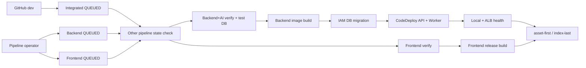

# 배포 및 운영 구조

## 문서 안내

- **관련 결정:** [프로젝트 ADR-0011](../../../.agents/skills/project-wiki/references/decisions/ADR-0011-dev-cicd-pipeline-modes.md) · [프로젝트 ADR-0019](../../../.agents/skills/project-wiki/references/decisions/ADR-0019-minimal-error-observability.md) · [프로젝트 ADR-0022](../../../.agents/skills/project-wiki/references/decisions/ADR-0022-sllm-release-v2-base-only.md) · [프로젝트 ADR-0027](../../../.agents/skills/project-wiki/references/decisions/ADR-0027-bedrock-gpt56-luna-dev-poc.md) · [Infra ADR-0011](../../../.agents/skills/infra/references/decisions/ADR-0011-dev-delivery-implementation.md) · [Infra ADR-0014](../../../.agents/skills/infra/references/decisions/ADR-0014-dev-deep-power-lifecycle.md) · [Infra ADR-0015](../../../.agents/skills/infra/references/decisions/ADR-0015-cloudwatch-alarm-discord-delivery.md) · [Infra ADR-0017](../../../.agents/skills/infra/references/decisions/ADR-0017-runpod-ephemeral-sllm-serving.md) · [Infra ADR-0018](../../../.agents/skills/infra/references/decisions/ADR-0018-runpod-bootstrap-secrets-monitoring.md) · [Infra ADR-0019](../../../.agents/skills/infra/references/decisions/ADR-0019-bedrock-luna-dev-poc.md)
- **실행 runbook:** [infra/delivery/README.md](../../../infra/delivery/README.md)
- **현재 상태:** dev workload, DB migration과 `main` source의 기존 세 Pipeline은 적용됐고 S3 dev release는 게시됐다. RunPod Pod와 이번 Terraform 변경은 미적용이다. `dev` source 전환, Verify/Build 분리, 환경 materialization과 전용 CI pgvector ECR 변경은 Terraform plan 검증 후 apply 승인 전이다. 아래 표는 승인된 목표 구성을 나타낸다.

## Pipeline 구성

| Pipeline | 시작 | Verify | Build | Deploy |
|---|---|---|---|---|
| `dev-integrated` | 최종 전환 후 `dev` 자동 감지 | Backend+AI와 Frontend 병렬 | Backend image와 Frontend release 병렬 | migration → Backend/Worker → health → Frontend |
| `dev-backend` | 운영자 수동, 최신 `dev` 또는 전체 SHA | Backend+AI, disposable DB | Backend image | migration → Backend/Worker → health |
| `dev-frontend` | 운영자 수동, 최신 `dev` 또는 전체 SHA | env·auth·오류 복구·F2·F3 계약, typecheck와 원장 테스트 | Vite release와 계약 검사 | 현재 Backend readiness → S3 → CloudFront |

세 Pipeline은 CodePipeline V2 `QUEUED`다. 독립 Pipeline 실행 권한이 운영자 승인 역할을 하므로 내부 Manual approval은 두지 않는다. 통합 Pipeline도 별도 승인 없이 끝까지 진행한다. 애플리케이션 Pipeline은 Terraform을 실행하지 않는다.

## Source revision과 충돌 방지

- 통합 Pipeline만 `dev` 변경 감지를 사용한다. 최초 적용, 실패 주입 검증과 deep suspend 중에는 Terraform 변수 또는 edge mode로 감지를 끈다.
- 독립 Pipeline은 `DetectChanges=false`이며 Console 또는 `StartPipelineExecution`으로 실행한다.
- 특정 revision은 Source action에 `COMMIT_ID`와 40자리 SHA를 override한다.
- 첫 action은 다른 두 Pipeline의 최신 실행이 `InProgress` 또는 `Stopping`인지 확인하고 해당하면 실패한다.
- 같은 Pipeline의 연속 실행은 `QUEUED`가 직렬화한다.
- 상태 조회와 배포 사이 race는 남는다. DynamoDB lock을 추가하지 않으므로 독립 실행 전에 운영자가 통합 Pipeline 상태를 다시 확인한다.

## Backend build와 image

Verify project는 다음 검사를 수행하고 output artifact를 만들지 않는다.

1. Python 3.13과 각 `uv.lock`으로 Backend·AI 환경을 동기화한다.
2. format, lint, type, architecture, unit/API/integration 검사를 수행하며 `TEST_DB_URL` 누락으로 DB 검사가 skip되는 것을 허용하지 않는다.
3. disposable PostgreSQL 15+pgvector에 전체 Yoyo migration을 두 번 실행해 적용과 no-op을 검증한다.

검증 DB image는 ECR Public PostgreSQL base와 고정 pgvector commit으로 만들며 전용 private ECR에 캐시한다. Docker Hub anonymous pull에 의존하지 않는다. Verify 성공 뒤 image Build project가 다음을 수행한다.

1. 저장소 root context에서 multi-stage image를 만든다.
2. commit SHA tag가 ECR에 있으면 기존 digest를 사용하고, 없으면 immutable tag로 push한다.
3. AppSpec, Compose, lifecycle script, digest와 release manifest를 Pipeline artifact로 출력한다.
4. image digest와 Terraform이 만든 비민감 배포 메타데이터는 기존 `backend-image.env`에 기록한다.
   release manifest에는 환경설정 schema를 추가하지 않는다.

이미지는 `brokerage-ai`를 non-editable dependency로 설치하고 UID 10001로 실행한다. 비밀값이나 환경 파일을 image layer에 넣지 않는다. API, Worker와 migration은 같은 digest를 사용한다.

## CodeDeploy와 migration

Launch Template은 SSM, Docker, pinned Compose plugin, CodeDeploy agent와 CloudWatch agent를 설치하고 기동을 확인한다.

| Hook | 동작 |
|---|---|
| `ApplicationStop` | 기존 Compose API·Worker graceful stop |
| `BeforeInstall` | revision/config directory 준비 |
| `AfterInstall` | digest 검증, RDS CA 단일-file mount 검증, ECR pull, 설정 조립, advisory lock 전진 migration |
| `ApplicationStart` | API와 Worker 시작 |
| `ValidateService` | container health와 local `/health/ready` 확인 |

runtime DB credential은 전용 Secret에서 읽고 migration token은 EC2 role의 `app_migrator`용 `rds-db:connect` 권한으로 그때 생성한다. Parameter Store의 Backend·AI 공개 설정은 경로 아래 유효한 환경변수 이름을 동적으로 조립한다. `AI_LLM_ENDPOINTS`의 Bedrock 항목은 alias·provider·리전만 공개 설정으로 전달한다. API에는 F2 endpoint가 active일 때만 vLLM LLM·STT key를 넣고, Worker에는 존재하는 선택적 Provider key만 넣는다. Bedrock은 key를 주입하지 않고 EC2 Instance Role을 사용한다. API·Worker의 `DB_URL`과 migration 전용 `DB_MIGRATION_URL`은 별도 env 파일에 원자적으로 생성한다. host config directory와 env 파일은 각각 root `0700`, `0600`으로 유지해 컨테이너에 directory 전체를 노출하지 않는다. 공개 RDS CA 파일만 `/etc/ssl/certs/aws-rds-global-bundle.pem`으로 read-only mount한다. migration 실패 시 새 API·Worker를 시작하지 않는다.

CodeDeploy deployment group은 ASG와 target group을 사용하고 실패 시 마지막 정상 revision으로 자동 rollback한다. rollback은 image와 application revision만 되돌리고 DB down migration을 실행하지 않는다.

Worker는 `WORKER_ENABLED=false`에서 DB readiness, health file과 SIGTERM cleanup만 수행하며 작업을 claim하지 않는다. 현재 공유 dev Parameter는 `WORKER_ENABLED=true`, `F3_ALLOW_SYNTHETIC_PROTOTYPE=true`이며 합성·비식별 데이터만 처리한다. Bedrock alias와 Instance Role이 준비되어도 Terraform이나 배포가 DB 활성 모델을 자동 변경하지 않는다. 정지 신호를 받으면 현재 application 단계까지 마친 뒤 종료한다.

## Frontend build와 배포

Frontend는 runtime Dockerfile을 사용하지 않는다. Verify project는
`npm ci → test:env → test:auth → test:root-error → typecheck → 원장 → F2 → F3 테스트`를 실행하고
artifact를 만들지 않는다. 성공 뒤 Build project가 격리된 작업공간에서
`npm ci → Vite build → release test`를 실행하고 `frontend/dist/client`만 artifact로 전달한다.

배포별 `VITE_*` 공개값은 Terraform의 단일 Frontend build map에서 CodeBuild process env로 동적
전달한다. CloudFront의 동일 origin routing을 사용하므로 API base는 절대 domain이 아니라 `/api`
하위 상대 경로다. 새 build 변수를 release manifest schema에 추가하지 않는다.

- asset path, bytes, SHA-256, entry document, revision과 execution ID를 release manifest에 기록한다.
- 독립 Pipeline은 Build 전에 CloudFront를 통한 Backend live/readiness를 확인한다.
- 기존 index와 manifest를 artifact bucket의 `frontend-releases/<execution-id>/`에 보관한다.
- index를 제외한 asset을 immutable cache로 먼저 업로드하며 기존 asset을 즉시 삭제하지 않는다.
- `index.html`을 no-cache로 마지막에 교체하고 `/`, `/index.html`을 invalidation한다.
- 업로드 또는 invalidation 실패 시 이전 index를 복원하고 다시 invalidation한다.

Breaking API 변경은 Frontend 독립 Pipeline으로 배포하지 않는다. 이전 Backend와 호환되는 단계적 변경이나 통합 Pipeline을 사용한다.

## RunPod 공유 F2 서빙과 endpoint 전환

학습 담당자는 Infra 권한 없이 SLLM v2 metadata bundle 하나만 전달한다. LoRA mode에는 adapter가 있고
base mode에는 없으며, `verified` stage의 두 mode는 모두 tar bundle과 full 평가·승인을 사용한다. 평가
dataset checksum, 실제 기반 모델 commit과 adapter checksum을 선택 모델에 결속하고 외부 전달용
요약은 aggregate allowlist로 다시 만든다. Infra는 이를 private S3
`releases/sllm/<release-id>/`에 불변 게시하고, private GHCR image가 한 GPU에서 `sllm`·`stt`를
자동 기동한다. 현재 vLLM 버전의 외부 인증 완화를 위해 서비스별 key와 허용 경로를 검사하는 proxy를
둔다. Team Template은 image·port·Secret·STT와 자원 기본값만 소유하며 SLLM 모델은 release manifest가
소유한다.

v2 S3 객체는 자기 checksum과 상대 객체 checksum을 metadata로 양방향 결속한다. 동일 내용의 부분
게시만 재개하며 기존 v1 LoRA 객체는 과거 자기 checksum 형식으로 계속 읽는다. Pod는 필요할 때
Secure Cloud에 생성하고 작업 종료 시 삭제한다. Volume·SSH는 사용하지 않으며 Pod에는 1시간
presigned S3 URL만 전달한다. 기반 모델은 공개 Hugging Face의 불변 commit에서 받고 HF token 계열은
Template과 자식 프로세스에서 제거한다. `/v1/models`가 각각 `sllm`, `stt`를 실제 반환한 뒤 SSM
`AI_VLLM_ENDPOINT_SET`을
`active`로, 삭제 전에는 `offline`으로 바꾸고 같은 Backend image의 API·Worker만 재생성한다.
refresh 실패 시 이전 JSON을 복원한다.

F2 smoke는 배포 bundle의 합성 음성만 사용해 개발 세션·CSRF를 거쳐 실제
`POST /api/v1/f2/analyses`를 호출한다. 응답 body, 전사와 인증값은 운영 도구 출력에 복사하지 않는다.

최초 구축은 성공한 image digest의 `runpod-bootstrap-plan → 확인 → runpod-bootstrap` 한 경로를
사용한다. 새 digest generation은 endpoint offline과 공유 Pod 부재에서만 만든다. Pod 생성 전
`runpod-create-plan`이 S3 release·control ready·공유 Pod 부재와 Backend API·Worker health를 확인한다.
평가 전 개발 기동은 `dev-*` ID와 `not-evaluated` marker를 가진 `dev` stage로만 허용하며 일반 create가
아닌 `runpod-create-dev-plan → runpod-create-dev`를 사용한다. 이 예외도 기반 commit·adapter checksum과
동일한 health·rollback·삭제 계약을 유지하며 정식 품질 승격으로 간주하지 않는다.
SSM 제어 문서가 registry·Template ID, digest와 AI Secret 동기화 version을 소유하며
개인 `.env`나 영구 `runpodctl` 설정을 요구하지 않는다. 기본 30분 읽기 전용 감시와 8시간 경고는
기존 Alarm SNS·Discord로 전달한다. 실행·회전·수동 reconcile과 비용 절차는
[RunPod F2 runbook](../../../infra/runpod/README.md)을 따른다. 자동 중지는 없고 생성 작업자가 종료 시
정확한 Pod ID로 삭제한다. 모델 정본은 private S3에 남는다.

## Bedrock 범용 모델 POC

공유 dev Worker는 `general-dev-bedrock` alias로 서울 `bedrock-runtime`의
`global.openai.gpt-5.6-luna`를 호출한다. EC2 role에는 해당 Global CRIS profile, 서울·global
foundation model, 계정의 `project/default`에 대한 비스트리밍 `InvokeModel`과 profile 조회만
허용한다. 정적 AWS credential과 Bedrock API key는 만들지 않는다.

Docker bridge에서 Instance Role을 사용하도록 IMDSv2 token 필수 상태에서 hop limit을 2로 올린다.
따라서 같은 앱 EC2의 다른 컨테이너도 role credential에 접근할 수 있다. 최소 권한 role과
합성·비식별 dev 제한을 함께 적용하며 이 방식은 prod identity 결정으로 승격하지 않는다.

ASG에는 자동 `instance_refresh`를 두지 않는다. 따라서 Terraform apply가 새 Launch Template을
만들어도 이미 실행 중인 EC2는 hop limit 1로 남을 수 있다. plan/apply와 전원 전환을 동시에
실행하지 않고, 공유 dev 중단 시간을 공지하고 실행 중인 배포·migration·API 요청·Worker 작업을
종료한 뒤 다음 순서로 활성화한다.

1. 승인한 Terraform plan을 apply한다.
2. `just dev-stop` 뒤 `just dev-start`를 실행해 기존 EC2를 종료하고 최신 Launch Template으로
   새 EC2를 만든다. 이 과정은 ASG뿐 아니라 RDS도 정지·재시작하므로 공유 dev 전체가 중단된다.
3. 새 인스턴스가 `InService`, SSM `Online`이고 IMDSv2 token 필수·hop limit 2인지 확인한 뒤 해당
   인스턴스에 Backend revision을 배포한다.
4. `just bedrock-doctor`로 일회성 Worker 컨테이너의 IMDSv2와 profile 조회를 검증한다. 이 명령은
   모델 추론을 수행하지 않는다.
5. `just dev-seed-f3`로 `dev-bedrock-gpt56-luna`를 명시 적용한다.
6. 합성 F3 smoke에서 JSON 로컬 검증과 repair를 확인한다.

실패 시 기존 OpenAI key와 runtime이 배포된 환경에서만 `just dev-seed-f3-openai`로 DB를
`local-openai` profile에 명시 복구한다. OpenAI가 준비되지 않았다면 Worker를 정지하고
Bedrock 설정을 복구한다. 자동 fallback은 하지 않으며 GPU EC2·EBS 기반 llama.cpp·vLLM 비교
Infra는 보류한다.

향후 prod 명령은 `prod-apply` 전체 apply, `prod-start` / `prod-stop` 비용 자원
시작·정지, `prod-destroy` snapshot 없는 전체 destroy로 구성한다. 실제 데이터가 있으면
보존·삭제 정책 승인 전에 `prod-destroy`를 실행하지 않는다.

## IAM과 비밀값

- Pipeline service role은 세 개로 나눈다.
- admission, Backend Verify/image Build, Frontend Verify/release Build와 Frontend deploy CodeBuild role은 기능별로 분리한다.
- CodeDeploy는 AWS 관리 service role을 사용한다.
- EC2 role에는 artifact read, ECR pull, runtime Secret/Parameter read, CloudWatch write, migration DB connect와 Luna 전용 최소 Bedrock 권한만 둔다.
- 운영자 policy는 `pipeline_operator_user_names`에 지정한 기존 IAM 사용자에게 직접 연결하고 `team-readonly`에는 쓰기 권한을 추가하지 않는다.
- 선택적 OpenAI·vLLM key, delivery·Alarm Discord webhook, RunPod 운영·감시 key와 GHCR credential의 정본은
  AWS Secrets Manager다. Terraform은 컨테이너만 만들고 값은 TTY bootstrap/rotation 명령이
  AWSCURRENT로 관리한다. F2 active 시에는 SLLM·STT key 두 개가 모두 필요하다. Bedrock은
  Instance Role SigV4를 사용하므로 Secret을 추가하지 않는다. Alarm webhook은 기존 delivery webhook을 재사용하지 않는다.
- RDS runtime 비밀번호와 migration IAM token은 서비스가 자동 생성하는 기존 경계를 유지한다.
- state, Build log, artifact, release manifest와 Discord 메시지에 DB URL, IAM token, API key 또는 webhook을 기록하지 않는다.

## 알림

CodePipeline 완료 상태와 CodeDeploy 상태 변경은 EventBridge가 기존 SNS topic에 게시한다. Lambda는 Pipeline 종류, revision, execution ID, 실패 action과 Console 링크를 Discord에 보낸다. CodeDeploy rollback creator도 구분한다.

CloudWatch Alarm은 별도 SNS topic과 별도 Lambda를 사용한다. 기존 인프라 alarm 6개와
`unhandled_request_error`, `ai_terminal_failure`에서 만든 애플리케이션 alarm 2개가 `ALARM`·`OK`
상태를 게시한다. Lambda는 이름·`backend|ai|infra` 모듈·상태·전이 시각·제한된 사유와 Alarm·장애
대응 Runbook 링크를 2,000자 이하·mention 비활성 메시지로 보낸다. 두 애플리케이션 알람에는
미리 채운 Logs Insights 링크를 추가하고 `ALARM`에서만 전이 시각 ±10분의 안전 필드 1건을 최대
2초 기다려 best-effort로 포함한다. 상세 로그는 직접 원인으로 확정하지 않으며 조회 실패는 기본 알림을
막지 않는다. [장애 대응 Runbook](../../operations/cloudwatch-alarm-response.md)이 조사 순서를 정한다.

이 Lambda는 새 Secrets Manager Secret에서 전용 webhook을 읽으며 기존 delivery notifier·Secret을
수정하지 않는다. 이 경로는 코드와 fixture 테스트를 구현했지만 새 webhook을 넣은 saved plan의
검토·승인·apply와 실제 alarm 검증 전에는 적용 상태로 간주하지 않는다.

## 단계적 적용

1. 애플리케이션·Docker·Compose·ADR 변경을 작업 PR로 `dev`에 병합한다.
2. 기존 IAM 운영자 목록과 최소 권한 Pipeline policy attachment를 승인한다.
3. 통합 변경 감지 `false`, ASG health `EC2`로 plan과 apply를 승인한다.
4. Secret version 삭제·민감정보가 없는 Terraform saved plan을 적용하고 `secret-status`로
   Secrets Manager 컨테이너의 AWSCURRENT 상태를 확인한다.
5. Backend, Frontend, 통합 순서로 최초 수동 배포한다.
6. 실패 주입으로 Backend rollback, Frontend index 복원과 알림을 검증한다.
7. 별도 Terraform 변경으로 통합 감지를 `true`, ASG health를 `ELB`로 전환한다.
8. 안전한 `dev` 변경 자동 배포와 빈 drift plan을 확인한다.

## 운영 제약

- ASG desired 1 인플레이스 배포의 짧은 개발환경 중단을 수용한다.
- Deep suspend 중에는 통합 Pipeline 자동 감지가 꺼지며 수동 Pipeline과 migration도 실행하지 않는다. `dev-deep-start`가 ALB·CloudFront 배포를 끝내고 RDS·ASG를 복구한 뒤 배포를 재개한다.
- Deep 전환은 `plan → show → 승인 → saved-plan apply → 상태·drift 검증` 순서를 지키며, suspend 중 일반 `dev-plan`은 active edge 복구를 제안하므로 전용 drift 명령을 사용한다.
- 도메인과 origin TLS가 없는 동안 합성·비식별 데이터만 사용한다.
- Terraform은 계속 `preflight → fmt/validate → plan → 승인 → apply → 검증 → drift` 수동 절차를 따른다.
- RunPod 운영, 비용 종료일과 개인정보 제한은 [인프라 개요](overview.md)와 RunPod runbook의
  경계를 유지한다.
