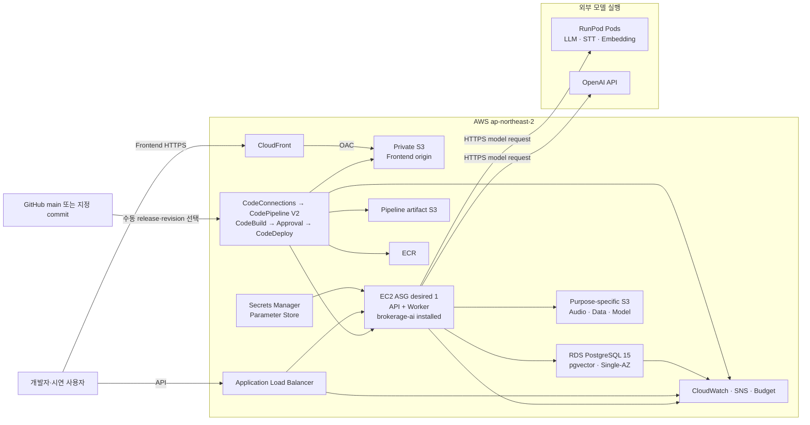
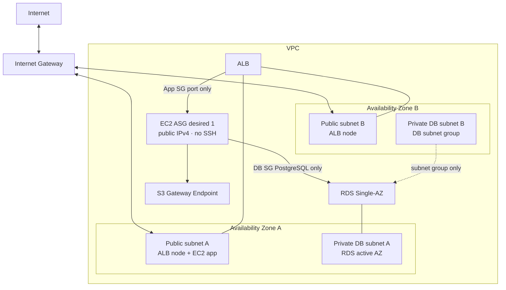
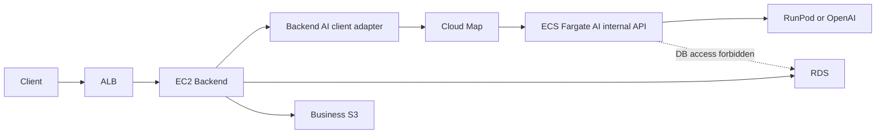

# 개발·시연용 인프라 아키텍처

## 문서 안내

- **이 문서가 답하는 질문:** 공유 개발·시연 환경을 AWS와 RunPod에 어떤 자원과 경계로 배치하는가?
- **대상 환경:** `ap-northeast-2` 단일 공유 환경
- **관련 결정:** [프로젝트 ADR-0008](../../../.agents/skills/project-wiki/references/decisions/ADR-0008-dev-demo-runtime-and-delivery.md) · [Infra ADR-0002](../../../.agents/skills/infra/references/decisions/ADR-0002-dev-demo-aws-runpod-architecture.md)
- **배포·운영:** [배포 및 운영 구조](deployment-and-operations.md)
- **적용 범위:** 문서와 결정 정본이며, 아직 AWS·RunPod 자원 생성이나 애플리케이션 API·DTO 변경을 뜻하지 않는다.

## 결정 요약

1차 런타임은 `EC2 Backend + 설치형 brokerage-ai + RunPod Pod 추론`이다. EC2 한 대에서 API와 Worker를 별도 프로세스로 실행하되 같은 배포 이미지와 호스트를 사용한다. Backend는 `brokerage-ai`를 Python 라이브러리로 설치해 프레임워크 중립 DTO와 실행 facade를 호출한다.

LLM·STT·Embedding은 설정, endpoint, 오류와 관측 항목을 논리적으로 분리한다. 하나의 Pod에 함께 둘지 여러 Pod로 나눌지는 모델별 VRAM·처리량 평가 후 정하며 현재는 미확정이다. OpenAI와 RunPod는 Provider adapter 뒤에 두므로 이 선택 때문에 공개 API·DTO를 변경하지 않는다.

AWS 예산은 2개월 합계 300,000원, RunPod와 OpenAI는 각각 2개월 합계 USD 300으로 분리해 추적한다. 비용 한도는 사용 허가가 아니라 알림 기준이며, 소유자와 종료일 태그 및 사용 후 삭제 절차를 함께 적용한다.

## 자원 상태 매트릭스

`결정`은 채택된 구조, `계획됨`은 아직 생성되지 않은 자원, `조건부`는 측정 또는 선행 결정 후 도입할 자원, `제외`는 1차 범위에서 만들지 않을 자원, `미확정`은 구체 값이 남은 항목이다.

| 영역 | 자원 | 선택 상태 | 구현 상태 | 비고 |
|---|---|---|---|---|
| 네트워크 | VPC, Internet Gateway, route table | 결정 | 계획됨 | NAT 없이 개발·시연용 public egress 사용 |
| 네트워크 | ALB용 서로 다른 AZ의 public subnet 2개 | 결정 | 계획됨 | ALB 활성화를 위한 기본 배치 |
| 네트워크 | EC2 app public subnet | 결정 | 계획됨 | public IPv4로 RunPod·OpenAI·AWS public endpoint에 outbound |
| 네트워크 | RDS private subnet 2개와 DB subnet group | 결정 | 계획됨 | 서로 다른 AZ를 포함하되 DB 인스턴스는 Single-AZ |
| 네트워크 | ALB·App·DB security group | 결정 | 계획됨 | App inbound는 ALB SG만, DB inbound는 App SG만 허용 |
| 네트워크 | S3 Gateway Endpoint | 결정 | 계획됨 | app route table의 S3 트래픽에 사용 |
| 컴퓨팅 | EC2, Launch Template, ASG `desired=1` | 결정 | 계획됨 | API·Worker 논리 분리, 동일 호스트 배포 |
| 컴퓨팅 | ALB, target group, health check | 결정 | 계획됨 | EC2에는 직접 공개 ingress를 허용하지 않음 |
| 운영 접속 | SSM Session Manager | 결정 | 계획됨 | SSH 및 22번 inbound 차단 |
| 이미지 | ECR | 결정 | 계획됨 | Backend와 설치형 AI가 포함된 불변 digest 이미지 |
| 데이터베이스 | RDS PostgreSQL 15 Single-AZ, pgvector | 결정 | 계획됨 | private 배치, 최소 백업 및 암호화 적용 |
| 파일 | Frontend private S3 origin | 결정 | 계획됨 | CloudFront OAC만 읽기 허용 |
| 파일 | 임시 음성 S3 | 결정 | 계획됨 | 업무 데이터 전용, 애플리케이션 삭제가 1차 통제 |
| 파일 | 데이터셋·평가·모델 artifact S3 | 결정 | 계획됨 | Terraform state 및 Pipeline artifact와 분리 |
| CDN | CloudFront, S3 Origin Access Control | 결정 | 계획됨 | S3 website endpoint와 public bucket 사용 금지 |
| 보안 | IAM 역할, Secrets Manager, Parameter Store | 결정 | 계획됨 | 비밀값과 일반 설정을 분리해 프로세스 환경변수로 주입 |
| 관측 | CloudWatch logs·metrics·alarms, SNS | 결정 | 계획됨 | 개인정보·프롬프트 원문 로깅 금지 |
| 비용 | AWS Budget | 결정 | 계획됨 | 조직 SCP 허용 여부는 미확정 |
| 전달 | GitHub CodeConnections, CodePipeline V2 | 결정 | 계획됨 | GitHub App 연결, 자동 변경 감지 비활성화 |
| 전달 | CodeBuild, CodeDeploy | 결정 | 계획됨 | 병렬 Build, 수동 승인, EC2 인플레이스 배포 |
| 전달 | Pipeline artifact 전용 S3 | 결정 | 계획됨 | 업무용 S3·Terraform state S3와 분리 |
| DNS·TLS | Route 53, ACM | 조건부 | 미확정 | 도메인 확정 후 ALB HTTPS listener 구성 |
| 비동기 작업 | SQS, DLQ | 조건부 | 미확정 | RDS 작업 polling이 독립 재시도·확장 요구를 충족하지 못할 때 |
| AI 분리 | ECS Fargate, Cloud Map | 조건부 | 미확정 | 경합·지연·독립 배포·장애 격리 필요성이 측정될 때 |
| RunPod | 공용 Pod Template, 개발자별 Pod | 결정 | 계획됨 | 가용 GPU를 선택해 생성·삭제, 운영 기간에는 선택 Pod 유지 |
| RunPod | custom image, Network Volume | 조건부 | 미확정 | 기본 vLLM·일반 다운로드·로컬 volume으로 부족할 때 |
| 1차 제외 | GitHub Actions OIDC | 제외 | 제외 | AWS Developer Tools 전달 경로를 사용 |
| 1차 제외 | NAT Gateway, Multi-AZ RDS | 제외 | 제외 | 공유 개발·시연 예산 우선 |
| 1차 제외 | WAF, ElastiCache, AWS Backup | 제외 | 제외 | 부하·보존 요구가 확인되면 별도 결정 |
| 1차 제외 | EKS, Step Functions | 제외 | 제외 | MVP 복잡도 대비 효익 부족 |
| 1차 제외 | Terraform 배포 Pipeline | 제외 | 제외 | Terraform은 수동 승인 절차 유지 |

## 전체 시스템

Frontend 정적 파일은 private S3 origin에서 CloudFront OAC를 통해서만 제공한다. S3 website hosting은 사용하지 않는다. API는 ALB를 통해 EC2로 진입하며 EC2는 RDS, 용도별 S3, RunPod와 OpenAI를 호출한다. Pipeline artifact는 배포 전달만을 위해 사용하고 애플리케이션 데이터와 섞지 않는다.

## AWS VPC 배치

[Application Load Balancer는 활성화할 각 AZ에 subnet을 선택](https://docs.aws.amazon.com/elasticloadbalancing/latest/application/application-load-balancers.html)하므로 서로 다른 AZ의 public subnet 2개를 둔다. RDS subnet group도 두 AZ의 private subnet을 포함하지만 비용상 실제 DB는 Single-AZ다.

### NAT 없는 개발·시연 구성

- EC2는 public subnet과 public IPv4를 사용해 Internet Gateway로 RunPod, OpenAI, ECR, CodeDeploy, SSM과 기타 AWS public endpoint에 outbound한다.
- App SG inbound는 ALB SG가 보내는 애플리케이션 포트만 허용한다. 인터넷 CIDR에서 EC2로 직접 들어오는 규칙과 SSH 22번은 만들지 않는다.
- 운영 접속은 SSM Session Manager만 사용한다. 인스턴스 역할은 SSM과 배포·실행에 필요한 최소 권한만 가진다.
- RDS에는 public IP를 부여하지 않고 DB SG는 App SG의 PostgreSQL 연결만 허용한다.
- S3 접근은 Gateway Endpoint를 우선 사용한다. 외부 API와 S3 이외 AWS 서비스 접근은 EC2의 제한된 outbound를 사용한다.
- 이 배치는 NAT 비용을 줄이기 위한 개발·시연 예외다. 개인정보를 다루는 운영 환경으로 승격할 때는 private app subnet, egress 통제, VPC endpoint 또는 NAT 설계를 새 ADR로 검토한다.

## 데이터 흐름과 경계

| 흐름 | 허용 데이터 | 저장 경계 | 실패·삭제 원칙 |
|---|---|---|---|
| Browser → CloudFront/S3 | 빌드된 정적 파일 | Frontend origin bucket | 배포 version으로 교체, 개인정보 저장 금지 |
| Browser → ALB → EC2 | 인증된 API 요청, 시연 입력 | Backend가 검증 후 RDS 또는 업무용 S3에 저장 | 도메인·ACM 전에는 합성 데이터만 허용 |
| EC2 → RDS | 장부, 작업 상태, 전사·구조화 결과, 평가 메타데이터 | 암호화된 PostgreSQL, Backend만 접근 | 법률·기획 보존기간은 미확정, 삭제 요청은 Backend가 소유 |
| EC2 → 임시 음성 S3 | 업로드 음성 | 전용 암호화 bucket | 성공·취소 시 즉시 삭제, 실패 시 1시간 이내 삭제 작업; S3 Lifecycle은 보조 안전망 |
| EC2 → 데이터·모델 S3 | 비식별 데이터셋, 평가 보고서, 승인된 artifact | 전용 bucket과 prefix·IAM 분리 | 현재·직전 버전 보존을 기본 계획으로 하고 정확한 기간은 미확정 |
| EC2 → RunPod/OpenAI | 모델 실행에 필요한 최소 입력 | 외부 장기 저장을 전제로 하지 않음 | 원문·개인정보 전송은 별도 승인 전 금지, 요청·응답 원문 로깅 금지 |
| 서비스 → CloudWatch | 가명 식별자, 지연·오류·비용 메타데이터 | log group별 보존 | 토큰·인증 헤더·음성·전사·전체 프롬프트 금지, 정확한 보존기간은 미확정 |
| RDS 자동 백업 | DB snapshot/PITR 데이터 | RDS 관리 백업 | 최소 보존을 계획하되 기간과 종료 시 snapshot 여부는 Infra 미해결 질문으로 관리 |

S3 Lifecycle의 최소 시간 단위만으로 임시 음성의 1시간 삭제를 보장할 수 없으므로 Backend 삭제 작업과 정기 sweeper가 1차 통제다. Lifecycle은 누락된 객체를 제거하는 방어선으로만 사용한다. `AWS Backup` 제외는 RDS 자체 자동 백업까지 끈다는 뜻이 아니다.

## 저장소 분리

다음 bucket은 이름, IAM 정책, 암호화 키 정책, lifecycle과 Terraform state를 각각 분리한다.

| 저장소 | 용도 | 혼용 금지 대상 |
|---|---|---|
| Terraform state S3 | IaC state와 lockfile | 모든 업무 데이터, Pipeline artifact |
| Pipeline artifact S3 | Source·Build·AppSpec 전달 | Frontend 원본, 음성, 데이터셋, 모델, Terraform state |
| Frontend origin S3 | CloudFront 정적 원본 | Pipeline artifact, 업로드 데이터 |
| Temporary audio S3 | 처리 중 임시 음성 | 장기 데이터셋·모델·로그 |
| Data/model S3 | 비식별 데이터셋, 평가 결과, 모델 artifact | 임시 음성, Pipeline artifact, Terraform state |

[CloudFront OAC는 S3 origin을 비공개로 제한](https://docs.aws.amazon.com/AmazonCloudFront/latest/DeveloperGuide/private-content-restricting-access-to-s3.html)하는 데 사용한다. 모든 업무용 bucket은 public access block과 저장 암호화를 적용한다.

## AI 실행 경계와 조건부 ECS 확장

현재는 Backend API와 Worker가 같은 EC2에 있고 Worker가 설치형 `brokerage-ai`를 호출한다. AI 라이브러리는 모델·프롬프트·워크플로를 소유하지만 DB 연결, ORM, FastAPI와 Repository를 알지 않는다. Backend가 실행 DTO를 조립하고 결과를 검증·저장한다.

다음 중 하나가 측정되면 AI 실행부의 ECS Fargate 분리를 검토한다.

- API와 Worker 사이 CPU·메모리 경합이 반복된다.
- 모델 orchestration 때문에 API 지연 또는 가용성 목표를 지키기 어렵다.
- AI와 Backend의 독립 배포 주기가 필요하다.
- AI 실패를 Backend API와 별도 장애 영역으로 격리해야 한다.

분리 후에도 Backend는 EC2에 남는다. 현재의 프레임워크 중립 요청·결과 DTO를 내부 전송 adapter가 직렬화하며 공개 애플리케이션 API는 바꾸지 않는다. AI 서비스는 DB나 업무용 S3에 직접 접근하지 않고 필요한 조회·부수 효과를 최소 권한 Backend capability로 요청한다. 내부 인증·암호화와 재시도 계약은 ECS 도입 ADR의 선행 조건이다.

## TLS와 개인정보 제한

CloudFront 기본 도메인은 Frontend 전송을 TLS로 보호할 수 있지만, 사용자 소유 API 도메인과 ALB 인증서는 도메인 확정 전에는 구성할 수 없다. Route 53·ACM과 ALB HTTPS listener가 검증되기 전에는 합성·비식별 시연 데이터만 허용한다. 이름, 연락처, 실제 음성, 인증정보 등 실제 개인정보 트래픽은 차단한다.

## 미확정 사항

- 도메인, Route 53 hosted zone과 ACM 인증서
- EC2·RDS instance class, EBS 크기와 정확한 로그·백업 보존기간
- LLM·STT·Embedding의 실제 모델, GPU, Pod 통합 또는 분리 배치
- RDS polling에서 SQS·DLQ로 전환할 측정 임계값
- 향후 ECS AI 내부 호출의 인증·암호화·재시도 방식

미확정 항목의 정본은 [프로젝트 미해결 질문](../../../.agents/skills/project-wiki/references/open-questions.md)과 [Infra 미해결 질문](../../../.agents/skills/infra/references/open-questions.md)이다.
