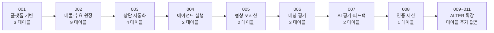
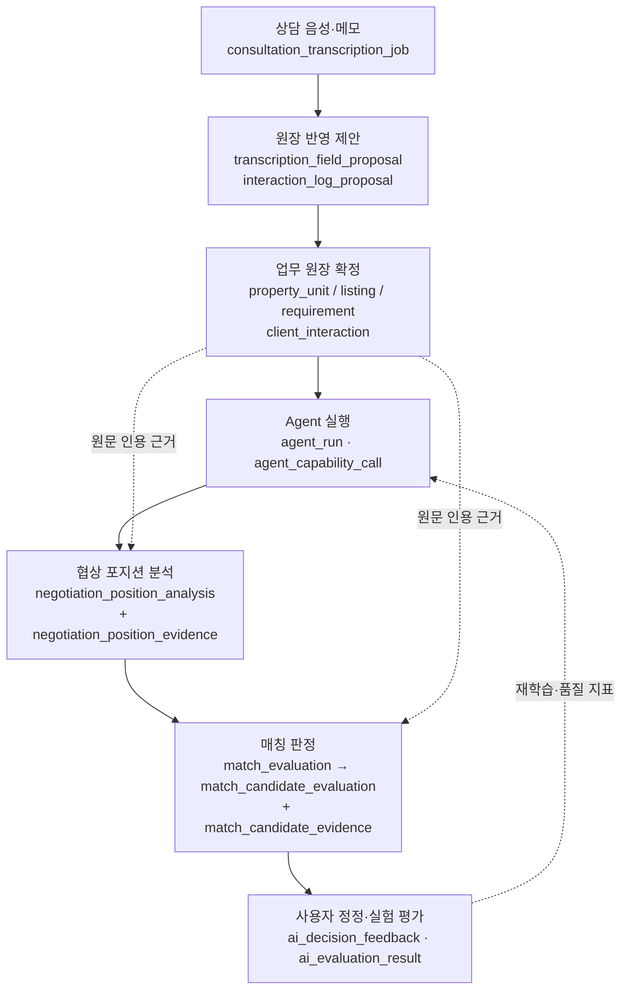
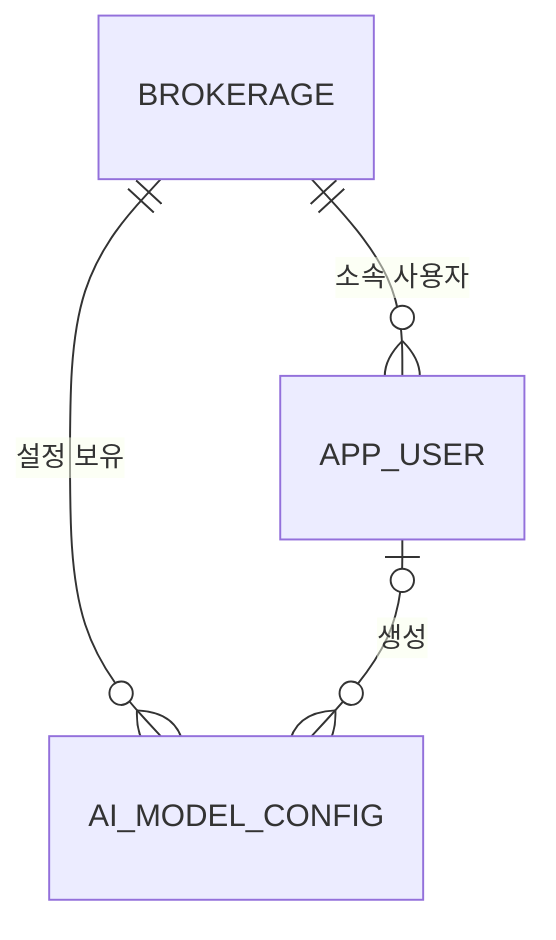
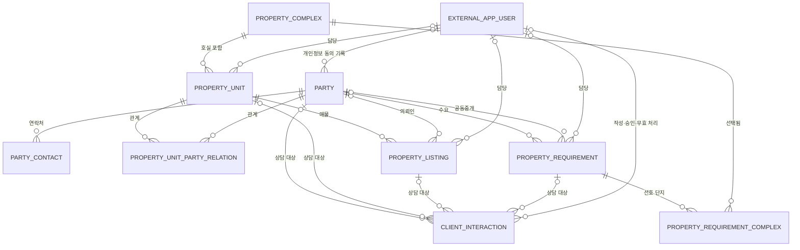
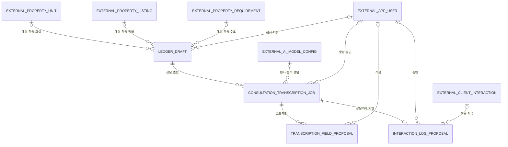
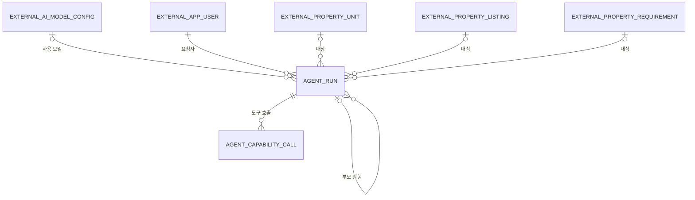
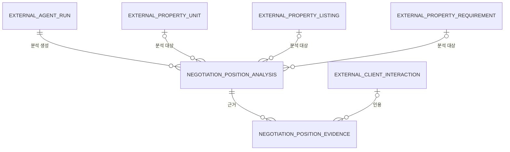
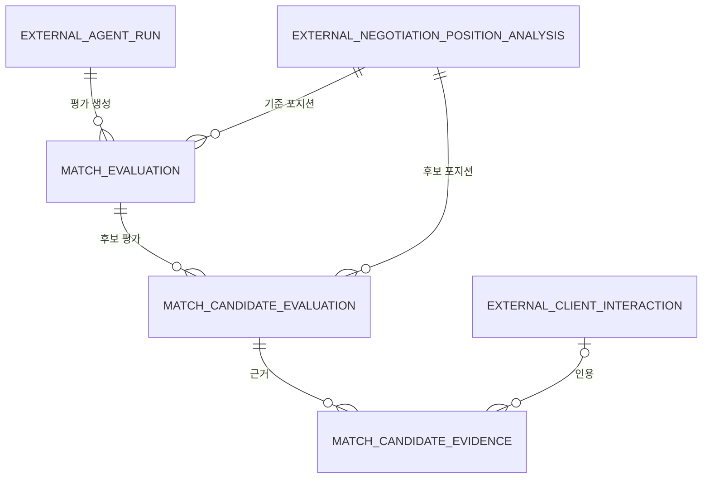
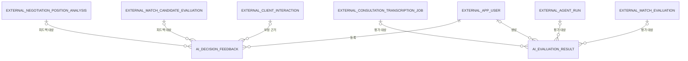
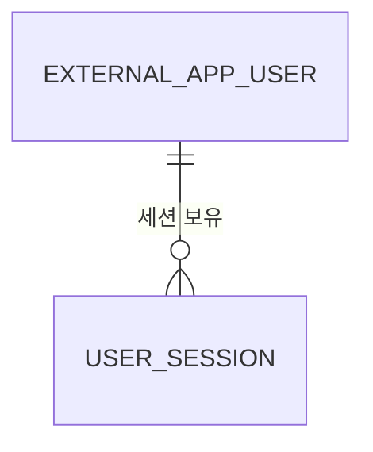

# 데이터베이스 ERD

`docs/db/migrate/`의 11개 전진 migration을 순서대로 적용했을 때 만들어지는 **26개 테이블**의 구조와 관계를 정리한 문서다.

- 대상 DBMS: PostgreSQL 15+
- 기준 파일: `001_CREATE_BROKERAGE_PLATFORM.sql` ~ `011_ALTER_AGENT_EXECUTION_LEASE.sql`
- 최상위 테넌트: `brokerage` (중개사무소)

---

## 1. SQL 파일을 어떻게 나누어 놓았나

### 1.1 두 개의 디렉터리

| 경로 | 무엇인가 | 실행 |
|---|---|---|
| `docs/db/archive/` | 전달받은 대형 통합 DDL 원본 보존본 (F1/F2/F3 표기 유지) | **실행하지 않음** |
| `docs/db/migrate/` | 실제 DB에 적용하는 전진 migration | **번호 순서대로 1회씩** |

`archive/`는 "과거에 이런 설계였다"는 기록일 뿐이고, 실제 스키마의 진실은 `migrate/`뿐이다.

### 1.2 파일 하나 = 업무 도메인 하나

파일 이름은 `NNN_ACTION_SCOPE.sql` 규칙을 따른다.

```text
011_ALTER_AGENT_EXECUTION_LEASE.sql
│    │      └── SCOPE : 업무 범위
│    └───────── ACTION: CREATE / ALTER / DATA / DROP
└────────────── NNN   : 3자리 순번 (재사용 금지)
```

각 파일 첫머리에는 `-- depends:` 주석으로 **직전 필수 migration**을 명시해 한 줄짜리 사슬을 만든다. 그래서 파일 번호 순서 = 의존성 순서 = 적용 순서가 항상 일치한다.



### 1.3 파일별 요약

| 파일 | 도메인 | 신규 테이블 | FK | 색인 | 핵심 내용 |
|---|---|---:|---:|---:|---|
| 001_CREATE_BROKERAGE_PLATFORM | 플랫폼 기반 | 3 | 3 | 3 | 테넌트·계정·AI 모델 설정 |
| 002_CREATE_PROPERTY_LEDGER | 매물·수요 원장 | 9 | 22 | 15 | 단지·호실·인물·매물·수요·상담 |
| 003_CREATE_CONSULTATION_AUTOMATION | 상담 자동화 | 4 | 19 | 4 | 음성 전사 → 필드 제안 → 승인 |
| 004_CREATE_AGENT_EXECUTION | 에이전트 실행 | 2 | 8 | 5 | Agent 실행 트리·도구 호출 로그 |
| 005_CREATE_NEGOTIATION_POSITION | 협상 포지션 | 2 | 6 | 4 | 포지션 분석 + 상담 원문 근거 |
| 006_CREATE_MATCH_EVALUATION | 매칭 평가 | 3 | 6 | 3 | 기준 1 : 후보 N 교차 판정 |
| 007_CREATE_AI_EVALUATION | AI 평가·피드백 | 2 | 9 | 3 | 사용자 정정 + 실험 평가 결과 |
| 008_CREATE_AUTHENTICATION | 인증 | 1 | 1 | 3 | 서버 세션·CSRF 해시 |
| 009_ALTER_PROPERTY_LEDGER_FIELDS | 원장 확장 | 0 | 1 | 1 | 세대 스펙, 공동중개, 분류·진행단계 |
| 010_ALTER_PARTY_PRIVACY_CONSENT | 원장 확장 | 0 | 1 | 0 | 개인정보 활용 동의 시각·기록자 |
| 011_ALTER_AGENT_EXECUTION_LEASE | 실행 확장 | 0 | 0 | 1 | Worker 선점 lease·시도 횟수 |
| **합계** | | **26** | **76** | **42** | |

### 1.4 한눈에 보는 성격 구분

- **001 · 002 · 009 · 010** — 사람이 직접 입력·관리하는 **업무 원장**
- **003 ~ 007 · 011** — AI가 만들어내는 **판단·근거·추적 기록**
- **008** — 인증 세션

즉 아래 번호로 갈수록 "사람의 데이터"에서 "AI의 데이터"로 옮겨가고, 뒤쪽 파일은 앞쪽 파일의 객체만 참조한다.

---

## 2. 전체 데이터 흐름

상담 음성 한 건이 어떻게 판정과 피드백까지 이어지는지가 이 스키마의 뼈대다.



이 사슬 덕분에 "왜 이 후보를 추천했는가"를 **판정 → 근거 → 상담 원문 → 사용한 모델·프롬프트 버전**까지 역으로 추적할 수 있다.

---

## 3. 도메인별 ERD

일반 관계선은 실제 외래 키를 뜻하며, `EXTERNAL_` 접두어가 붙은 테이블은 다른 파일에서 정의된 참조 대상이다.
단, 8개 테이블이 테넌트 루트를 직접 가리키는 `brokerage_id → brokerage(id)` 참조선은 모든 도메인에 반복되므로 3.1을 빼고는 생략했다.

### 3.1 플랫폼 기반 — 001



| 테이블 | 역할 | 주요 제약 |
|---|---|---|
| `brokerage` | 중개사무소 테넌트의 루트. 이름·사업자등록번호·상태·설정 | 사업자등록번호는 값이 있을 때만 전체 유일 |
| `app_user` | 사무소 소속 계정. 삭제 대신 비활성화 | `UNIQUE (brokerage_id, login_id)` |
| `ai_model_config` | AI 기능별 모델·제공자·파라미터 설정의 **불변 버전**. 비밀키는 저장하지 않음 | `UNIQUE (brokerage_id, capability, config_key, config_version)`, `config_version > 0` |

### 3.2 매물·수요 원장 — 002 · 009 · 010



| 테이블 | 역할 | 주요 제약 |
|---|---|---|
| `property_complex` | 아파트 등 부동산 단지 | |
| `property_unit` | 단지 내 개별 호실. 면적·임대차 현황·특성·담당자 | 삭제되지 않은 `(단지, 동, 호)` 조합은 하나만 |
| `party` | 매도·임대·매수·임차·공동중개 상대방. 개인정보 동의 시각·기록자 보관 | 동의 시각과 기록자는 **둘 다 있거나 둘 다 없어야** 함 |
| `party_contact` | 연락처. 연락 가능 상태와 제한 사유 포함 | **같은 인물 안에서** 방식별 대표 연락처 1개, 방식별 정규화 값 중복 금지 (인물이 다르면 같은 번호 허용) |
| `property_unit_party_relation` | 호실 ↔ 인물 N:M. 역할·대표·공동소유·유효 기간 | 유효 종료 전(`valid_to IS NULL`) `(호실, 역할, 순번)` 유일 |
| `property_listing` | 호실의 공급 매물. 매매/전세/월세 조건 + 의뢰인 | |
| `property_requirement` | 고객의 수요. 예산·면적·입주 시점·공동중개 상대·분류·진행 단계 | |
| `property_requirement_complex` | 수요 ↔ 선호 단지 N:M 연결 | PK `(brokerage_id, requirement_id, complex_id)` |
| `client_interaction` | 상담·연락 이력. **추가 전용**, 정정은 새 로그로 | 인물·호실·매물·수요 중 **최소 1개** 대상 필수 |

> 소프트 삭제(`is_deleted` / `deleted_at`)는 `property_complex` · `property_unit` · `party` · `party_contact` · `property_listing` · `property_requirement` 6개 테이블에만 있다.
> `property_unit_party_relation`은 `valid_to`로 기간을 닫고, `property_requirement_complex`는 물리 삭제하며, `client_interaction`은 `is_voided`로 무효 처리한다.
> 경쟁 수정이 가능한 데이터에는 `row_version`을 둔다.

### 3.3 상담 자동화 — 003



| 테이블 | 역할 | 주요 제약 |
|---|---|---|
| `ledger_draft` | 상담에서 뽑아낸 원장 변경 초안. **작업 대상**(target)과 **최종 반영 대상**(final)을 각각 호실·매물·수요로 연결 | |
| `consultation_transcription_job` | 전사·분석 작업 1건. 모델 스냅샷, 프롬프트/파서 버전, 실패 단계, 보존·파기 시각 | 요청 UUID는 사무소 안에서 유일 |
| `transcription_field_proposal` | 제안된 원장 필드 값(현재값/제안값/최종값 + 신뢰도 + 원문 근거 구간) | `(작업, 대상 엔터티, 필드명)` 유일 |
| `interaction_log_proposal` | 생성할 상담기록 제안. 승인 후 실제 `client_interaction` 연결 | 한 작업당 **최대 1건** |

### 3.4 에이전트 실행 — 004 · 011



| 테이블 | 역할 | 주요 제약 |
|---|---|---|
| `agent_run` | AI Agent 실행 1건. 부모-자식 트리, 모델·프롬프트·워크플로 버전, 실험 키, 마스킹된 입출력 스냅샷, 토큰·지연 시간, 보존·파기 시각. 011에서 Worker 선점용 `lease_owner` / `lease_expires_at` / `attempt_count` 추가 | `attempt_count >= 0` |
| `agent_capability_call` | 실행 중 발생한 도구 호출 로그 | 같은 실행 안에서 `sequence_no` 유일 |

### 3.5 협상 포지션 분석 — 005



| 테이블 | 역할 | 주요 제약 |
|---|---|---|
| `negotiation_position_analysis` | 한쪽(매도·매수 등) 협상 포지션 분석 결과. 의사·희망가·추정가·시급도·양보 가능/불가 조건·연락 가능 상태 | 호실·매물·수요 중 **최소 1개** 대상 필수 / 유효한 `cache_key`는 사무소 안에서 유일 |
| `negotiation_position_evidence` | 분석 근거. 상담기록 인용 또는 `INFERENCE` 추론 | 인용이 없으면 유형이 반드시 `INFERENCE` |

### 3.6 매칭 평가 — 006



| 테이블 | 역할 | 주요 제약 |
|---|---|---|
| `match_evaluation` | 기준 포지션 1개와 후보 N개를 비교한 판정 헤더. 후보 선택 조건과 입력 데이터 버전 스냅샷 보관 | |
| `match_candidate_evaluation` | 후보별 등급·순위·판단 근거·주요 장애 요인·양보 가능성·권장 행동 | 한 평가에서 후보 중복 금지, 순위 중복 금지, `match_rank > 0` |
| `match_candidate_evidence` | 후보 판정 근거(양쪽 구분). 상담기록 인용 또는 추론 | 인용이 없으면 유형이 반드시 `INFERENCE` |

### 3.7 AI 평가·피드백 — 007



| 테이블 | 역할 | 주요 제약 |
|---|---|---|
| `ai_decision_feedback` | 포지션 분석 또는 후보 판정에 대한 사용자의 정정·보정 | 두 대상 중 **최소 1개** 필수 |
| `ai_evaluation_result` | 전사 작업·Agent 실행·매칭 평가의 실험 평가 결과. 루브릭 버전·지표 점수·정답 스냅샷·통과 여부 | 세 대상 중 **최소 1개** 필수 |

### 3.8 인증 세션 — 008



| 테이블 | 역할 | 주요 제약 |
|---|---|---|
| `user_session` | 서버 세션. 세션·CSRF 토큰은 원문 없이 SHA-256 해시만 저장 | 해시는 64자리 소문자 16진수, `created_at ≤ idle_expires_at ≤ absolute_expires_at`, 세션 토큰 해시는 **전역 유일** |

---

## 4. 전체 테이블 색인

| # | 테이블 | 도메인 | 정의 파일 |
|---:|---|---|---|
| 1 | `brokerage` | 플랫폼 기반 | 001 |
| 2 | `app_user` | 플랫폼 기반 | 001 |
| 3 | `ai_model_config` | 플랫폼 기반 | 001 |
| 4 | `property_complex` | 매물·수요 원장 | 002 |
| 5 | `property_unit` | 매물·수요 원장 | 002 (+009) |
| 6 | `party` | 매물·수요 원장 | 002 (+010) |
| 7 | `party_contact` | 매물·수요 원장 | 002 |
| 8 | `property_unit_party_relation` | 매물·수요 원장 | 002 |
| 9 | `property_listing` | 매물·수요 원장 | 002 |
| 10 | `property_requirement` | 매물·수요 원장 | 002 (+009) |
| 11 | `property_requirement_complex` | 매물·수요 원장 | 002 |
| 12 | `client_interaction` | 매물·수요 원장 | 002 |
| 13 | `ledger_draft` | 상담 자동화 | 003 |
| 14 | `consultation_transcription_job` | 상담 자동화 | 003 |
| 15 | `transcription_field_proposal` | 상담 자동화 | 003 |
| 16 | `interaction_log_proposal` | 상담 자동화 | 003 |
| 17 | `agent_run` | 에이전트 실행 | 004 (+011) |
| 18 | `agent_capability_call` | 에이전트 실행 | 004 |
| 19 | `negotiation_position_analysis` | 협상 포지션 | 005 |
| 20 | `negotiation_position_evidence` | 협상 포지션 | 005 |
| 21 | `match_evaluation` | 매칭 평가 | 006 |
| 22 | `match_candidate_evaluation` | 매칭 평가 | 006 |
| 23 | `match_candidate_evidence` | 매칭 평가 | 006 |
| 24 | `ai_decision_feedback` | AI 평가·피드백 | 007 |
| 25 | `ai_evaluation_result` | AI 평가·피드백 | 007 |
| 26 | `user_session` | 인증 | 008 |

---

## 5. 공통 설계 원칙

| 항목 | 방식 |
|---|---|
| **테넌트 분리** | 모든 업무 테이블에 `brokerage_id`. 테넌트 루트인 `brokerage` 자신을 가리키는 8개 FK만 `brokerage_id` 단일 키이고, **업무 테이블 사이의 참조 68개는 전부 `(brokerage_id, id)` 복합 FK**다. 그래서 서로 다른 사무소 데이터는 구조적으로 연결될 수 없다. 이 복합 FK를 받기 위해 `brokerage`와 `property_requirement_complex`를 뺀 24개 테이블에 `UNIQUE (brokerage_id, id)`를 둔다. |
| **키 전략** | PK는 원칙적으로 `id BIGINT GENERATED ALWAYS AS IDENTITY`, FK 컬럼은 `대상_id` 명명. 순수 연결 테이블인 `property_requirement_complex`만 `id` 없이 복합 PK를 쓴다. |
| **유연한 데이터** | 설정·스냅샷·모델 출력처럼 구조가 유동적인 값은 `JSONB` |
| **상태 값** | `status`·`role`·`party_type` 등은 문자열 컬럼. 허용값과 상태 전이 규칙은 **DB가 아니라 백엔드**가 관리한다. DB는 존재·관계·고유성·최소 형식 무결성만 담당 |
| **삭제 정책** | 단지·호실·인물·연락처·매물·수요 6개 테이블만 `is_deleted` + `deleted_at` 소프트 삭제. 상담 로그는 추가 전용이며 `is_voided`로 무효 처리하고, AI 산출물은 삭제 대신 `retention_until` / `purged_at`으로 보존·파기를 관리 |
| **동시성** | 경쟁 수정 가능 테이블에 `row_version` (낙관적 락). Agent 실행은 `lease_owner`/`lease_expires_at`로 Worker 선점 |
| **개인정보·보안** | 비밀번호·세션·CSRF는 해시만 저장. Agent 입출력은 마스킹(`redacted_*`). `retention_until`·`purged_at`으로 보존/파기 시각 관리 |
| **부분 색인** | 전체 42개 색인 중 24개가 부분 색인이다. 원장 계열(001·002·009)은 `WHERE is_deleted = FALSE`로 살아있는 행만 걸지만, AI 산출물 계열(003·006·007)의 색인 11개는 전량 전체 색인이다 |
| **추적 가능성** | 모든 AI 산출물이 `agent_run` → 모델·프롬프트 버전 → 근거 → 상담 원문으로 역추적된다 |

### 5.1 알아둘 예외 세 가지

거의 모든 유일성 제약과 색인이 `brokerage_id`로 시작하지만, 다음 셋은 그렇지 않다.

1. `uq_user_session_token_hash` — `brokerage_id` 없이 **전역 유일**이다. 세션 토큰 자체가 전역 식별자이기 때문이다.
2. `idx_agent_run_claim_queue` — Worker가 사무소 구분 없이 오래된 작업부터 선점해야 해서, 선점 쿼리의 필터와 정렬에만 맞춘 부분 색인을 따로 둔다. (011에 근거 주석이 있다.)
3. `idx_user_session_expiry` — 만료 시각 두 개로만 구성된다. 폐기되지 않은 세션을 사무소 구분 없이 만료 시각 기준으로 훑기 위한 색인이다.

---

## 6. 문서 사용 시 주의

- 이 문서는 `migrate/` SQL 원문에서 추출한 결과다. **SQL이 진실이고 문서는 사본**이다.
- 적용된 migration은 역편집하지 않는다. 스키마가 바뀌면 다음 번호의 새 파일을 추가하고 이 문서를 함께 갱신한다.
- 실제 PostgreSQL 15에 순서대로 적용해 검증하기 전에는 "적용 가능"으로 단정하지 않는다.
