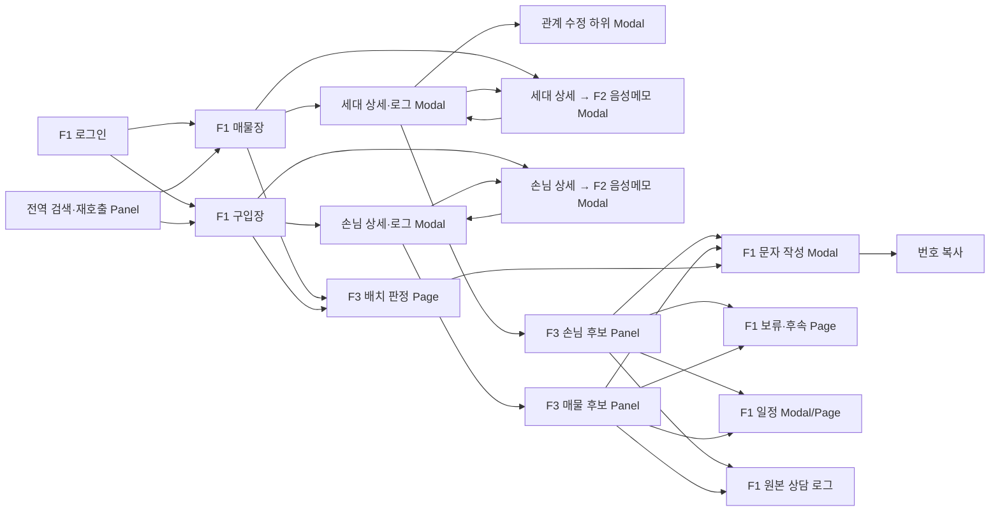

# F1·F2·F3 화면구조 분석

> 상태: **검토안**  
> 단계: 화면 설계 전 IA·화면 인벤토리·요구사항 추적성 정리  
> 범위: 시각 디자인, 와이어프레임, 컬러·타이포그래피 결정 제외  
> 기준: `docs/requirements/` 분할 정본, 2026-08-14 화면설계 검토와 2026-08-27 교차 판정 트리거 개정
> 주의: 현재 기능 요구사항의 승인 상태는 `출처`다. 팀 승인 전에는 이 문서와 Screen Matrix를 확정 요구사항으로 표현하지 않는다.  
> 검토 Matrix: [SCREEN_MATRIX_F1_F2_F3.md](SCREEN_MATRIX_F1_F2_F3.md)

## 0. 분석 결론

1. **F1은 애플리케이션 셸과 업무 상태를 소유한다.** 장부, 상세, 로그, 일정, 계약, 문자, 설정과 감사가 F1이다.
2. **F2는 독립 메뉴나 Page를 갖지 않는다.** F1 상세 Modal 위에 겹치는 음성메모 하위 Modal 하나로 실행한다.
3. **F2 입력은 파일 업로드 전용이다.** 상담 후 작성한 `wav`, `mp3`, `m4a` 파일을 사용하며 브라우저 녹음·실시간 통화 STT·자동녹음·화자분리는 제외한다.
4. **장부 저장 상태는 `임시저장 / 저장 완료` 두 가지다.** 업로드·변환·분석·실패 같은 AI 처리 상태는 실행 중인 F2 Modal 안에서만 표시한다.
5. **기존 값 변경은 F2 검토표에서 고르고 부모 상세에서 확정한다.** 검토표는 `변경` 상태, 현재값, 제안값과 사용자 체크로 처리하고, 이미 값이 있는 칸을 덮어쓸 때만 반영 직전에 부모 상세가 대체 여부를 한 번 더 확인한다.
6. **F3 교차 판정은 F1 상세 또는 저장 결과에 붙는 비차단 Panel이다.** F1 저장·조회·편집을 잠그지 않는다.
7. **F3 배치 판정은 별도 Page다.** 대상 확인·제외 후 사용자가 [판정하기]를 눌러야 실행하며, 진입만으로 자동 판정하지 않는다.
8. **상세의 기준 단위는 매물이 아니라 세대다.** 매물화는 세대 상태이며 같은 세대에 거래와 상담 이력이 반복 누적된다.
9. **인물별 연락 동의는 세대 상세에서 O/X로 관리한다.** X 또는 값 없음은 문자 대상과 F3 캠페인의 발송 제외 판단에 사용한다.
10. **문자 MVP는 문안 작성·대상 확정·번호 복사로 종료한다.** 실발송 UI는 adapter 활성 전까지 노출하지 않는다.
11. **개인정보 패턴은 주의 대상이지 자동 차단 대상이 아니다.** 주민번호·계좌번호 형태를 발견해도 자동 마스킹·수정·저장 차단하지 않는다. 손님 개인정보 동의와 권한 오류는 별도 저장 게이트다.

### 화면 유형 정의

| 유형 | 판단 기준 |
|---|---|
| Page | 주소·메뉴로 재진입하고 장시간 작업·필터·목록 상태를 보존해야 하는 업무 공간 |
| Panel | 현재 F1 업무 맥락을 유지한 채 붙는 비차단 보조 영역 |
| Modal | 대상 1건의 입력·승인·삭제·병합 또는 되돌리기 어려운 결정을 완료하는 차단형 대화상자 |

F1 상세 위에 다시 열리는 F1 관계 수정·F2 음성메모 Modal은 최신 요구사항이 명시한 예외다. 구현 시 자식 Modal을 닫으면 부모의 미저장값을 유지하고 원래 trigger로 focus를 복원해야 한다.

---

## 1. 전체 IA

```text
F1 애플리케이션 셸
├─ 접근
│  └─ 로그인
├─ 핵심 장부
│  ├─ 매물장(세대 전수 대장)
│  │  └─ 세대 상세·상담 로그 Modal
│  │     ├─ 관계 수정 하위 Modal
│  │     ├─ F2 음성메모·AI 제안 검토 하위 Modal
│  │     ├─ F3 포지션 카드·교차 판정 후보 Panel
│  │     ├─ 인물 통합 이력 Panel
│  │     ├─ 거래·시설물 이력 Panel
│  │     └─ 문서함 Panel
│  └─ 구입장(손님 대장)
│     └─ 손님 상세·상담 로그 Modal
│        ├─ F2 음성메모·AI 제안 검토 하위 Modal
│        ├─ F3 포지션 카드·교차 판정 후보 Panel
│        ├─ 인물 통합 이력 Panel
│        └─ 문서함 Panel
├─ 연락·후속 업무
│  ├─ 연락처 목록
│  ├─ 문자 대상 수집 Panel
│  ├─ 문자 작성·번호 복사 Modal
│  ├─ 문자 작업 이력
│  ├─ 알림 센터
│  └─ 보류·후속 처리 목록
├─ 일정·거래
│  ├─ 일정
│  └─ 계약
├─ F3 판단 업무
│  ├─ 교차 판정: F1 상세·저장 결과의 Panel
│  ├─ 배치 판정: F1 셸 안의 캠페인 Page
│  └─ 판정 실행·피드백: 관리자 Page
├─ 관리
│  ├─ 마스터 데이터
│  ├─ 사무소·직원·권한·알림 설정
│  ├─ 감사·변경 이력
│  ├─ 삭제 항목 복구
│  └─ 통계·메모장
└─ 도움말
   ├─ 화면 도움말 Panel
   └─ 검색형 매뉴얼 Page
```

현행 장부 데이터 이관은 현재 범위 밖이므로 IA와 상태 목록에 포함하지 않는다.

### 소유 경계

| 영역 | 소유 | 화면 원칙 |
|---|---|---|
| 장부 데이터·저장 상태·검색·로그 | F1 | 모든 진입의 기준이며 F2/F3 실패와 무관하게 사용 가능 |
| 음성 파일·STT·필드 제안·로그 초안 | F2 | F1 상세 위 하위 Modal. 선택 항목 반영까지만 담당하고 장부 저장은 F1 |
| 포지션·등급·순위·행동·문안 제안 | F3 | F1 데이터에 붙는 Panel 또는 F1 셸 내부 캠페인 Page |
| 상담 로그 추가·일정 등록 | F1 저장 / F3 제안 | 사용자가 승인한 경우에만 F1이 기록 |
| 문자 작업 | F1 | 연락 동의·수신 거부를 확인하고 MVP는 번호 복사까지 수행 |

---

## 2. 화면 인벤토리

### 2.1 Page — 17개

| 화면 ID | 화면명 | 소유 | 주요 목적 |
|---|---|---|---|
| F1-PG-001 | 로그인 | F1 | 사무소·담당자 인증과 잠금 해제 |
| F1-PG-010 | 매물장 | F1 | 세대 전수 조회·검색·필터·편집·다중 선택 |
| F1-PG-020 | 구입장 | F1 | 손님 조건 조회·검색·필터·편집·다중 선택 |
| F1-PG-030 | 연락처 목록 | F1 | 세대·손님 연락처 통합 조회와 개인 문자 진입 |
| F1-PG-040 | 문자 작업 이력 | F1 | 문자 작업 대상·문안·결과 이력 조회 |
| F1-PG-050 | 일정 | F1 | 오늘·월간·담당자별 일정 관리 |
| F1-PG-060 | 계약 | F1 | 계약 건·단계·서류 체크리스트 관리 |
| F1-PG-070 | 보류·후속 처리 | F1 | F3 [나중에]와 사람의 후속 작업 조회 |
| F1-PG-080 | 메모장 | F1 | 세대·손님에 종속되지 않는 자유 메모 |
| F1-PG-090 | 통계 | F1 | 접촉·매물·담당자 실적 조회 |
| F1-PG-100 | 마스터 데이터 | F1 | 단지·업소·직원·코드·평형 관리 |
| F1-PG-110 | 사무소 설정 | F1 | 권한·계정·알림·보관·문자 adapter 설정 |
| F1-PG-120 | 감사·변경 이력 | F1 | 개인정보 접근·복사·내보내기·변경 추적 |
| F1-PG-140 | 도움말·매뉴얼 | F1 | 검색형 사용법·단축키·변경 사항 조회 |
| F1-PG-150 | 삭제 항목 복구 | F1 | 소프트 삭제 항목 복구 |
| F3-PG-010 | 배치 판정 캠페인 | F3 판단 / F1 셸 | 대상 확인·제외→판정→세그먼트→문안 승인 |
| F3-PG-020 | 판정 실행·피드백 | F3 | 기각 포함 실행 근거·비용·격리·오판 피드백 조회 |

### 2.2 Panel — 9개

| 화면 ID | 화면명 | 소유 | 부모 | 차단 여부 |
|---|---|---|---|---|
| F1-PNL-010 | 전역 검색·재호출 | F1 | 모든 Page | 비차단 |
| F1-PNL-020 | 알림 센터 | F1 | 모든 Page | 비차단 |
| F1-PNL-030 | 문자 대상 수집 | F1 | 매물장·구입장 | 비차단 |
| F1-PNL-040 | 인물 통합 이력 | F1 | 세대·손님 상세 | 비차단 |
| F1-PNL-050 | 문서함 | F1 | 세대·손님 상세 | 비차단 |
| F1-PNL-060 | 거래·상태·시설물 이력 | F1 | 세대 상세 | 비차단 |
| F1-PNL-070 | 화면 도움말 | F1 | 현재 화면 | 비차단 |
| F3-PNL-010 | 교차 판정 후보 | F3 | F1 상세·저장 결과 주변 | 비차단 |
| F3-PNL-020 | 포지션 카드·이력 | F3 | F3-PNL-010 | 비차단 |

### 2.3 Modal — 19개

| 화면 ID | 화면명 | 소유 | 사용 이유 |
|---|---|---|---|
| F1-MOD-010 | 세대 상세·상담 로그 | F1 | 33개 필드·인물·동의·로그 편집 |
| F1-MOD-020 | 손님 상세·상담 로그 | F1 | 17개 조건·인물·동의·로그 편집 |
| F1-MOD-030 | 컬럼 값 필터 | F1 | 실제 값 검색·복수 선택·빈 값 선택 |
| F1-MOD-040 | 일괄 편집 확인 | F1 | 다중 행 변경 대상·전후값 확인 |
| F1-MOD-050 | 중복 세대·인물 해결 | F1 | 기존 항목 열기 또는 병합 결정 |
| F1-MOD-060 | 문자 작성·대상 확정·번호 복사 | F1 | 수신자·동의·문안·미리보기 확인 |
| F1-MOD-070 | 실발송 최종 확인 | F1 | adapter 활성 후 실제 발송 직전 확인. MVP 미노출 |
| F1-MOD-080 | 일정 등록·수정 | F1 | 세대·손님·F3 제안 일정 편집·승인 |
| F1-MOD-090 | 계약 등록·수정 | F1 | 매물·손님 연결과 계약 단계·서류 입력 |
| F1-MOD-100 | 거래 완료·임대차 갱신 | F1 | 완료 기록과 현 임대차 갱신 여부 결정 |
| F1-MOD-110 | 단지 세대 일괄 생성 | F1 | 동·층·라인 범위 확인 후 대량 생성 |
| F1-MOD-120 | 인물 병합 확인 | F1 | 로그·연락처·관계를 보존하는 병합 승인 |
| F1-MOD-125 | 관계 수정 | F1 | 관계·순번·연락처·태그 수정 |
| F1-MOD-130 | 미저장 닫기·복구 | F1 | 저장·저장 안 함·취소와 초안 복구 |
| F1-MOD-140 | 개인정보 주의·저장 검증 | F1 | 주의 확인과 실제 저장 차단 사유를 구분 |
| F1-MOD-150 | 인쇄 미리보기 | F1 | 체크리스트·상세·일정 출력 확인 |
| F2-MOD-010 | 음성메모·AI 제안 검토 | F2 | 파일 업로드부터 선택 항목 반영까지 한 하위 Modal에서 완료 |
| F3-MOD-010 | 관심없음·판정 피드백 | F3 | 사유를 구조화해 신뢰 루프로 전달 |
| F3-MOD-020 | 캠페인 규모·교차 옵션 경고 | F3 | 대상·비용 상한 확인 또는 P2 차단 |

`F1-MOD-145 AI 값 반영 충돌 확인`은 최신 개정에서 삭제한다. 기존 값 변경은 `F2-MOD-010`의 검토표 안에서 결정한다.

---

## 3. 핵심 요구사항 연결

### 3.1 F1 장부와 상세

| 화면 | 직접 근거 | 핵심 반영 |
|---|---|---|
| F1-PG-010 | F1-GR-01~45, F1-SR-01~08 | 33개 컬럼 기본 표시, 가상화, 필터·정렬·편집, 행 추가, F2 이원 진입 |
| F1-PG-020 | F1-DM-01~07, F1-GR-11~45 | 17개 컬럼, 기간·담당자 필터, 최종접촉일 정렬, 행 추가 |
| F1-MOD-010 | F1-UD-01~28, F1-LG-01~06, F1-LG-08~34 | 33개 항목, 관계 수정 하위 Modal, 연락 동의 O/X, 상담 로그 append |
| F1-MOD-020 | F1-DM-08~16, F1-LG-01~06, F1-LG-08~19, F1-LG-33~34 | 손님 조건, 개인정보 동의 저장 게이트, 상담 로그 append |
| F1-MOD-125 | F1-UD-10, F1-UD-12~13, F1-UD-27, F1-LG-33 | 관계·등록 순번·연락처·태그 수정, 부모 미저장값 유지 |
| F1-PNL-030 / F1-MOD-060 | F1-MS-01~15, F1-UD-28 | 연락 동의 X·수신 거부·중복·연락처 없음 제외, 번호 복사 |

### 3.2 F2 — 독립 Page·Panel 없음

| 화면 | 요구사항 근거 | 결합 규칙 |
|---|---|---|
| 부모 F1-PG-010/020 | F1-ST-01~03, F1-ST-15~18, F2-LIST-01~04 | 그리드와 상세에 F2 진입 제공. 장부 목록 상태는 임시저장·저장 완료만 표시 |
| 부모 F1-MOD-010/020 | F1-ST-04~13, F1-ST-15, F2-POP-01~03 | F2 대상 고정, F2 하위 Modal 호출, 반영된 값을 부모 입력칸에서 최종 확인 |
| F2-MOD-010 | F2-POP-03, F2-REV-01~04, F2 5.2~5.4·6장·8장 | 주의 확인→파일 업로드→STT·분석→현재값·제안·근거 검토→선택 항목 반영 |
| F1-MOD-130 | F2-POP-02 | 부모 상세의 미저장 변경을 F1 닫기 정책으로 처리 |

F2 처리·필드·저장·보안 규칙 일부는 독립 ID가 없다. `F2-REC`, `F2-STT`, `F2-ANL`, `F2-SAVE`, `F2-SEC` ID를 화면 문서에서 임의로 만들지 않는다.

### 3.3 F3

| 화면 | 직접 근거 | 지원·연동 규칙 |
|---|---|---|
| F3-PNL-010 | F3-CR-05~18, F3-BR-03~10, F3-BR-14 | F1 저장 또는 상세의 [교차 판정] 버튼에 반응, 순차 표시, F1 작업 비차단 |
| F3-PNL-020 | F3-PC-01~13, F3-LA-01~08, F3-CA-01~08 | 근거 이동, 카드 정정·이력, 캐시 상태 |
| F3-PG-010 | F3-BT-01~20, F3-SQ-01~07, F3-GN-01~07 | 대상 확인·개별 제외 후 판정, 세그먼트 수정, F1 문자 작업 연결 |
| F3-PG-020 | F3-CM-04~05, F3-CM-08, F3-TR-05, F3-TR-07~08 | 기각 건·실행 근거·격리·비용·피드백 조회 |
| F3-MOD-010 | F3-CR-17, F3-TR-03, F3-TR-07 | 관심없음 사유와 오판 피드백 기록 |
| F3-MOD-020 | F3-BT-04, F3-BT-23~24 | 대상 상한 경고와 P2 교차 옵션 제한 |

F3 후보의 기각 표시 범위는 부모에 따라 다르다.

| 부모·트리거 | 기각 표시 |
|---|---|
| 세대 상세 판정 실행(F3-CR-04) | Panel에는 강함·약함만 표시. 기각과 사유는 F3-PG-020에서 조회 |
| 손님 상세 판정 실행(F3-CR-03) | 기각을 사유와 함께 접어서 표시 |
| 저장 트리거(F3-CR-01~02) | 기각을 사유와 함께 접어서 표시 |

---

## 4. 화면 간 이동 관계



### 핵심 이동 규칙

| 출발 | 행동 | 도착 | 문맥·안전 규칙 |
|---|---|---|---|
| 매물장·구입장 | 행 클릭 | 해당 상세 Modal | 그리드 필터·정렬·스크롤·선택 유지 |
| 매물장·구입장 | 행 추가 | 빈 행 + 상세 Modal | 새 행은 임시저장. 저장하지 않고 닫으면 확인 후 제거 |
| 매물장·구입장 | F2 실행, 0행 선택 | 새 행 + 상세 + F2 Modal | F1이 새 행을 만들고 대상을 고정 |
| 매물장·구입장 | F2 실행, 1행 선택 | 해당 상세 + F2 Modal | 선택 행을 대상으로 고정 |
| 매물장·구입장 | F2 실행, 복수 선택 | 실행하지 않음 | 대상 1건 원칙과 비활성 이유 표시 |
| 상세 | 음성메모 입력 | F2-MOD-010 | 부모 상세 위에 하나만 열고 부모의 미저장값 유지 |
| F2 Modal | 선택 항목 반영 | 부모 상세 | 선택값만 채우고 아직 장부 저장하지 않음 |
| 세대 상세 | 관계 수정 | F1-MOD-125 | 부모 상세 미저장값 유지, 닫은 뒤 trigger로 focus 복원 |
| 상세 저장 또는 [교차 판정] | F3 교차 판정 | 상세 주변 F3 Panel | 상세 진입만으로 실행하지 않으며 F1 저장·편집·닫기 비차단 |
| F3 후보 | 문자 보내기 | F1 문자 작성 Modal | 연락 동의·수신 거부를 재확인하고 MVP는 번호 복사로 종료 |
| F3 후보 | 나중에 | F1 보류·후속 Page | F3 별도 큐를 만들지 않음 |
| F3 후보 | 일정 승인 | F1 일정 Modal→일정 Page | 주체 F3와 사용자 승인 시각 기록 |
| 캠페인 진입 | 대상 확인·제외 | 같은 캠페인 Page | [판정하기] 전에는 LLM 실행하지 않음 |

---

## 5. 주요 사용자 행동

### 5.1 F1 중심 업무

1. 동·호, 성명, 전화번호, 로그 본문으로 대상을 찾는다.
2. 장부 컬럼을 정렬·필터·고정·재배치하고 담당자 설정으로 복원한다.
3. 셀을 직접 편집하거나 여러 행을 선택해 일괄 편집하고 실행 취소한다.
4. 행을 추가하거나 기존 행을 열어 세대·손님 필드와 인물을 편집한다.
5. 세대 상세에서 관계·순번·연락처·태그를 하위 Modal로 수정하고 연락 동의를 O/X로 확인한다.
6. 상담 로그를 추가하며 기존 로그는 수정·삭제하지 않는다.
7. 개인 또는 복수 대상의 문자 문안과 수신자를 확인하고 번호를 복사한다.
8. 일정과 계약을 만들고 거래 완료 시 세대와 손님을 연결한다.
9. 소유자는 마스터·권한·감사·삭제 복구를 관리한다.

### 5.2 F2 입력 보조

1. 그리드 또는 F1 상세에서 [음성메모 입력]을 실행한다.
2. 하위 Modal의 개인정보 주의 문구를 확인한다.
3. 상담 후 작성한 음성 파일을 선택하고 재생·교체한다.
4. 분석을 실행하고 업로드→텍스트 변환→장부 분석 상태를 확인한다.
5. 현재값, AI 제안값, 상태와 근거 문장을 검토한다.
6. 빈 필드는 기본 선택된 제안을 확인하고, 기존 값과 다른 항목은 `변경` 체크로 명시적으로 결정한다.
7. 상담 로그 초안을 수정하거나 제외하고 [선택 항목 반영]을 누른다.
8. 부모 F1 상세에서 반영된 값을 다시 확인하고 임시저장 또는 장부 저장한다.
9. 실패 시 음성·STT·제안값을 잃지 않고 재시도한다.

### 5.3 F3 판단 보조

1. F1 상세·저장 결과에서 앵커 카드와 후보를 순차 확인한다.
2. 비교 근거·결정적 걸림돌·양보 지점·다음 행동을 확인한다.
3. 근거 문장을 눌러 F1 원본 상담 로그로 이동한다.
4. 포지션을 정정하고 정정 내용을 F1 상담 로그에 남긴다.
5. 후보에서 문자 보내기, 나중에, 관심없음, 일정 제안 승인을 실행한다.
6. 캠페인에서는 대상을 먼저 확인·제외한 뒤 [판정하기]를 누른다.
7. 발송 제외·판단 불가를 포함한 세그먼트를 검토·수정한다.
8. 세그먼트별 문안을 승인한 뒤 F1 문자 작성·번호 복사 흐름으로 넘긴다.

---

## 6. 필요한 상태와 안전 규칙

### 6.1 공통 상태

| 상태 | 표현 원칙 | 복구 행동 |
|---|---|---|
| Loading | 전체 화면이 아니라 대상 영역에 표시 | 다른 F1 조회·스크롤 유지 |
| Empty | 비어 있는 이유와 다음 행동을 함께 표시 | 필터 해제, 행 추가, 입력 시작 |
| No match | 데이터 없음과 필터 결과 없음을 구분 | 필터 초기화·조건 완화 |
| Error | 실패 대상과 보존된 내용을 명확히 표시 | 동일 입력 재시도, 수동 입력, F1 계속 사용 |
| Disabled | 인접한 곳에 비활성 이유 표시 | 선택 수·권한·필수 입력·처리 중 조건 해소 |
| Read-only / Permission denied | 마스킹·조회 전용·접근 불가를 구분 | 권한 요청 경로 또는 조회 불가 사유 표시 |
| Unsaved / Offline | 필드·행 단위 미전송 상태 표시 | 연결 복구 후 재전송, 닫기 전 확인 |
| Conflict | 동시 편집 전후값 표시 | 유지할 값 선택과 이력 기록 |

### 6.2 장부와 F2 상태 분리

| 구분 | 허용 상태 | 표시 위치 |
|---|---|---|
| 장부 저장 | 임시저장 / 저장 완료 | 장부 목록과 F1 상세 |
| F2 처리 | 파일 준비 / 업로드 중 / 텍스트 변환 중 / 장부 분석 중 / 완료 / 실패 | F2-MOD-010 내부만 |
| F2 제안 | 확인됨 / 확인 필요 / 변경 / 누락 | F2-MOD-010 검토표 내부만 |

### 6.3 개인정보·발송 규칙

| 상황 | 화면 동작 |
|---|---|
| F2 주의 문구 미확인 | 파일 선택과 분석 실행 비활성화 |
| 주민번호·계좌번호 형태 감지 | 주의 문구 표시. 자동 마스킹·수정·저장 차단 없음 |
| 손님 개인정보 동의 미체크 | 손님 레코드 저장 차단 |
| 세대 인물 연락 동의 X·값 없음 | 문자 대상과 F3 캠페인 발송 대상에서 제외 |
| 수신 거부 | 단체 문자 대상에서 자동 제외하고 사유 표시 |
| 읽기전용 역할 | 연락처 마스킹, 복사·내보내기·편집 권한 제한 |

---

## 7. 기존 화면 근거와 구조 판단

| 근거 | 관찰 | 반영 |
|---|---|---|
| 기존 장부 메인 | 상단 검색·조작과 세대 행·다수 필드의 고밀도 구조 | 매물장은 Card 대시보드가 아니라 세대 전수 Grid Page가 중심 |
| 매물 입력 | 상단 필드, 인물, 상담 로그의 세로 순서 | 세대 상세·로그를 하나의 F1 Modal로 유지 |
| 기존 구입장 | 매물장과 같은 고밀도 Grid지만 컬럼·기간·담당자 흐름이 다름 | 같은 Grid 기반을 쓰되 별도 Page와 프리셋 사용 |
| 최신 화면 검토 | 관계 수정과 음성메모를 상세 위 하위 팝업으로 분리 | 부모 미저장값·focus 복원·중복 Modal 방지 규칙 필요 |

PatternFly·AG Grid 적용 시 Grid의 keyboard navigation, Modal focus trap, 하위 Modal 종료 후 trigger 복원, 200% 확대와 screen reader 알림을 실제 구현으로 검증한다.

---

## 8. MVP 제외 UI

| 제외 UI | 근거 |
|---|---|
| F2 독립 메뉴·Page·상세 내부 Panel | F2-POP-03 하위 Modal로 통합 |
| 브라우저 직접 녹음·실시간 통화 STT·자동녹음·화자분리 | 파일 업로드 방식 확정 |
| 실제 문자 발송 CTA와 F1-MOD-070 | 발송 adapter 전제 미충족 |
| F3-BT-21~24 배치+교차 옵션 | P2 구현 유보 |
| 현행 장부 데이터 이관 화면 | 현재 요구사항 범위 밖 |

---

## 9. 승인 전 잔여 논점

- F1 보류 목록의 수신 요구사항 ID
- 손님 상세의 필드 순서·액션 상세
- F3 포지션 정정 로그 스키마
- 개인정보·실행 로그·음성 관련 보유·파기 기간
- F1-ST-12의 녹취 파일·전사 원문 보관 범위와 F2의 RunPod 비보존 경계
- F2 로컬 LLM과 F3 모델의 자원 경합
- 상담 로그의 `주` 표기 의미
- 모바일 조회 범위의 별도 list/detail 구조

교차 판정 트리거는 현재 요구사항의 F3-CR-01~04에 따라 저장 이벤트와 상세의 [교차 판정] 버튼으로 정의한다. 상세 진입만으로는 실행하지 않는다. 다른 UX로 변경하려면 먼저 요구사항 정본을 개정한다.

---

## 10. 다음 화면 설계 단계

1. `F1-PG-010/020` 공통 Grid 골격과 두 장부 차이 정의
2. `F1-MOD-010/020` 상세 Modal의 공통 영역·장부별 변형 정의
3. `F1-MOD-125` 관계 수정과 연락 동의 표시 정의
4. `F2-MOD-010` 주의 확인·업로드·분석·검토·반영 흐름 정의
5. `F3-PNL-010/020` 부모별 기각 노출·순차 로딩·근거 이동 정의
6. F1 문자·일정·계약 연결 흐름 정의
7. `F3-PG-010` 대상 확인·제외·판정·문안 승인 흐름 정의
8. 관리·감사·삭제 복구 화면과 모바일 조회 변형 정의

시각 디자인은 별도 요청 전에는 시작하지 않는다.
