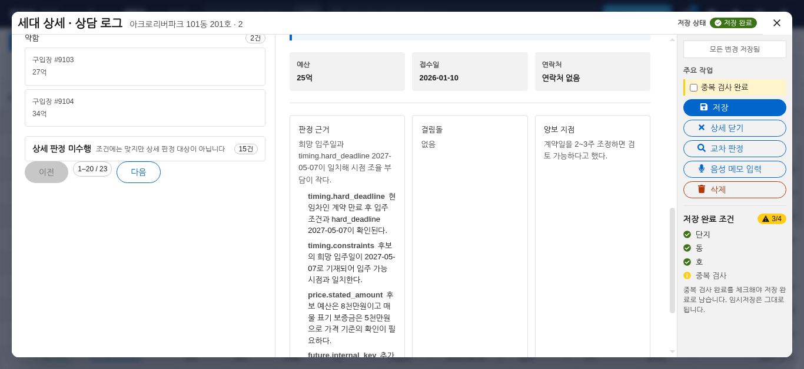
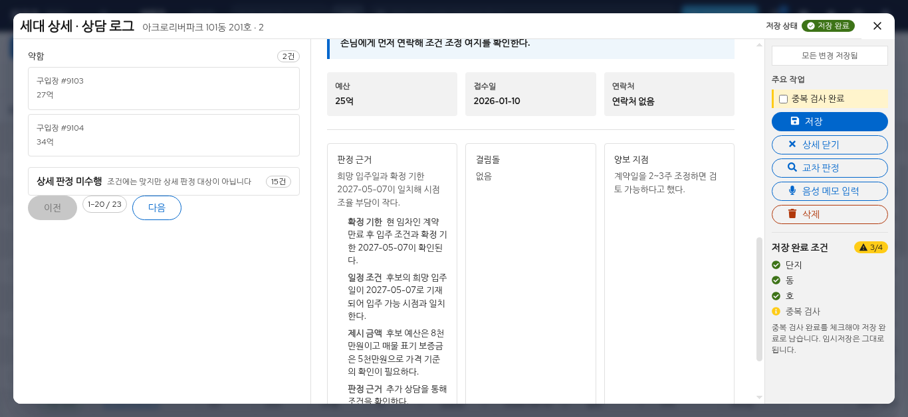

# F3 판정 근거 한국어 표시 검증 — 2026-09-10

사용자가 지적한 `timing.hard_deadline`, `timing.constraints`, `price.stated_amount` 제목과
설명문 속 `hard_deadline` 노출을 재현했다. 기존 PR #130 병합 후 최신 dev `589b1b4`를 기준으로
분리 워크트리의 `fix/f3-korean-evidence` 브랜치에서 수정했다.

## 변경 범위

- 영향 모듈: **frontend, 문서·위키**. Backend·AI·data·infra 코드 및 HTTP 계약 변경 없음.
- `model/evidenceText.ts`에서 알려진 필드명을 한국어로 변환하고 `viewModel.ts`에서 적용한다.
  예: `timing.hard_deadline` → ‘확정 기한’, `timing.constraints` → ‘일정 조건’,
  `price.stated_amount` → ‘제시 금액’. 기한은 입주일 외 일정도 포함하므로 ‘입주일’로 단정하지 않는다.
- 생성된 판정 이유·근거 설명·장애 요인·양보 가능 조건·제외 이유·추천 행동에도 같은 변환을 적용한다.
  알려지지 않은 영문 제목은 ‘판정 근거’로 표시하며, 설명 속 미지의 용어를 임의로 해석하지 않는다.
- 상담 인용 원문, 일반 영문 고유명사, 날짜·금액, 판정 등급·순위·식별자·저장 응답을 보존한다.
  기존 결과에도 조회 시 적용되므로 데이터 이관·재판정·추가 모델 호출이 필요하지 않다.
- CSS·PatternFly 컴포넌트·패널 구조는 변경하지 않았다. 영문 길이에 따른 줄바꿈은 한국어 길이에 맞게 달라진다.

## 자동 검증

Frontend 디렉터리에서 실행:

```sh
npm run test:f3
node --test --test-isolation=none tests/f3-evidence-text.test.ts
node --test --test-isolation=none tests/f3-panel.browser.test.mjs
npm run typecheck
npm run build
npm run test:release
```

- F3 빠른 테스트 5개 파일 통과. 신규 단위 테스트 4건은 경로·배열·한국어/미지 항목,
  토큰 경계, 설명 변환, 날짜·금액·원문 인용 및 원본 DTO 불변을 검증한다.
- F3 패널 브라우저 테스트 11건 통과. 매물·구입장 두 경로의 근거 제목·설명, 날짜·금액 보존,
  접수 1회와 기존 장부 저장·패널 이동·키보드 초점 회귀를 포함한다.
- 타입 검사·production build·release 검사 통과. 기존 Vite 대형 청크 경고는 남는다.
- Python 변경이 없어 Ruff 대상은 없다. 실제 모델 품질이나 인프라 성능을 재측정한 작업은 아니다.

## Linux Chrome 전후 비교

```sh
F3_EVIDENCE_BASELINE=589b1b4 node tests/manual/f3-evidence-chrome.mjs
```

설치된 **Linux Google Chrome 148의 실제 창**과 Chrome 자체 배율 설정을 사용했다.
원본 dev의 추적된 frontend 파일만 임시 비교 폴더로 추출하고, 양쪽에 동일한 합성 장부·판정
응답을 주입했다. 개인 설정·운영 데이터·실제 모델은 사용하지 않았다.

- 매물·구입장 × 1920×1080/1366×768 × 100%/200% × 전후 = **16건**.
- 한국어 제목·설명, 원래의 날짜·금액, 실행 접수 1회, 근거 목록 가로 넘침 없음,
  키보드로 닫은 뒤 실행 버튼 초점 복원을 확인했다. 페이지 JavaScript 오류 0건.
- WSL 창 관리자 제한으로 1920×1080 요청의 실제 창은 **1919×1079**다. 1366×768은 정확하다.
- 좁은 200% 화면의 고정 작업 영역에 의한 내용 가림과 작은 읽기 영역은 기존 dev에도 있다.
  이번 문구 변경의 레이아웃 회귀와 구분하며 전체 확대 접근성 통과로 간주하지 않는다.
  스크린샷은 첫 근거를 스크롤한 위치를 기록하며, 목록 전체가 한 화면에 들어온다는 뜻은 아니다.
- Windows·스크린 리더는 이번에 검증하지 않았다. 사용자 후속 지시에 따라 Linux에서 확인했다.

측정값·텍스트·가림 상태: [report.json](f3-evidence-korean-2026-09-10/report.json).
16장 전체 화면은 같은 디렉터리에 있다. 대표 비교:

| 매물·1366×768·100% 수정 전 | 수정 후 |
|---|---|
|  |  |

## 정리

테스트 DB는 생성하지 않았다. 비교 서버·Chrome 프로필·기준선 임시 폴더는 검증 스크립트가
종료 시 제거한다. 설치 캐시·node_modules·dist는 PR 준비 후 제거하고 소스와 이 검증 자료만 보존한다.
