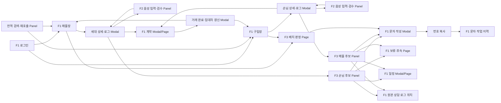

# F1·F2·F3 화면구조 분석

> 단계: 화면 설계 전 IA·화면 인벤토리·요구사항 추적성 정의  
> 범위: 시각 디자인, 와이어프레임, 컴포넌트 스타일, 컬러·타이포그래피 결정 제외  
> 기준 자료: 통합 요구사항 정의서, F1/F2/F3 원문, 기존 장부 목록 2종과 입력 화면 2종  
> 확정 Matrix: [SCREEN_MATRIX_F1_F2_F3.md](SCREEN_MATRIX_F1_F2_F3.md)

## 0. 분석 결론

1. **F1은 애플리케이션 셸과 업무 상태를 소유한다.** 매물장, 구입장, 상세·로그, 일정, 계약, 문자, 설정, 감사가 F1이다.
2. **F2는 독립 메뉴나 독립 페이지를 갖지 않는다.** F1의 매물/손님 상세 모달 안에서 음성 입력과 AI 제안 검수 영역으로만 나타난다.
3. **F3의 교차 판정은 F1 상세에 붙는 비차단 패널이다.** F1 상세를 대체하거나 F1 편집을 잠그지 않는다.
4. **F3의 배치 판정만 예외적으로 페이지가 필요하다.** 대상 선정→판정 세그먼트→문안 승인이라는 장시간 다단계 작업이기 때문이다. 이 페이지도 F1 셸 안에서 F1 데이터로 시작하고 F1 문자 작성·번호 복사로 끝난다.
5. 상세 화면의 기준 단위는 `매물`이 아니라 `세대`다. 매물화는 세대의 상태이며, 같은 세대에 매물·거래 이력이 반복 누적된다.
6. 기존 화면에서 확인되는 업무 습관인 **고밀도 그리드**, **상단 필드→인물→로그의 세로 순서**, **우측 액션 열**은 구조 근거로 보존한다. 구체 배치는 다음 화면 설계 단계에서 결정한다.
7. 불완전 데이터도 저장하며 `작성 중 / 검토 필요 / 저장 완료`를 구분한다. 장부별 최소 조건은 `저장 완료` 전환에만 적용한다.
8. 음성 입력은 상담 후 음성메모 녹음 또는 파일 업로드로 한정한다. 실시간 통화 STT·자동녹음·화자분리는 제외한다.
9. 문자 MVP는 문안 작성·대상 확정·번호 복사로 종료한다. 실발송 UI는 adapter 활성 전까지 노출하지 않는다.

### 화면 유형 정의

| 유형 | 판단 기준 |
|---|---|
| Page | 주소·메뉴로 다시 진입할 수 있고, 장시간 작업·필터·목록 상태를 보존해야 하는 업무 공간 |
| Panel | 현재 F1 업무 맥락을 유지한 채 옆이나 위에 붙는 비차단 보조 영역 |
| Modal | 저장·삭제·병합·승인처럼 대상 1건이나 되돌리기 어려운 결정을 완료할 때 쓰는 차단형 대화상자 |

---

## 1. 전체 IA

```text
F1 애플리케이션 셸
├─ 접근
│  └─ 로그인
├─ 핵심 장부
│  ├─ 매물장(세대 전수 대장)
│  │  └─ 세대 상세·상담 로그 Modal
│  │     ├─ F2 음성메모·제안 검수 Panel
│  │     ├─ F3 포지션 카드·교차 판정 후보 Panel
│  │     ├─ 인물 통합 이력 Panel
│  │     ├─ 거래·시설물 이력 Panel
│  │     └─ 문서함 Panel
│  └─ 구입장(손님 대장)
│     └─ 손님 상세·상담 로그 Modal
│        ├─ F2 음성메모·제안 검수 Panel
│        ├─ F3 포지션 카드·교차 판정 후보 Panel
│        ├─ 인물 통합 이력 Panel
│        └─ 문서함 Panel
├─ 연락·후속 업무
│  ├─ 연락처 목록
│  ├─ 문자 작성·확인
│  ├─ 문자 이력
│  ├─ 알림 센터
│  └─ 보류·후속 처리 목록
├─ 일정·거래
│  ├─ 일정
│  └─ 계약
├─ F3 판단 업무
│  ├─ 교차 판정: F1 상세에 붙는 Panel
│  ├─ 배치 판정: F1 셸 안의 캠페인 Page
│  └─ 판정 실행·피드백 조회: 관리자 Page
├─ 관리
│  ├─ 마스터 데이터
│  ├─ 사무소·직원·권한·알림 설정
│  ├─ 감사·변경 이력
│  ├─ 삭제 항목 복구
│  └─ 통계·메모장
└─ 도움말
   ├─ 화면 도움말 Panel
   └─ 검색형 매뉴얼 Page
```

### 소유 경계

| 영역 | 소유 | 화면 원칙 |
|---|---|---|
| 장부 데이터·상태·저장·검색·로그 | F1 | 모든 진입의 기준. F2/F3 실패와 무관하게 사용 가능 |
| 음성 녹음·업로드·STT·필드 제안 | F2 | F1 상세 Modal 내부의 조건부 Panel. 독립 내비게이션 금지 |
| 포지션·등급·순위·행동·문안 제안 | F3 | F1 데이터에 붙는 Panel 또는 F1 셸 내부 캠페인 Page |
| 상담 로그 추가·일정 등록 | F1 저장 / F3 제안 | 사용자가 승인한 경우에만 F1이 기록 |
| 문자 작업 | F1 | MVP는 문안 작성·대상 확정·번호 복사까지. F3는 초안과 대상만 전달하고 실발송 UI는 미노출 |

---

## 2. 필요한 화면 목록과 화면 ID

### 2.1 Page

| 화면 ID | 화면명 | 소유 | 주요 목적 | 진입 |
|---|---|---|---|---|
| F1-PG-001 | 로그인 | F1 | 사무소·담당자 인증, 잠금 해제 | 최초 접속·세션 만료 |
| F1-PG-010 | 매물장 | F1 | 세대 전수 조회·검색·필터·편집·다중 선택 | 기본 진입, 전역 검색 |
| F1-PG-020 | 구입장 | F1 | 손님 조건 조회·검색·필터·편집·다중 선택 | 주 메뉴, 세대 상세의 구입장 추가 |
| F1-PG-030 | 연락처 목록 | F1 | 세대·손님 연락처 통합 조회, 개인 문자 진입 | 주 메뉴·상세 |
| F1-PG-040 | 문자 작업 이력 | F1 | 초안·번호 복사 이력 조회. 실발송 결과는 adapter 활성 후 확장 | 주 메뉴·상세 |
| F1-PG-050 | 일정 | F1 | 오늘/월간/담당자별 일정 관리 | 주 메뉴·알림·상세 |
| F1-PG-060 | 계약 | F1 | 계약 건, 단계, 서류 체크리스트 관리 | 주 메뉴·세대 상세 |
| F1-PG-070 | 보류·후속 처리 | F1 | F3의 나중에 처리와 사람의 후속 작업 통합 | 주 메뉴·알림·F3 후보 |
| F1-PG-080 | 메모장 | F1 | 세대·손님에 종속되지 않는 자유 메모 | 유틸리티 메뉴 |
| F1-PG-090 | 통계 | F1 | 접촉·매물 유입/소진·담당자 실적 조회 | 관리 메뉴 |
| F1-PG-100 | 마스터 데이터 | F1 | 단지·업소·직원·코드·평형 관리 | 관리 메뉴 |
| F1-PG-110 | 사무소 설정 | F1 | 권한·계정·알림·보관·문자 모드·모바일 범위 설정 | 관리 메뉴 |
| F1-PG-120 | 감사·변경 이력 | F1 | 개인정보 접근, 내보내기, 필드 변경 추적 | 관리 메뉴·상세 |
| F1-PG-140 | 도움말·매뉴얼 | F1 | 검색형 사용법, 단축키, 변경 사항 조회 | 전역 도움말 |
| F1-PG-150 | 삭제 항목 복구 | F1 | 소프트 삭제된 손님·계정·기타 항목 복구 | 관리 메뉴 |
| F3-PG-010 | 배치 판정 캠페인 | F3 판단 / F1 셸 | 대상 선정→판정 세그먼트→문안 승인→F1 번호 복사 | F1 장부의 선택 행·주 메뉴 |
| F3-PG-020 | 판정 실행·피드백 | F3 | 실행 근거·비용·도구 격리·오판 피드백 조회 | 관리자 메뉴·후보 결과 |

### 2.2 Panel

| 화면 ID | 화면명 | 소유 | 부모 화면 | 차단 여부 |
|---|---|---|---|---|
| F1-PNL-010 | 전역 검색·재호출 | F1 | 모든 Page | 비차단 |
| F1-PNL-020 | 알림 센터 | F1 | 모든 Page | 비차단 |
| F1-PNL-030 | 문자 대상 수집 | F1 | 매물장·구입장 | 비차단 |
| F1-PNL-040 | 인물 통합 이력 | F1 | 세대/손님 상세 | 비차단 |
| F1-PNL-050 | 문서함 | F1 | 세대/손님 상세 | 비차단 |
| F1-PNL-060 | 거래·상태·시설물 이력 | F1 | 세대 상세 | 비차단 |
| F1-PNL-070 | 화면 도움말 | F1 | 현재 화면 | 비차단 |
| F2-PNL-010 | 음성메모 입력·처리 | F2 | F1-MOD-010/020 | 비차단, 상세 내부 |
| F2-PNL-020 | AI 제안 검수 | F2 | F1-MOD-010/020 | 비차단, 상세 내부 |
| F3-PNL-010 | 교차 판정 후보 | F3 | F1-MOD-010/020 또는 해당 상세 주변 | 비차단 |
| F3-PNL-020 | 포지션 카드·이력 | F3 | F3-PNL-010 | 비차단 |

### 2.3 Modal

| 화면 ID | 화면명 | 소유 | 사용 이유 |
|---|---|---|---|
| F1-MOD-010 | 세대 상세·상담 로그 | F1 | 대상 1세대의 필드·인물·로그를 현재 그리드 맥락에서 편집 |
| F1-MOD-020 | 손님 상세·상담 로그 | F1 | 대상 1손님의 조건·인물·로그를 현재 그리드 맥락에서 편집 |
| F1-MOD-030 | 컬럼 값 필터 | F1 | 컬럼별 실제 값 검색·복수 선택·빈 값 선택 |
| F1-MOD-040 | 일괄 편집 확인 | F1 | 다중 행 변경 대상·전후값을 저장 전에 확인 |
| F1-MOD-050 | 중복 세대·인물 해결 | F1 | 신규 생성 대신 기존 항목 열기/병합 여부 결정 |
| F1-MOD-060 | 문자 작성·대상 확정·번호 복사 | F1 | 개인·단체 수신자 확인, 문안·변수·미리보기 후 번호 복사 |
| F1-MOD-070 | 실발송 최종 확인 | F1 | adapter 활성 후 실제 발송 직전 확인. MVP에서는 미노출 |
| F1-MOD-080 | 일정 등록·수정 | F1 | 세대·손님·F3 제안에 연결된 일정 승인·편집 |
| F1-MOD-090 | 계약 등록·수정 | F1 | 매물·손님 연결과 계약 단계·서류 입력 |
| F1-MOD-100 | 거래 완료·임대차 갱신 | F1 | 완료 이력과 현 임대차 갱신 여부 분기 |
| F1-MOD-110 | 단지 세대 일괄 생성 | F1 | 동·층·라인 범위 확인 후 대량 생성 |
| F1-MOD-120 | 인물 병합 확인 | F1 | 로그·연락처·관계를 보존하는 비가역적 병합 확인 |
| F1-MOD-130 | 미저장 닫기·복구 | F1 | 저장/저장 안 함/취소, 임시 내용 복구, 오프라인 종료 경고 |
| F1-MOD-140 | 개인정보·저장 검증 경고 | F1 | 주민번호 패턴, 동의 누락, 권한·완료 전환 오류 처리 |
| F1-MOD-145 | AI 값 반영 충돌 확인 | F1 | 기존 값이 있는 필드의 내용 추가/기존 값 변경 선택. F2 소유 Modal 없음 |
| F1-MOD-150 | 인쇄 미리보기 | F1 | 체크리스트·상세·일정·문자 대상 출력 확인 |
| F3-MOD-010 | 관심없음·판정 피드백 | F3 | 사유를 구조화해 신뢰 루프로 전달 |
| F3-MOD-020 | 캠페인 규모·교차 옵션 경고 | F3 | 대상 상한·비용 상한을 넘는 실행 확인 또는 차단 |

---

## 3. 화면별 요구사항 ID 매핑

### 3.1 F1 Page

| 화면 ID | 직접 매핑 | 연동·상태 매핑 |
|---|---|---|
| F1-PG-001 | F1-SE-01, F1-SE-10~11 | F1-HP-03, F1-NF-07 |
| F1-PG-010 | F1-GR-01~47, F1-SR-01~08, F1-TR-01~03 | F1-MS-01, F1-MS-17, F1-ST-01~03, F1-ST-16~18, F1-NF-01~08, F1-NF-11, F1-NF-14, F2-LIST-01~04, F3-CR-02, F3-CR-04 |
| F1-PG-020 | F1-DM-01~07, F1-SR-02~04, F1-SR-06 | F1-GR-11~29, F1-GR-33~47, F1-MS-01, F1-ST-01~03, F1-ST-16~18, F2-LIST-01~04, F3-CR-01, F3-CR-03 |
| F1-PG-030 | F1-MS-07~08 | F1-SE-06~07, F1-SE-13, F1-UD-12~13 |
| F1-PG-040 | F1-MS-06, F1-MS-13, F1-MS-15 | F1-SE-07, F1-AG-04 |
| F1-PG-050 | F1-SC-01~05 | F1-AL-02, F1-AG-04, F3-IF-04~05 |
| F1-PG-060 | F1-CT-01~03, F1-TR-03~06 | F1-UD-18, F1-ET-04 |
| F1-PG-070 | F3-CR-16 | F1-AL-04, F1-SC-01. 통합 문서에 대응 F1 고유 ID가 없어 신규 요구사항 ID 필요 |
| F1-PG-080 | F1-ET-01 | F1-HP-01 |
| F1-PG-090 | F1-ET-03 | F1-NF-05 |
| F1-PG-100 | F1-MD-01~07 | F1-UD-13~14, F1-GR-44, F1-HP-02 |
| F1-PG-110 | F1-MD-05, F1-SE-02, F1-SE-09~11, F1-AL-05~06 | F1-MS-11, F1-MS-14~15, F1-NF-07, F1-NF-13 |
| F1-PG-120 | F1-ET-02, F1-SE-07, F1-SE-12~13, F1-AG-06 | F3-CM-04~05, F3-IF-07, F3-TR-05, F3-TL-07 |
| F1-PG-140 | F1-HP-01~07 | F1-GR-24, F1-HP-02 |
| F1-PG-150 | F1-SE-08~10 | F1-DM-06 |

### 3.2 F1 Panel·Modal

| 화면 ID | 직접 매핑 | 연동·상태 매핑 |
|---|---|---|
| F1-PNL-010 | F1-SR-02~06 | F1-SR-01, F1-HP-06, F1-NF-03 |
| F1-PNL-020 | F1-AL-01~06 | F1-MS-08, F1-SC-02 |
| F1-PNL-030 | F1-MS-01~05, F1-MS-09~10 | F1-GR-27, F1-SE-13 |
| F1-PNL-040 | F1-UD-21~23 | F1-LG-01~06, F1-MS-13 |
| F1-PNL-050 | F1-UD-24~26 | F1-SE-06~07 |
| F1-PNL-060 | F1-TR-05, F1-TR-07, F1-UD-20, F1-ET-02 | F1-AG-01 |
| F1-PNL-070 | F1-HP-01~06 | 현재 부모 화면의 ID를 함께 전달 |
| F1-MOD-010 | F1-UD-01~26, F1-TR-01~05, F1-TR-07, F1-LG-01~06, F1-LG-08~32, F1-MD-08 | F1-ST-01, F2-REC-06, F1-ST-04~14, F2-POP-01, F2-SAVE-01~03, F2-SAVE-05~06, F2-SAVE-08, F3-CR-02, F3-CR-04 |
| F1-MOD-020 | F1-DM-08~16, F1-LG-01~06, F1-LG-08~19, F1-UD-21~26, F1-TR-06 | F1-ST-01, F2-REC-06, F1-ST-04~14, F2-POP-01, F2-SAVE-01~02, F2-SAVE-04~06, F2-SAVE-08, F3-CR-01, F3-CR-03 |
| F1-MOD-030 | F1-GR-17~18, F1-GR-38~41 | F1-GR-19~22, F1-HP-06 |
| F1-MOD-040 | F1-GR-27, F1-GR-33~34, F1-GR-45 | F1-ET-02, F1-SE-02 |
| F1-MOD-050 | F1-SR-07, F1-UD-21~22, F1-ST-17 | F1-LG-01, F1-ET-02 |
| F1-MOD-060 | F1-MS-04~05, F1-MS-08~15 | F1-UD-12, F1-SE-13, F3-CR-15, F3-BT-13~20, F3-GN-01~07. MVP는 번호 복사로 종료 |
| F1-MOD-070 | F1-MS-16 | F1-MS-14, F1-SE-13, F3-BT-16, F3-BT-20. MVP 미노출 |
| F1-MOD-080 | F1-SC-01, F1-SC-04~05, F1-UD-19 | F3-BR-08, F3-CR-18, F3-IF-04~05 |
| F1-MOD-090 | F1-CT-01~03, F1-UD-18 | F1-TR-06 |
| F1-MOD-100 | F1-TR-03~06 | F1-CT-02, F1-ET-02 |
| F1-MOD-110 | F1-SR-08 | F1-MD-01, F1-NF-05 |
| F1-MOD-120 | F1-UD-22 | F1-UD-21, F1-UD-23, F1-ET-02 |
| F1-MOD-130 | F1-GR-32, F1-GR-35~36, F1-ST-18 | F2-POP-02, F2-SAVE-07, F1-NF-14. F2는 분석 중 취소 경고만 추가 |
| F1-MOD-140 | F1-SE-03~05, F1-DM-16, F1-ST-13 | F1-GR-32, F1-GR-46, F1-LG-28, F2-SEC-06. 불완전 필드 자체는 차단 사유가 아니지만 개인정보·보안·권한은 저장 게이트 |
| F1-MOD-145 | F1-ST-06~07 | F2-REV-02, F2-ANL-08. F1이 충돌 결정을 소유 |
| F1-MOD-150 | F1-ET-04 | F1-CT-03, F1-MS-05 |

### 3.3 F2 — 독립 Page·상세 Modal 없음

| 화면 ID | 직접 매핑 | F1과의 결합 규칙 |
|---|---|---|
| F2-PNL-010 | F2-REC-01~06, F2-STT-01~05, F2-SEC-01, F1-ST-01~05, F1-ST-12~15 | F1-MOD-010/020 안에서 상담 후 메모 녹음·파일 업로드·처리를 담당 |
| F2-PNL-020 | F2-ANL-02~06, F2-ANL-08, F2-REV-01~04, F2-SAVE-05, F2-SAVE-08, F2-SEC-06 | 현재값·제안·근거 검수. 저장·닫기·충돌 결정은 F1 소유 |
| 부모 F1-PG-010/020 | F2-LIST-01~04, F2-SAVE-02 | 저장 상태와 AI 처리 상태를 분리해 표시 |
| 부모 F1-MOD-010/020 | F2-POP-01~02, F2-SAVE-01~06, F2-SAVE-08 | F2-POP은 호환 ID이며 별도 팝업을 뜻하지 않음 |
| 부모 F1-MOD-130 | F2-SAVE-07 | `저장 / 저장 안 함 / 취소`; 분석 중이면 취소 경고 추가 |
| 부모 F1-MOD-140/145 | F2-SEC-06, F2-ANL-08, F2-REV-02 | 개인정보 경고와 값 충돌 결정은 F1이 소유 |

> **추적성 확정:** `F2-REC-01~06`, `F2-STT-01~05`, `F2-ANL-01~08`, `F2-SAVE-01~08`, `F2-SEC-01~06` 총 33개 ID를 신설해 Screen Matrix와 연결했다.

### 3.4 F3

| 화면 ID | 직접 매핑 | 지원·연동 매핑 |
|---|---|---|
| F3-PNL-010 | F3-CR-05~18, F3-BR-03~10, F3-BR-14, F3-TR-01, F3-TR-03~06 | F3-CM-01~07, F3-SQ-03~06, F3-NF-01~04, F3-IF-03~05, F3-IF-08~09, F1-AG-03~04, F1-AG-07 |
| F3-PNL-020 | F3-PC-01~09, F3-PC-13, F3-LA-01~08, F3-CA-01~08, F3-TR-01~02 | F3-PC-10~12, F3-TL-01~06, F3-SE-01~05, F3-IF-01~02, F3-IF-06 |
| F3-MOD-010 | F3-CR-17, F3-TR-03, F3-TR-07 | F3-IF-08 |
| F3-PG-010 | F3-BT-01~24, F3-SQ-01~07, F3-GN-01~07 | F3-CM-01~08, F3-LA-01~08 또는 F3-CA-01~08, F3-NF-05~10, F3-SE-01~05, F1-MS-09~16 |
| F3-MOD-020 | F3-BT-04, F3-BT-23~24 | F3-CM-08, F3-NF-05~06 |
| F3-PG-020 | F3-CM-04~05, F3-CM-08, F3-TL-07, F3-TR-05, F3-TR-07~08 | F3-IF-07, F1-AG-06, F1-SE-12 |
| 부모 F1-PG-010/020 | F3-CR-01~04 | 저장 또는 상세 열기 이벤트가 트리거. F1 저장·조회는 기다리지 않음 |
| 부모 F1-MOD-060 | F3-CR-15, F3-BT-13~20, F3-GN-01~07 | F3는 초안·대상만 넘기고 MVP는 F1 번호 복사로 종료. F1-MOD-070은 adapter 후속 |
| 부모 F1-MOD-080 | F3-BR-08, F3-CR-18, F3-IF-04~05 | 승인된 제안만 F1 일정으로 생성 |

### 3.5 직접 화면을 만들지 않는 요구사항

아래 요구사항은 별도 화면을 만들기보다 위 화면의 동작·상태·감사 근거로 반영한다.

| 범주 | 요구사항 ID | 화면 반영 방식 |
|---|---|---|
| F1↔F3 인터페이스 | F1-AG-01~03, F1-AG-05, F1-AG-07 | 후보/캠페인 패널의 독립 로딩·오류·마스킹, F1 비차단 동작 |
| F1 성능·운영 | F1-NF-01~14 | 그리드 가상화, 즉시 반영, 비동기 로딩, 오프라인 복구, 모바일 화면 제한 |
| F2 처리·보안 | F2-ANL-01, F2-ANL-07, F2-SEC-02~05 | F2-PNL-010/020의 상태와 F1 경고에 결과만 반영. 별도 화면 없음 |
| F3 캐시·후보 코드 | F3-PC-10~12, F3-SQ-01~06 | 캐시 재사용 표시, 순차 표시, 후보 페이징. 별도 AI 화면 금지 |
| F3 대리·판정 내부 | F3-LA-01~08, F3-CA-01~08, F3-BR-01~02, F3-BR-11~13, F3-TL-01~07 | 포지션 카드·후보 결과·실행 로그에서 결과와 격리 근거만 노출 |
| F3 연동·보안·비기능 | F3-IF-01~09, F3-SE-01~05, F3-NF-01~10 | 마스킹·권한·오류 격리·응답·비용 지표로 반영 |

---

## 4. 화면 간 이동 관계



### 핵심 이동 규칙

| 출발 | 행동 | 도착 | 문맥 유지 |
|---|---|---|---|
| 매물장/구입장 | 행 1건 클릭 | 해당 상세 Modal | 그리드 필터·정렬·스크롤·선택 유지 |
| 매물장/구입장 | 행 추가 | 빈 행 + 해당 상세 Modal | 신규 행은 작성 중. 취소 시 행 제거 |
| 매물장/구입장 | F2 실행, 행 미선택 | 빈 행 + 상세 + F2 Panel | F1이 새 행을 만들고 대상 고정 |
| 상세 | F2 실행 | 같은 상세 내부 F2 Panel | 새 Page·새 상세 Modal 생성 금지 |
| 상세 저장/열기 | F3 교차 판정 | 상세에 붙는 후보 Panel | F1 저장·편집·닫기 비차단 |
| F3 근거 | 원문 보기 | 같은 상세의 해당 로그 앵커 | 대상과 시간 위치 보존 |
| F3 후보 | 문자 작성 | F1 문자 작성 Modal | 선택 대상·F3 초안을 전달하고 MVP는 번호 복사로 종료 |
| F3 후보 | 나중에 | F1 보류·후속 Page/목록 | F3 별도 큐 생성 금지 |
| F3 후보 | 일정 승인 | F1 일정 Modal→일정 Page | 주체 `F3`, 사용자 승인 시각 기록 |
| 다중 행 선택 | 문자/캠페인 | 수집 Panel 또는 F3 캠페인 Page | 선택 행 ID와 제외 사유 보존 |
| 계약 완료 | 완료 처리 | 거래 완료 Modal→두 장부 갱신 | 세대·손님 연결, 직전 값 이력 보존 |

---

## 5. 주요 사용자 행동

### 5.1 F1 중심 업무

1. 동·호, 성명, 전화번호, 로그 본문으로 대상을 찾는다.
2. 장부의 컬럼을 정렬·필터·고정·재배치하고 개인 설정으로 복원한다.
3. 셀을 직접 편집하거나 여러 행을 선택해 일괄 편집하고 실행 취소한다.
4. 행을 추가해 상세를 열고, 세대/손님 필드·인물·연락처를 입력한다.
5. 상담 로그를 추가하고 부재중 결과를 원클릭 기록한다. 기존 로그는 수정·삭제하지 않는다.
6. 개인 또는 복수 대상의 문자 초안을 작성하고, 현재 범위에서는 번호 복사 모드로 외부 도구에 전달한다.
7. 일정과 계약을 만들고, 거래 완료 시 세대와 손님을 연결한다.
8. 알림에서 대상 상세·문자·일정으로 이동한다.
9. 소유자는 마스터·권한·감사·이관·삭제 복구를 관리한다.

### 5.2 F2 입력 보조

1. F1 상세에서 녹음하거나 음성 파일을 선택한다.
2. 분석을 실행하고 업로드→STT→장부 분석 진행 상태를 본다.
3. 현재값, AI 제안값, 신뢰 상태, 근거 문장을 비교한다.
4. 반영할 항목만 선택하고 충돌 필드는 내용 추가/기존 값 변경을 명시적으로 결정한다.
5. 누락 항목을 직접 보완하거나 `미확인`으로 남긴다.
6. 상담 로그 초안을 수정·제외한 뒤 사용자 승인으로 F1에 저장한다.
7. 실패 시 같은 음성·STT·제안값을 잃지 않고 재시도한다.

### 5.3 F3 판단 보조

1. F1 상세에서 앵커 포지션과 후보의 강함/약함/기각·순위를 확인한다.
2. 비교 근거·결정적 걸림돌·양보 지점·다음 행동을 확인한다.
3. 근거 문장을 눌러 F1의 원본 상담 로그로 이동한다.
4. 포지션을 정정하고 정정 내용을 F1 상담 로그에 남긴다.
5. 후보에서 문자 작성, 나중에, 관심없음, 일정 제안 승인을 실행한다.
6. 캠페인에서는 F1 데이터로 대상을 선정하고, AI 판정 세그먼트를 검토·수정한다.
7. 세그먼트별 문안을 검토·승인한 뒤 F1 문자 작성·번호 복사 흐름으로 넘긴다.
8. 관리자는 실행 근거·호출 비용·격리·오판 피드백을 조회한다.

---

## 6. 필요한 상태

### 6.1 공통 상태 규칙

| 상태 | 공통 표현 원칙 | 복구 행동 |
|---|---|---|
| Loading | 화면 전체를 가리지 않고 대상 영역만 스켈레톤/진행 상태로 표시 | 뒤 화면의 조회·스크롤 유지 |
| Empty | `데이터 없음`이 아니라 왜 비었는지와 다음 행동을 함께 표시 | 필터 해제, 행 추가, 조건 완화, 입력 시작 |
| Error | 실패 대상과 보존된 내용을 명확히 표시 | 동일 입력 재시도, 수동 입력, F1 계속 사용 |
| Disabled | 비활성 이유를 인접 설명으로 제공 | 선택 수·권한·필수 입력·처리 중 조건 해소 |
| Unsaved | 행·필드 단위로 미저장 여부 표시 | 저장, 저장 안 함, 계속 작성 |
| Offline | 변경분을 로컬 보관하고 셀/상세에 미전송 표시 | 연결 복구 시 자동 재전송 |
| Conflict | 동시 편집 또는 AI 제안 충돌의 전후값 표시 | 유지할 값 명시 선택, 이력 기록 |
| Permission/Masked | 읽기전용·민감 문서·연락처를 마스킹 | 권한 요청 경로 또는 조회 불가 사유 표시 |
| Deleted/Expired | 소프트 삭제·문서 만료·계정 비활성 상태 구분 | 복구, 새 문서 등록, 계정 재활성 |

### 6.2 화면별 상태 매트릭스

| 화면 | Loading | Empty | Error | Disabled | 추가 필수 상태 |
|---|---|---|---|---|---|
| 매물장 | 7,200행 초기 로드, 가상 스크롤 추가 로드 | 검색/필터 결과 없음. 세대 전수 장부 자체의 빈 매물 칸은 정상 데이터 | 초기 조회 실패, 셀 저장 실패, 내보내기 실패 | 복수 선택 시 F2, 권한 없는 내보내기·편집 | 선택, 인라인 편집, 저장 중, 미저장, 오프라인, 동시 편집 충돌 |
| 구입장 | 목록·필터 로드 | 기간/담당자/검색 결과 없음 | 조회·저장·삭제 실패 | 동의 누락 시 저장 완료 전환, 복수 선택 F2, 읽기전용 편집 | 작성 중, 검토 필요, 저장 완료, 소프트 삭제 |
| 상세 Modal | 프레임 즉시 표시 후 로그 스켈레톤, 이전 로그 추가 로드 | 로그 없음, 인물 없음, 문서 없음 | 주요 필드·로그·첨부 저장 실패 | 저장 완료 조건 미충족, 읽기전용, 식별자 기본 잠금 | 작성 중, 검토 필요, 저장 완료, Dirty, 복구 가능 초안, 중복 후보, AI 작성 주체 |
| F2 입력 | 업로드 중, 변환 중, 분석 중 | 음성 없음, STT 빈 텍스트 | 네트워크·STT·LLM·저장 실패 | 음성 없음, 처리 중 중복 실행, 지원하지 않는 파일 | 녹음 중, 일시정지, 파일 준비, 검토 필요, 저신뢰, 장부 불일치, 충돌, 임시저장 |
| F3 후보 Panel | 앵커 카드→SQL 후보→판정 결과 순차 표시 | 후보 없음 + 사용한 조건 | 일부 후보 실패, F3 전체 실패 | 읽기전용의 정정·문자·일정, 데이터 미저장 상태 | 캐시 재사용, 오래된 카드, 강함/약함/기각, 페이징, 피드백 완료 |
| 문자 작성 | 대상·중복 제거·치환 미리보기 | 수신자 없음, 연락처 없음 | 템플릿·미리보기·번호 복사 실패 | 유효 대상 없음, 권한 없음 | 개인/단체, 중복 제외, 수신 거부 제외, 번호 복사. 실발송 UI 미노출 |
| 캠페인 | 대상 조회, 병렬 판정 진행률, 문안 생성 | 대상 0명, 세그먼트 없음 | 일부 대상 판정 실패, 문안 실패 | 200명 초과 미확인, 전체 대상 교차 옵션, P2 비활성, 미승인 번호 복사 | 대상 확정, 제외 대상, 판단 불가, 얕은 판정, 세그먼트 편집, 승인 대기 |
| 일정·계약 | 월/상세 로드 | 일정/계약 없음 | 저장·단계 전이 실패 | 권한 없음, 선행 정보 누락 | 임박, 완료, F3 생성, 서류 미완료 |
| 이관 | 파일 검증·적재 진행 | 파일 미선택, 실패 행 없음 | 형식·적재·재실행 실패 | 건수 불일치 시 완료 | 원본/적재/실패 건수, 표본 검수, 재시도 가능 |

### 6.3 주요 Disabled 조건

| 행동 | Disabled 조건 |
|---|---|
| F2 분석 실행 | 음성 없음, 파일 형식/용량 오류, 이미 처리 중 |
| F2 실행 대상 | 복수 행 선택. 0행 선택은 Disabled가 아니라 신규 행 생성 |
| 저장 완료 전환 | 장부별 완료 조건 미충족, AI 충돌 미해결, 개인정보 동의 미체크, 주민번호 패턴 미해결. 작성 중/검토 필요 저장은 허용 |
| 일괄 편집 | 선택 행 2건 미만, 편집 권한 없음 |
| 번호 복사 | 최종 유효 수신자 0명, 문안·대상 미확정, 권한 없음 |
| F3 포지션 정정 | 읽기전용 권한, 카드 생성 전 |
| F3 일정 생성 | 일정 제안 없음, 사용자 승인 전 |
| F3 캠페인 실행 | 대상 0명, 상한 초과 미확인, 이전 실행 중 |
| F3 교차 옵션 | P2 미활성, 선택 세그먼트 없음, 30명 초과, 캠페인 전체 선택 |

---

## 7. 기존 화면 근거와 구조적 판단

| 근거 화면 | 관찰 | 화면 구조에 반영할 점 | 상태 |
|---|---|---|---|
| 기존 장부 메인 | 상단에 검색·조작이 밀집되고, 세대가 행·다수 필드가 열로 유지되는 고밀도 장부 | 매물장은 카드형 대시보드가 아니라 세대 전수 그리드 Page가 중심 | 양호한 업무 모델, 웹 조작 규칙 정리가 필요 |
| 매물 입력 | 상단 3열 필드, 중단 임대인/임차인, 하단 상담 로그, 우측 액션의 세로 순서가 뚜렷함 | F1-LG-20~28과 일치. 세대 상세·로그를 하나의 Modal로 유지 | 구조 근거 충분 |
| 기존 장부 구입장 | 매물장과 같은 고밀도 그리드지만 컬럼 수·기간·담당자 흐름이 다름 | 같은 그리드 엔진을 쓰되 별도 Page ID와 프리셋 필요 | 구조 근거 충분 |
| 구입장 입력 | 조건·인물·별도 메모·상담 로그·우측 액션이 한 화면에 결합 | 손님 상세 Modal은 세대 상세와 공통 골격을 쓰되 필드·최소 저장·동의 규칙을 별도 정의 | 상세 규격 보강 필요 |

> 스크린샷만으로 키보드 포커스, 실제 저장 반응, 색 대비, 확대/리플로, 보조기술 읽기 순서는 검증할 수 없다.

---

## 8. 확정 정책과 잔여 논점

### 8.1 확정 완료

| 주제 | 확정 내용 | 반영 |
|---|---|---|
| 저장 상태 | 불완전 저장 허용, 작성 중/검토 필요/저장 완료 분리 | F1-GR-46, F2-SAVE-01~06, Screen Matrix 6장 |
| 상세 닫기 | F1의 저장/저장 안 함/취소, F2 분석 취소 경고만 추가 | F2-SAVE-07, F1-MOD-130 |
| 상세 소유 | F1 상세 Modal 하나, F2 내부 Panel, 2열 상세 폐기 | F2-POP-01~02, F2-PNL-010/020 |
| 음성 입력 | 상담 후 녹음·파일 업로드, 상세 헤더 진입, 실시간·자동녹음·화자분리 제외 | F2-REC-01~06 |
| 문자 MVP | 문안·대상·번호 복사, 실발송 UI 미노출 | F1-MOD-060/070 |
| F2 추적성 | REC 6, STT 5, ANL 8, SAVE 8, SEC 6 신설 | 총 33개 ID 연결 |

### 8.2 화면 수·소유를 바꾸지 않는 잔여 논점

- F1-PG-070 보류 목록의 F1 수신 요구사항 ID 신설
- 손님 상세의 필드 순서·액션 요구사항 세부화
- F3 포지션 정정 로그 스키마
- 개인정보 보유·파기 기간
- F2 로컬 LLM과 F3 모델의 자원 경합
- 상담 로그 마커 `①②③`과 `주`의 의미

---

## 9. 다음 화면 설계 단계의 입력물

Screen Matrix 확정 이후 화면 설계는 다음 순서로 진행한다.

1. `F1-PG-010/020` 공통 그리드 골격과 두 장부의 차이 정의
2. `F1-MOD-010/020` 상세 Modal의 공통 영역·장부별 변형 정의
3. 상세 안의 `F2-PNL-010/020` 단계와 충돌·실패 상태 정의
4. 상세에 붙는 `F3-PNL-010/020`의 순차 로딩·근거 이동·F1 액션 연결 정의
5. F1 문자·일정·계약 연결 흐름 정의
6. `F3-PG-010` 배치 판정 다단계 흐름 정의
7. 관리·감사·이관 화면 정의

화면 시각 디자인은 별도 요청 전에는 시작하지 않는다.
